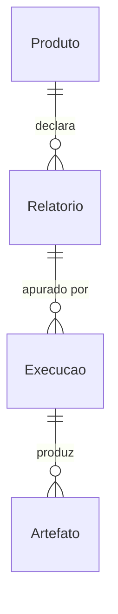

# Coleta do produto POUPANCA

## Problem

Não existe repositório algum. `git ls-files` devolve cinco arquivos: `.gitignore`, `CLAUDE.md` e
os três documentos de `docs/`. Não há `pom.xml`, `docker-compose.yml`, migration, runner de teste
nem uma linha de Java.

Quem paga por isso são as duas afirmações centrais dos documentos, que hoje não têm como estar
erradas porque não há onde verificá-las. O PRD promete que o relatório é **lido da base uma vez e
exportado quantas vezes for preciso**; a arquitetura declara em RA-16 que o intermediário é um
`JasperPrint` serializado, e na §12 lista cinco consequências desse formato — substituição de
fonte, `ClassNotFoundException` em renderer, e um `.jrprint` desserializado ocupando múltiplos do
seu tamanho em disco — todas marcadas como trade-off aceito e **nenhuma exercitada**. A §14 fecha
com seis itens de desenho ainda abertos, entre eles os nomes dos módulos, a estrutura interna de
cada um, os relatórios de exemplo de RA-08 e a modelagem das tabelas do schema de controle.

O documento não apresenta evidência quantitativa do custo — não há incidente, volume de chamado
nem prazo de terceiro citado. O que ele apresenta é a data: `Ambiente instalado: 2026-06-01` no
`CLAUDE.md` global e cinco commits de documentação, o último em `a1d466c`.

Quando esta fatia entra, existe um `mvn verify` que sai 0 num clone limpo, um schema de controle
versionado, e um produto — POUPANCA — cujos dois relatórios são apurados de ponta a ponta: lidos
do schema transacional numa janela com prazo, renderizados, gravados no MinIO sob um caminho que
nunca muda, e registrados numa linha de Execução que a métrica primária do PRD §6 consegue contar.

## Flow

Nada existe para reusar: esta é a primeira fatia. O que ela estabelece para as seguintes reusarem
é `biblioteca-comum` (termos do domínio, os quatro status e a origem da execução) e
`processador-starter`, que concentra o que RA-03 manda concentrar — leitura paginada, renderização,
gravação de artefato e registro de metadados — para que `processador-poupanca` traga apenas o que
é do produto.

1. `docker compose up --wait` -> `infra local` (new, door 1) - sobe PostgreSQL e MinIO, aplica as migrations e cria o bucket `artefatos`
2. `processador-poupanca` (new, door 1) - ao iniciar, publica produto e relatórios no schema de controle (door 3) e recusa a inicialização se a declaração violar sigla, código, tempo estimado ou o teto da soma
3. `processador-starter` (new, door 1) - reserva uma Execução por relatório ativo do produto, com início nulo, e persiste `execucao` (door 2) antes de qualquer leitura
4. `processador-starter` (new, door 1) - por relatório: conta as linhas do dataset e recusa acima do teto; senão abre a transação de leitura com `statement_timeout` (door 5) e lê paginado do schema transacional
5. `processador-poupanca` (new, door 1) - preenche o JRXML do relatório (door 10) e devolve o `JasperPrint`
6. `processador-starter` (new, door 1) - grava `.jrprint` e `.csv.gz` sob `<data>/<SIGLA>/<CODIGO>` (door 4) no MinIO e **só então** registra o encerramento da Execução
7. out: o código de saída do processo (door 6), as linhas de `execucao` e `artefato` no schema de controle, e os dois objetos por relatório no bucket

## Impact

Greenfield: nada existe para mudar por baixo. O que esta fatia disturba são os documentos e os
termos que as features seguintes vão herdar.

| Front | What changes |
| --- | --- |
| domain | novo termo: `Execução reservada` - linha de `execucao` com início nulo, criada antes de qualquer leitura; é o que distingue "nunca começou" de "está rodando" (RN-45, RA-14), e vive em `biblioteca-comum` |
| domain | novo termo: `Catálogo derivado` - produto e relatório existem porque o código os declara ao iniciar; a aplicação edita nome, descrição e tempo estimado e nunca cria nem apaga (RN-49, RA-58) |
| domain | novo termo: `Tempo estimado copiado` - o valor que a Execução carrega dentro de si, não o que está no catálogo agora; é o que faz `processado com alerta` permanecer comparável ao longo do tempo (RN-47) |
| documentos | `docs/arquitetura-inicial.md` §14 tem quatro itens resolvidos por esta fatia: nomes dos módulos, estrutura interna, relatórios de exemplo de RA-08 e modelagem das tabelas do schema de controle. Eu **não** edito esse arquivo — é fonte binding desta feature; as decisões ficam em `.specs/STATE.md` `## Decisions` para o autor dobrar no log RA-NN se quiser |
| documentos | `docs/glossario.md`, `docs/especificacao.md` e `docs/adr/` são declarados como existentes por `arquitetura-inicial.md` §15 e **não existem no repositório**. Os termos acima são fixados sem glossário, então quando ele for escrito pode discordar - questão aberta 1 |
| stored data | nada a migrar: o schema de controle e o schema transacional `poupanca` nascem aqui, e a primeira migration do Flyway roda contra banco vazio. A seed transacional é gerada, não importada |

## Relations

Restrições one-way: sigla do `Produto` única (door 3); código do `Relatorio` único no sistema, e
seus quatro dígitos únicos dentro do produto (door 3); no máximo uma `Execucao` vigente por par
data de referência + código de relatório (door 2); `Execucao` em status terminal nunca muda de
status (door 2); caminho do `Artefato` único (door 4). Nada é apagado fisicamente — `Produto` e
`Relatorio` só são inativados (door 3). Sem colunas e sem tipos aqui: vêm das convenções e são
resolvidos no diff.

## Surface

`None - nenhuma rota HTTP nesta fatia.` O módulo processador é uma task de linha de comando, não
um serviço: não expõe porta, não tem actuator (RA-43 é do módulo API, que não está aqui) e não
atende usuário final. O que atravessa a fronteira para fora são duas coisas, e as duas são portas
em `Landing` em vez de rota: o layout do objeto no bucket (door 4), que a API vai ler na feature
de exportação, e o código de saída do processo (door 6), de que a task do Airflow depende.

## Landing

| One-way door | Literal shape | Alternative rejected |
| --- | --- | --- |
| 1 · Nomes e fronteiras dos módulos Maven | parent `scheduler-jasper-report` (pom), módulos `biblioteca-comum`, `processador-starter`, `processador-poupanca`; groupId `io.github.halissonmartins.scheduler`; parent `spring-boot-starter-parent:4.1.1`, `maven.compiler.release` 25 | nomes em inglês (`common-library`, `processor-starter`): RNF-15 fixa pt-BR na interface e nas mensagens, e o glossário do projeto é em pt-BR, então o código em inglês obrigaria a traduzir o termo do domínio em toda fronteira. O **split** em si não foi comparado: RA-02, RA-03 e RA-04 o forçam |
| 2 · `execucao` append-only quanto a status terminal | `UNIQUE (data_referencia, relatorio_codigo) WHERE vigente` (índice parcial); início nulo marca a reserva; retentativa e reprocessamento inserem linha nova e movem o ponteiro, e nenhum caminho faz `UPDATE` de status em linha terminal | histórico em tabela separada com `UPDATE` livre na linha corrente: perde a distinção de RA-14 entre "reservada e nunca iniciada" e "em processamento", que é feita justamente pelo início nulo |
| 3 · Catálogo publicado por upsert, nunca por truncate | `INSERT INTO controle.relatorio (...) ON CONFLICT (codigo) DO UPDATE SET` apenas das colunas que a aplicação **não** edita; nenhum caminho de `DELETE`; relatório que deixa de ser declarado vira `ativo = false` | truncate-and-republish a cada inicialização: apagaria nome, descrição e tempo estimado editados pela aplicação (RN-49) e quebraria as referências que RN-50 manda preservar |
| 4 · Layout do artefato no bucket | `artefatos/<yyyy-MM-dd>/<SIGLA>/<CODIGO>.jrprint` e `artefatos/<yyyy-MM-dd>/<SIGLA>/<CODIGO>.csv.gz` | incluir o nome do produto no caminho: o nome é editável (RN-01), então o caminho de um artefato já gravado mudaria — é exatamente o que RA-19 proíbe |
| 5 · Prazo do statement de leitura | `SET LOCAL statement_timeout = <2 × tempo estimado copiado × 1000>` na transação do step de leitura de cada relatório | `JdbcCursorItemReader.setQueryTimeout`: é o único reader do Spring Batch 6.0.5 que expõe a propriedade — verificado no bytecode, `JdbcPagingItemReader` só tem `setFetchSize` — mas RA-03 fixa leitura paginada, e um cursor mantém uma conexão e uma transação abertas por toda a leitura |
| 6 · Contrato de saída do processo | exit `0` quando toda Execução do produto terminou em sucesso ou alerta; exit `1` quando qualquer uma terminou em erro; exit `2` quando a inicialização foi recusada | exit `0` sempre, com o status apenas no banco: o callback de falha de RA-14 é acionado pelo estado da task do Airflow, que vem do código de saída — sem ele o mecanismo de RN-10 não tem gatilho |
| 7 · Cliente do repositório de artefatos | `io.minio:minio:9.0.3` | `software.amazon.awssdk:s3:2.55.1`: arrasta a própria pilha de protocolo, auth, retry e HTTP (`aws-xml-protocol`, `apache-client`, `netty-transport`, `aws-crt`) para as mesmas quatro operações, e RA-50 fixa a primeira versão em ambiente local, então portabilidade para o S3 real não é requisito desta versão |
| 8 · Conjunto de JobParameters exaustivo | `DefaultJobParametersValidator` com `requiredKeys = {}` e `optionalKeys = {}`, que recusa qualquer chave desconhecida | aceitar chaves extras e ignorá-las: uma chave `data_referencia` passada por engano seria silenciosamente descartada em vez de recusada, e RN-54 existe para que isso não seja possível |
| 9 · Modelo transacional de POUPANCA e sua seed | schema `poupanca` com uma tabela de movimento de conta poupança, populada por `generate_series` em migration de teste; a recusa de RNF-06 é exercitada com 50.001 linhas reais | H2 ou banco em memória: RA-47 exige Testcontainers, e a contagem prévia de RA-64 precisa do plano de contagem do PostgreSQL para significar algo |
| 10 · Convenção de autoria dos JRXML | `POUPANCA-0001.jrxml` e `POUPANCA-0002.jrxml` em `processador-poupanca/src/main/resources/relatorios/`, cada um com imagem e font extension próprias (RA-08), cabeçalho de coluna na banda `title` e apenas ornamento descartável em `pageHeader`/`pageFooter` (RA-59) | um JRXML parametrizado compartilhado: RA-08 exige dois relatórios que difiram em imagem e fonte precisamente para exercitar o risco de substituição de fonte da §12, que um modelo único não exercita |

- Nada mais nesta fatia é difícil de reverter: onde cada classe mora, como o job é decomposto em
  steps, nomes de método e formato das mensagens de log saem das convenções e são revistos no diff.

## Criteria

### S1: Build, schema e infra local (P1)

Um clone limpo compila, testa e sobe as dependências reais com um comando cada.

**Acceptance Criteria**

1. The system SHALL compilar e testar o parent e os três módulos num único `mvn verify` a partir de um clone limpo, sob Java 25 e Maven 3.9.16, sem passo manual anterior.
2. WHEN as migrations são aplicadas a um PostgreSQL vazio THEN the system SHALL criar o schema `controle` com as entidades `produto`, `relatorio`, `execucao` e `artefato`, e o schema `poupanca`.
3. IF o checksum de uma migration já aplicada for alterado THEN the system SHALL abortar a inicialização com erro do Flyway e não aplicar migration alguma.
4. WHEN `docker compose up --wait` roda THEN the system SHALL deixar PostgreSQL e MinIO saudáveis e o bucket `artefatos` criado, saindo com código 0.
5. WHEN o workflow de CI roda num pull request THEN the system SHALL executar `mvn verify` e reprovar o pull request se qualquer proof falhar.

**Independent test:** clonar em diretório vazio, rodar `docker compose up --wait` e `mvn verify`, e conferir os dois códigos de saída.

### S2: Catálogo derivado do código (P1)

O produto e seus relatórios existem porque o módulo os declara, e uma declaração inválida impede o módulo de subir.

**Acceptance Criteria**

6. WHEN `processador-poupanca` inicia THEN the system SHALL publicar no schema `controle` o produto `POUPANCA` e os relatórios `POUPANCA-0001` e `POUPANCA-0002`, cada um com nome, descrição e tempo estimado inicial.
7. WHEN o módulo inicia novamente depois de o nome de um relatório ter sido alterado no schema `controle` THEN the system SHALL preservar o nome alterado e não reescrevê-lo com o valor declarado no código.
8. IF dois relatórios declarados pelo mesmo módulo tiverem os mesmos quatro dígitos THEN the system SHALL recusar a inicialização com erro que nomeia o código duplicado, e sair com código 2.
9. IF a sigla declarada não casar com `^[A-Z]{1,20}$` ou um código de relatório não casar com `^[A-Z]{1,20}-\d{4}$` THEN the system SHALL recusar a inicialização e sair com código 2.
10. IF um relatório declarar tempo estimado menor ou igual a zero THEN the system SHALL recusar a inicialização e sair com código 2.
11. IF a soma dos tempos estimados dos relatórios ativos declarados ultrapassar 600 segundos THEN the system SHALL recusar a inicialização e sair com código 2.
12. WHEN um relatório antes publicado deixa de ser declarado pelo código THEN the system SHALL marcá-lo `ativo = false` e preservar a linha, sem apagá-la.

**Independent test:** subir o módulo contra um schema vazio e conferir as duas linhas de relatório; depois subir uma variante com código duplicado e conferir o código de saída 2.

### S3: Apuração, artefatos e status (P1)

Os dois relatórios do produto são apurados numa janela, gravados no bucket e registrados com status.

**Acceptance Criteria**

13. WHEN o job de apuração do produto é disparado THEN the system SHALL criar uma Execução por relatório ativo, com início nulo, **antes** de abrir qualquer leitura da base transacional.
14. WHEN a apuração de um relatório começa THEN the system SHALL copiar para dentro da Execução o tempo estimado que está no catálogo naquele instante, e preencher a data e hora de início.
15. WHEN a apuração de um relatório conclui sem falha THEN the system SHALL gravar `.jrprint` e `.csv.gz` sob `<yyyy-MM-dd>/<SIGLA>/<CODIGO>` no bucket `artefatos` antes de registrar o encerramento da Execução.
16. WHEN a apuração conclui sem falha e a duração não ultrapassa o tempo estimado copiado THEN the system SHALL encerrar a Execução em `processado com sucesso`.
17. WHEN a apuração conclui sem falha e a duração ultrapassa o tempo estimado copiado THEN the system SHALL encerrar a Execução em `processado com alerta` e manter os dois artefatos gravados.
18. IF qualquer falha for registrada durante a apuração THEN the system SHALL encerrar a Execução em `processado com erro`, mesmo que a duração também tenha ultrapassado o tempo estimado.
19. The system SHALL gravar o `.csv.gz` a partir da consulta principal do relatório, com separador `;`, sem passar pelo JasperReports.
20. The system SHALL resolver a data de referência como o dia corrente no fuso `America/Sao_Paulo`.
21. IF o job receber qualquer JobParameter THEN the system SHALL recusar a execução antes de abrir leitura, e sair com código 2.
22. The system SHALL emitir, por Execução encerrada, um registro de log estruturado contendo sigla do produto, código do relatório, data de referência, status final, duração e Correlation ID.

**Independent test:** disparar o job contra a seed e conferir quatro objetos no bucket, duas linhas de `execucao` em sucesso, e o `.csv.gz` abrindo com `;`.

### S4: Limites, recusas e encerramento (P1)

Nenhuma Execução fica pendurada, e cada limite tem efeito observável.

**Acceptance Criteria**

23. IF a contagem prévia de linhas do dataset de um relatório ultrapassar 50.000 THEN the system SHALL encerrar aquela Execução em `processado com erro` com motivo que nomeia a contagem e o teto, sem ler o dataset e sem gravar artefato.
24. IF a apuração de um relatório atingir o dobro do tempo estimado copiado THEN the system SHALL abortar aquele relatório em `processado com erro` e seguir apurando os demais relatórios ativos do produto.
25. WHILE uma transação de leitura do schema transacional está aberta the system SHALL manter `statement_timeout` igual ao dobro do tempo estimado copiado daquele relatório.
26. IF já existir Execução vigente do par data de referência + código de relatório em `em processamento` THEN the system SHALL recusar nova Execução do mesmo par, registrar evento de auditoria com solicitante, momento e Correlation ID, e não criar Execução.
27. IF já existir Execução vigente do par em `processado com sucesso` ou `processado com alerta` THEN the system SHALL recusar nova Execução, preservar os artefatos e os metadados, e registrar evento de auditoria sem criar Execução.
28. WHEN o job termina THEN the system SHALL encerrar em `processado com erro` toda Execução daquele produto que tenha ficado com início nulo ou em `em processamento`.
29. WHEN o job termina THEN the system SHALL sair com código 0 se toda Execução do produto estiver em sucesso ou alerta, e com código 1 se qualquer uma estiver em erro.

**Independent test:** semear 50.001 linhas para um dos relatórios e conferir que o outro é apurado normalmente enquanto o primeiro fica em erro, com exit 1.

### S5: Modelos de relatório e a convenção de autoria (P1)

Os dois JRXML exercitam o risco declarado na §12, e a convenção que RA-59 impõe tem guarda desde o primeiro relatório escrito.

**Acceptance Criteria**

30. The system SHALL declarar dois JRXML no módulo, com imagens distintas entre si e com font extensions distintas entre si.
31. The system SHALL declarar o cabeçalho de coluna de todo JRXML do módulo na banda `title`, mantendo em `pageHeader` e `pageFooter` apenas ornamento descartável.
32. WHEN o `.jrprint` de um relatório do módulo é exportado para XLSX com `onePagePerSheet(false)` THEN the system SHALL apresentar o cabeçalho de coluna exatamente uma vez.
33. WHEN um `.jrprint` gravado por este módulo é desserializado num classpath que tem as font extensions do módulo THEN the system SHALL reproduzir a fonte declarada, sem recorrer a fonte substituta.

**Independent test:** exportar o `.jrprint` de cada relatório para XLSX e contar as ocorrências do cabeçalho.

## Out of scope

| Excluded | Why |
| --- | --- |
| Orquestração no Airflow: DAG, reserva do ciclo inteiro, pool de 2, `catchup=False`, `execution_timeout` e callback de falha (RA-54, RA-55, RA-56, RA-57, RA-65, RA-14) | é a feature seguinte. Esta fatia entrega o contrato de que a DAG depende — o código de saída (door 6) e a reserva escopada ao produto — e nenhum outro produto existe ainda para haver ciclo |
| Os outros quatro produtos: CLIENTE, CONTACORRENTE, CONSORCIO, EMPRESTIMO (RA-04) | um produto prova o starter; cinco repetem o mesmo teste quatro vezes. O quinto relatório com barcode de RA-08 é requisito **do conjunto dos dez**, não de cada módulo, e entra com o produto que o trouxer |
| Módulo API REST, exportação síncrona, semáforo de RNF-10, recusa por expurgo (RA-26, RA-27, RA-60, RN-39) | a exportação é a outra metade do sistema e consome o artefato que esta fatia passa a produzir; sem ela a API exportaria fixture |
| Frontend Angular e tudo de P1/P2 do guia — fluxos, wireframes, design system | não há tela nesta fatia, e o guia condiciona E3 de UI a `design-system.md`, que não existe |
| Keycloak, perfis, cadeia de permissão, autocadastro (RA-30 a RA-35, RA-61) | o módulo processador não atende usuário: a autorização começa a existir quando a API existir |
| Retentativa e reprocessamento forçado (RN-44, RNF-17, RA-12, RA-13) | a retentativa é decisão do orquestrador e o reprocessamento é acionado pela API; o schema já nasce capaz de os representar (door 2), e é isso que esta fatia lhes deve |
| Expurgo: política de ciclo de vida do bucket, webhook de `s3:ObjectRemoved:*`, marca de expurgado (RA-20, RA-21, RA-63) | a janela de 7 dias só tem efeito observável quando existe listagem e exportação para recusar |
| Pilha de observabilidade: OTel Collector, Graylog, Prometheus, Grafana, Jaeger, e as labels de métrica de RA-40 | o log estruturado com Correlation ID entra aqui (AC 22) porque é o que diagnostica esta fatia; a pilha inteira serve à métrica do PRD §6, que precisa de série de mais de um produto |
| Calibração dos limites de PRD §10 com `k6` | o próprio documento marca o spike como não bloqueante, e reprovar PR contra número não medido é transformar chute em portão |

## Assumptions

| Assumption | Chosen default | Rationale | Confirmed? |
| --- | --- | --- | --- |
| RA-67 diz que a Execução é "append-only", e a reserva de RA-54 depois preenche início, fim e status na mesma linha | append-only significa que **nenhum status terminal muda**, não que a linha nunca sofra `UPDATE`; reserva -> início -> encerramento atualizam a mesma linha enquanto ela é não-terminal | RA-54 manda criar a linha com início nulo e RA-14 manda distinguir a reservada pelo início nulo: as duas exigem que a linha seja preenchida depois. A leitura literal de "append-only" tornaria RA-54 e RA-14 inconstruíveis | n |
| RN-48 é escrita como validação de catálogo e RF-47 só cobre a edição; nada diz o que acontece na inicialização | a inicialização é recusada quando a soma ultrapassa 600 s (AC 11) | o catálogo é derivado do código (RN-49), então a inicialização é a única outra porta por onde um tempo estimado entra. Sem a validação lá, um módulo poderia publicar em código um catálogo que já nasce violando RNF-04 | n |
| RNF-19 fixa o teto da soma em "10 min" sem dar o valor em segundos, enquanto RN-04 mede tempo estimado em segundos inteiros | 600 segundos | conversão direta, e a unidade tem de ser a de RN-04 para a comparação ser feita sem arredondamento | n |
| RA-57 exige `queryTimeout` em todo statement de leitura, e RA-03 exige leitura paginada; o `JdbcPagingItemReader` do Spring Batch 6.0.5 não expõe a propriedade | `SET LOCAL statement_timeout` na transação do step (door 5) | verificado no bytecode de `spring-batch-infrastructure:6.0.5`: `JdbcPagingItemReader` tem apenas `setFetchSize`, e só `AbstractCursorItemReader` tem `setQueryTimeout`. `statement_timeout` limita cada statement, que é o efeito que RA-57 descreve | n |
| O guia P0 exige `user-stories.md` com Given/When/Then, que não existe | os critérios EARS desta feature fazem o papel, e nenhum `user-stories.md` é criado | EARS e Given/When/Then são a mesma obrigação em duas gramáticas, e manter as duas produz duas fontes que divergem. Se o autor quiser o arquivo do guia, ele se gera destes critérios | n |
| `groupId` e estrutura de pacote não são fixados por documento algum | `io.github.halissonmartins.scheduler`, derivado do autor dos commits | nada é publicado em repositório de artefatos, então a coordenada é interna; derivá-la do autor evita inventar um domínio de empresa que não existe | n |
| Qual produto vem primeiro, entre os cinco de RA-04 | POUPANCA | é o primeiro de RA-04 e o `POUPANCA-0001` é o primeiro exemplo de código válido do PRD §8.1 | n |
| A seed transacional precisa de mais de 50.000 linhas para exercitar RNF-06, e nenhum modelo de dados existe | seed gerada por `generate_series` em migration de escopo de teste, com 50.001 linhas para o caso de recusa | RNF-06 é valor fixo e PRD §5 proíbe parametrizá-lo, então a recusa só é observável com contagem real acima do teto; gerar é reproduzível e cabe no disco | n |

**Open questions**

| # | Kind | Question | Until answered |
| --- | --- | --- | --- |
| 1 | open | `docs/glossario.md` é declarado como existente por `arquitetura-inicial.md` §15 e não existe. Os termos `Execução reservada`, `Catálogo derivado` e `Tempo estimado copiado` ficam fixados aqui sem glossário | os três termos valem como escritos em `Impact` e em `biblioteca-comum`; quando o glossário for escrito pode discordar, e aí o custo é renomear em `biblioteca-comum` e nas migrations |
| 2 | open | `docs/especificacao.md` é citado como fonte normativa por `arquitetura-inicial.md` §14 (`especificacao.md` §5.5, sobre não reprovar PR contra número não medido) e não existe no repositório | a regra citada é seguida — nenhum proof desta feature compara contra número marcado `PROVISÓRIO`; se o documento aparecer e disser outra coisa, os limites de S4 são revistos |
| 3 | open | PRD Q10 e Q11: os limites recalibrados de §10 resistem à medição, e a meta de 98% é adequada | AC 23 compara contra 50.000 e AC 11 contra 600 s, que são os valores escritos hoje; a calibração com `k6` está fora de escopo e não bloqueia |
| 4 | blocks go-live | RA-32 cria o ADMINISTRADOR inicial com senha em variável de ambiente, e nenhuma credencial foi emitida para PostgreSQL, MinIO ou Keycloak | nada nesta fatia: os proofs usam Testcontainers com credenciais efêmeras. O `docker compose` local precisa de `.env` preenchido a partir de `.env.example`, e nenhum ambiente além do local é alcançável até isso existir |

## Observable

| Surface | Decision | Landing |
| --- | --- | --- |
| task `processador-poupanca` | formato e verbosidade da saída | AC 22 |
| task `processador-poupanca` | flags e seus defaults | AC 21 - o conjunto de JobParameters é vazio e exaustivo (door 8) |
| task `processador-poupanca` | códigos de saída | AC 4, AC 8, AC 21, AC 29 - e door 6 fixa os três valores |
| task `processador-poupanca` | o que imprime ao falhar no meio | AC 22, AC 28 - a Execução de cada relatório é encerrada e registrada, apurado ou não |
| task `docker compose up --wait` | códigos de saída e o que reporta | AC 4 |
| coleção artefatos no bucket | critério de agrupamento e nomenclatura | AC 15 - e door 4 fixa o caminho literal |
| coleção artefatos no bucket | ordenação | n/a - a chave é hierárquica por data, sigla e código, e nada nesta fatia lista o bucket; a listagem é da feature de exportação |
| coleção artefatos no bucket | o que acontece com duplicata | AC 27 - a recusa de nova Execução do par é o que impede sobrescrita; o reprocessamento forçado, que sobrescreve por decisão, está fora de escopo |
| coleção artefatos no bucket | a exceção que não se encaixa | AC 23 - relatório recusado pelo teto não produz objeto algum, então a data existe no bucket com menos objetos que relatórios ativos |
| mensagens de recusa lidas por quem opera | estrutura, tom e profundidade | AC 8, AC 23 - cada recusa nomeia o valor que a violou; o Correlation ID de RN-40 vem em AC 22 |
| mensagens de recusa lidas por quem opera | o que o leitor deve fazer em seguida | n/a - RN-40 exige momento, descrição e Correlation ID, e não exige ação sugerida; a tela que oferece a cópia estruturada é RF-39, da API |
| screen | n/a - esta fatia não expõe tela alguma; o Angular de RA-06 está fora de escopo |
| API ou webhook | n/a - o módulo processador não expõe rota, porta nem actuator, conforme `## Surface` |

## Sources

- `docs/prd.md` - **binding**. Perfis e matriz §3.2, escopo §4, fora de escopo §5, métrica §6, RN-01 a RN-54, RF-01 a RF-55, RNF-01 a RNF-20
- `docs/arquitetura-inicial.md` - **binding**. RA-01 a RA-68, os trade-offs da §12, a rastreabilidade da §13 e os itens abertos da §14
- `docs/guias/guia-app-web.md` - **binding** para os artefatos exigidos: E1 (fundações, CI bloqueante, `.env.example`), E2 (schema e migration, seed) e E3 (módulos compilando, health check, `*.feature`)
- Maven Central `maven-metadata.xml` - as versões fixadas em door 1 e door 7: Spring Boot 4.1.1, JasperReports 7.0.8, MinIO 9.0.3, e as que o BOM do Boot gerencia (Spring Batch 6.0.5, Flyway 12.4.0, Testcontainers 2.0.5, driver PostgreSQL 42.7.13)
- bytecode de `spring-batch-infrastructure:6.0.5` - a ausência de `queryTimeout` no `JdbcPagingItemReader`, que é a razão de door 5
