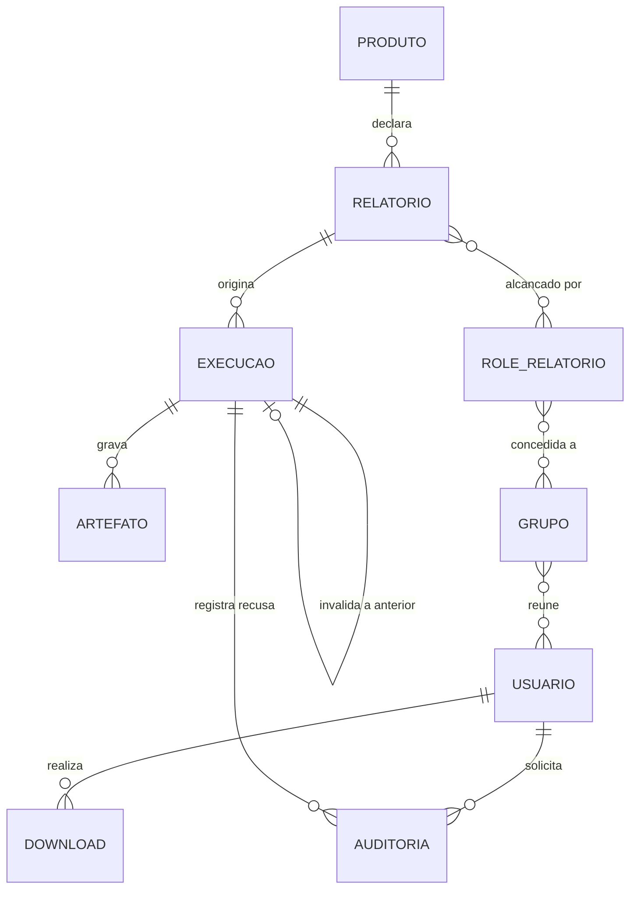

# Scheduler Jasper Report — projeto completo

## Problem

Hoje, toda solicitação de relatório vai direto à base transacional do produto e concorre com a
operação dele. O pico de pedidos é o fim do mês, que é exatamente quando a base está mais
carregada. Não existe nenhum lugar onde o dado do relatório já esteja apurado, congelado por data
e pronto para ser entregue.

Quem paga, e o quê:

- **Quem precisa do relatório** não sabe se o dado está disponível, não sabe se o número que
  recebeu ontem é o mesmo de hoje, e depende de alguém para obter o arquivo em formato diferente
  de PDF.
- **Quem administra o acesso** concede permissão caso a caso, e a permissão fica dispersa e não
  auditável.
- **Quem opera** descobre que a apuração falhou quando o usuário reclama. Uma execução travada é
  indistinguível de uma que ainda está rodando.

**A fonte não traz número algum** — nem volume de solicitações, nem tempo de espera, nem custo de
contenção. O `prd.md` descreve as consequências por pessoa e não as quantifica, e nada aqui
manufatura urgência que ele não declarou.

Quando isto existir, o dado é apurado uma vez por dia, congelado por data de referência, e a
entrega vira um problema de leitura: rápida, repetível, autorizada e observável.

**Escopo deste documento — risco aceito.** Este `plan.md` cobre o projeto inteiro, e não uma
fatia. A objeção foi levantada uma vez e o pedido foi reafirmado: sobre 69 critérios, 8 fatias e
9 módulos, o portão de fechamento ("todo critério aterrissa num hop, numa entidade ou numa rota")
verifica muito menos do que verificaria sobre uma fatia, e o documento fica no nível de detalhe do
PRD em vez do nível de uma obrigação. A contrapartida é registrada na suposição 8, e a derivação
para `checks.md` é onde a omissão volta a aparecer — cada rota de `Surface` e cada porta de
`Landing` passa a dever uma linha de prova lá.

## Flow

Nada aqui é escrito do zero onde já existe peça pronta: o agendamento é do Airflow, a identidade é
do Keycloak, o armazenamento é o S3 do MinIO, a paginação em chunks é do Spring Batch e a
renderização é do JasperReports. O projeto escreve a cola e as regras, não os motores.

O repositório está vazio: nenhum módulo existe hoje, então todo hop é `new`, e as portas de
`Landing` marcam os que são irreversíveis.

**Coleta — agendada, diária**

1. relógio de 03h00 em `America/Sao_Paulo` -> `dag-coleta-diaria` (new, door 6) — resolve a data de
   referência a partir do próprio disparo e não aceita data como parâmetro
2. `dag-coleta-diaria` (new) — reserva o ciclo: grava uma Execução por relatório ativo no
   `schema-controle` (new, door 2), com início nulo, antes de qualquer contêiner subir
3. `dag-coleta-diaria` (new) — dispara uma task por produto, em pool de 2, cada uma subindo o
   contêiner do seu módulo processador
4. `processador-<produto>` (new, door 1) — abre a janela de leitura no schema transacional do
   produto, conta as linhas do dataset, apura em chunks com `queryTimeout` declarado
5. `processador-<produto>` (new) — grava `.jrprint` e `.csv.gz` no `minio` (new, door 3) e só então
   registra o status no `schema-controle`
6. out: quando a task termina de forma anômala, o callback de falha da DAG encerra como
   `processado com erro` toda Execução daquele produto que ficou aberta

**Exportação — sob demanda, síncrona**

7. navegador -> `frontend-angular` (new) — navega data -> produto -> relatório e pede um formato
8. `frontend-angular` (new) — chama `api-rest` (new) com o JWT emitido pelo `keycloak`
   (new, door 4)
9. `api-rest` (new) — resolve a cadeia de permissão e lê o status na tabela de Execução do
   `schema-controle`; nunca toca em schema transacional
10. `api-rest` (new) — toma uma das 2 permissões do semáforo, lê o artefato do `minio` e converte
11. out: o arquivo na mesma resposta HTTP, e uma linha de Download gravada no `schema-controle`

## Impact

| Front | What changes |
| --- | --- |
| domínio | os termos já estão fixados em `docs/glossario.md` e nenhum é redefinido aqui; `Produto`, `Relatório`, `Execução`, `Artefato`, `Download` e o elo `Role de relatório` viram entidades do schema de controle |
| domínio | `Execução vigente` é **ponteiro**, não status — quem escrever "última execução" lê errado; hoje não existe nenhum consumidor para errar, e é por isso que o nome precisa nascer certo |
| domínio | `Data de referência` rotula o **dia da apuração**, e o artefato de 09/08 contém o movimento fechado de 08/08; qualquer relatório, tela ou métrica que trate o rótulo como dia do movimento erra por um dia |
| dado armazenado | nada a migrar: não há base nem linha em produção; o Flyway nasce na migration inicial e nenhuma migration aplicada é alterada depois |
| dado armazenado | **as bases transacionais dos 5 produtos não existem** — serão schemas semeados com dado sintético (suposição 2); todo número de RNF-05, RNF-06 e RNF-10 medido contra elas é sintético até haver base real |
| dependência externa | nenhuma integração com terceiro: PostgreSQL, Keycloak, MinIO, Airflow, Traefik, Mailpit e a pilha de telemetria sobem no Docker Compose local |
| método | `docs/user-stories.md` (P0 do guia) e `docs/design/` (P1 e P2) não existem; o primeiro é coberto pelos critérios deste arquivo (suposição 5), o segundo é a questão aberta 3 |

## Relations

One-way constraints, todas detalhadas em `Landing`:

- unicidade do par data de referência + código do relatório **apenas entre as vigentes** (door 2)
- `EXECUCAO` append-only: nenhum caminho do sistema atualiza status terminal (door 2)
- sigla única no sistema e código único dentro do produto, ambos imutáveis (door 3)
- `DOWNLOAD` guarda cópia dos identificadores e não depende de o relatório continuar ativo (door 8)
- `ROLE_RELATORIO`, `GRUPO` e `USUARIO` vivem no Keycloak; só o elo `RELATORIO` -> `ROLE_RELATORIO`
  é tabela no schema de controle (door 4)

Sem colunas e sem tipos aqui.

## Surface

Rotas que este projeto cria. O frontend Angular consome exclusivamente estas.

| Route | In | Out | Status |
| --- | --- | --- | --- |
| `GET /api/v1/datas-referencia` | — | datas em `dd/MM/yyyy` com artefato disponível | `200`, `401` |
| `GET /api/v1/datas-referencia/{data}/produtos` | `data` | `sigla` · `nome` | `200`, `401`, `404` |
| `GET /api/v1/datas-referencia/{data}/produtos/{sigla}/relatorios` | `data`, `sigla` | `codigo` · `nome` · `status` | `200`, `401`, `403`, `404` |
| `GET /api/v1/datas-referencia/{data}/relatorios/{codigo}/exportacoes/{formato}` | `data`, `codigo`, `formato` | o arquivo, com `Content-Disposition` | `200`, `401`, `403`, `404`, `409`, `410`, `429` |
| `POST /api/v1/reprocessamentos` | `codigoRelatorio`, `motivo` | `idExecucao` · `correlationId` | `202`, `400`, `401`, `403`, `409` |
| `GET /api/v1/downloads` | período, `codigoRelatorio` | linhas com os identificadores copiados | `200`, `401`, `403` |
| `PATCH /api/v1/produtos/{sigla}` | `nome` | o produto | `200`, `400`, `401`, `403`, `404` |
| `POST /api/v1/produtos/{sigla}/inativacao` | `sigla` | — | `204`, `401`, `403`, `404`, `409` |
| `PATCH /api/v1/relatorios/{codigo}` | `nome`, `descricao`, `tempoEstimadoSegundos` | o relatório | `200`, `400`, `401`, `403`, `404`, `409` |
| `POST /api/v1/relatorios/{codigo}/inativacao` | `codigo` | — | `204`, `401`, `403`, `404` |
| `POST /api/v1/roles-relatorio` | `nome` | a role | `201`, `400`, `401`, `403`, `409` |
| `PUT /api/v1/roles-relatorio/{nome}/relatorios` | lista de `codigo` | — | `204`, `400`, `401`, `403`, `404` |
| `POST /api/v1/grupos` | `nome` | o grupo | `201`, `400`, `401`, `403`, `409` |
| `PUT /api/v1/grupos/{id}/roles-relatorio` | lista de `nome` | — | `204`, `401`, `403`, `404` |
| `PUT /api/v1/grupos/{id}/usuarios` | lista de `idUsuario` | — | `204`, `401`, `403`, `404` |
| `POST /api/v1/usuarios-administrativos` | `email`, `perfil` | o usuário | `201`, `400`, `401`, `403`, `409` |
| `DELETE /api/v1/usuarios/{id}` | `id` | — | `204`, `401`, `403`, `404` |
| `POST /internal/artefatos/expurgos` | evento do bucket, credencial de serviço | — | `202`, `400`, `401` |
| `GET /actuator/health/liveness` e `/actuator/health/readiness` | — | `status` | `200`, `503` |

## Landing

| One-way door | Literal shape | Alternative rejected |
| --- | --- | --- |
| 1 — artefato persistido como `JasperPrint` serializado | dois arquivos irmãos por execução: `<CODIGO>.jrprint` (serialização Java nativa) e `<CODIGO>.csv.gz` (separador `;`) | preencher o relatório de novo na exportação — reabriria a base transacional, e isso quebra a janela única (RN-31, RN-44) |
| 2 — Execução append-only com ponteiro de vigência | unicidade parcial do par `data de referência + código do relatório` restrita às linhas vigentes, e nenhum `UPDATE` de status: retentativa e reprocessamento inserem linha nova | uma linha por par, atualizada a cada tentativa — apaga a série de tentativas que a métrica de 30 dias precisa ler (RN-46, RN-51) |
| 3 — caminho do artefato por identificadores imutáveis | `{yyyy-MM-dd}/{SIGLA}/{SIGLA-NNNN}.jrprint` e `.csv.gz` no bucket | caminho pelo nome do produto — o nome é editável, e o caminho mudaria por baixo de artefatos já gravados (RN-01, RA-19) |
| 4 — autorização partida entre Keycloak e schema de controle | Perfil = realm role (`ADMINISTRADOR`, `GERENTE`, `RELATOR`); Role de relatório = client role do cliente `relatorios`; o elo Relatório -> Role é tabela | a cadeia inteira no Keycloak — ele não conhece o conceito de Relatório, então o elo não tem onde morar (RA-31, aposentada) |
| 5 — mono repositório com versão única do JasperReports | uma propriedade `jasperreports.version` no POM pai, herdada por processadores e API | versão por módulo — o `serialVersionUID` do `.jrprint` deixa de casar entre quem grava e quem lê, e os quatro trade-offs da arquitetura caem juntos |
| 6 — `catchup=False` declarado na DAG | `catchup=False` escrito explicitamente na construção da DAG, junto do `start_date` | confiar no padrão do Airflow — é `True` no 2.x, e uma run por dia perdido carimba data antiga com o dado de hoje (RN-54) |
| 7 — convenção de autoria do JRXML | cabeçalho de coluna na banda `title`, renderizada uma vez; `pageHeader` e `pageFooter` só com ornamento descartável | configurar o exportador XLSX — `ignorePagination` age no preenchimento, não na exportação, e o print já está paginado (RA-59) |
| 8 — Download guarda cópia dos identificadores | a linha de download copia código, nome do relatório, sigla do produto, data de referência e formato como estavam no instante | só chaves estrangeiras — o nome é editável, e o histórico de 2026 passaria a exibir o nome que o relatório ganhou em 2027 (RA-66) |
| 9 — códigos HTTP das três recusas de exportação | `409` sem execução válida, `410` artefato expurgado, `429` semáforo cheio | um `400` genérico para as três — RN-39 exige mensagem distinta de indisponibilidade por retenção, e o frontend precisa distinguir o que o usuário deve fazer |
| 10 — fuso fixo em toda a pilha | `TZ=America/Sao_Paulo` em todo serviço do Compose e a mesma propriedade na JVM | UTC com conversão na borda — a data de referência é resolvida no disparo, e um ciclo de 03h00 lido em UTC cai no dia anterior (RN-07) |
| 11 — tempo estimado copiado para dentro da Execução | a Execução carrega o valor vigente no momento do disparo, e alerta e métrica leem essa cópia | ler o catálogo na hora de classificar — editar o tempo reclassificaria execuções passadas e a série deixaria de ser comparável (RN-47) |

- Nada mais neste projeto é difícil de reverter: nomes de módulo, estrutura interna de pacote,
  índices comuns e forma de payload interno são decididos no diff.

## Criteria

Os conectivos EARS (`WHEN`, `WHILE`, `IF`/`THEN`, `SHALL`) ficam em inglês porque são o esquema; o
resto é pt-BR. A numeração corre pelo plano inteiro.

### S1: O repositório roda e cada módulo sobe (P1)

Um clone limpo compila, o CI fecha o portão e a API responde que está viva.

**Acceptance Criteria**

1. The system SHALL compilar todos os módulos a partir de um clone limpo, com o build Maven retornando código de saída 0.
2. WHEN a API REST termina de subir THEN the system SHALL responder `200` com estado `UP` em `/actuator/health/liveness` e em `/actuator/health/readiness`.
3. The system SHALL executar todo contêiner e toda JVM no fuso `America/Sao_Paulo`.
4. WHEN um pull request é aberto THEN the system SHALL impedir o merge enquanto lint, testes e build não terminarem com código de saída 0.
5. WHERE o perfil de teste está ativo the system SHALL desabilitar o SDK do OpenTelemetry, de modo que nenhum teste dependa do Collector nem emita telemetria.

**Independent test:** clonar em diretório vazio, rodar o build, subir a API e requisitar os dois endpoints do Actuator.

### S2: O catálogo é derivado do código (P1)

Cada módulo processador anuncia o seu produto e os seus relatórios ao iniciar; a aplicação só edita o que é mutável.

**Acceptance Criteria**

6. WHEN um módulo processador inicia THEN the system SHALL publicar no schema de controle a sigla do seu produto e, para cada relatório declarado, código, nome, descrição e tempo estimado inicial.
7. IF dois relatórios declarados pelo mesmo módulo processador carregam o mesmo código THEN the system SHALL abortar a inicialização do módulo com código de saída diferente de 0.
8. IF um relatório declara tempo estimado que não seja inteiro maior que 0 segundos THEN the system SHALL abortar a inicialização do módulo com código de saída diferente de 0.
9. The system SHALL recusar sigla de produto que não case com `^[A-Z]{1,20}$` e código de relatório que não case com `^[A-Z]{1,20}-\d{4}$`.
10. WHEN um ADMINISTRADOR edita o catálogo THEN the system SHALL persistir apenas nome do produto e nome, descrição e tempo estimado do relatório, mantendo sigla e código inalterados.
11. IF a edição do tempo estimado faz a soma dos tempos estimados dos relatórios ativos do produto ultrapassar 600 segundos THEN the system SHALL recusar a edição com `409`.
12. IF um ADMINISTRADOR solicita a inativação de um produto que ainda tem ao menos um relatório ativo THEN the system SHALL recusar com `409`.
13. WHEN um produto ou relatório é inativado THEN the system SHALL retirá-lo da listagem e manter íntegras as linhas de execução, auditoria e download que o referenciam.
14. The system SHALL nunca apagar linha de catálogo: nenhuma rota e nenhuma rotina executa remoção física de produto ou de relatório.

**Independent test:** subir dois módulos, um íntegro e um com código duplicado, e comparar o catálogo publicado com o código de saída do segundo.

### S3: O ciclo diário apura e registra o que aconteceu (P1)

A metade agendada inteira: reserva, janela de leitura, artefato, status e os dois limites de tempo.

**Acceptance Criteria**

15. The system SHALL disparar o ciclo de coleta diariamente às 03h00 no fuso `America/Sao_Paulo`, todos os dias.
16. The system SHALL declarar `catchup=False` na DAG, de modo que subir a DAG com `start_date` no passado não produza nenhuma execução retroativa.
17. WHEN o ciclo é disparado THEN the system SHALL criar, antes de qualquer contêiner de produto subir, uma Execução por relatório ativo, com data/hora de início nula e origem `agendada`.
18. The system SHALL apurar no máximo 2 produtos simultaneamente.
19. WHEN a apuração de um relatório conclui sem falha THEN the system SHALL gravar um `.jrprint` e um `.csv.gz` sob `{yyyy-MM-dd}/{SIGLA}/{SIGLA-NNNN}` no repositório de artefatos.
20. WHEN uma execução conclui THEN the system SHALL gravar os artefatos antes de registrar o status de conclusão, nunca na ordem inversa.
21. WHEN a apuração conclui sem nenhuma falha e a duração não ultrapassa o tempo estimado copiado na própria Execução THEN the system SHALL registrar `processado com sucesso`.
22. WHEN a apuração conclui sem nenhuma falha e a duração ultrapassa o tempo estimado copiado na própria Execução THEN the system SHALL registrar `processado com alerta`.
23. IF qualquer falha é registrada durante a apuração THEN the system SHALL registrar `processado com erro`, inclusive quando a duração também tiver ultrapassado o tempo estimado.
24. WHEN a apuração de um relatório atinge o dobro do tempo estimado copiado na Execução THEN the system SHALL abortar somente esse relatório como `processado com erro` e seguir apurando os demais relatórios do mesmo produto.
25. The system SHALL declarar `queryTimeout` em todo statement de leitura da Coleta.
26. WHEN o contêiner de um produto termina de forma anômala THEN the system SHALL encerrar como `processado com erro` toda Execução daquele produto que ficou aberta, inclusive as reservadas que nunca chegaram a iniciar.
27. IF a contagem prévia de linhas do dataset de um relatório ultrapassa 50.000 THEN the system SHALL encerrar a execução como `processado com erro` com motivo explícito, sem apurar o relatório.
28. WHEN uma Execução termina em `processado com erro` e ainda restam retentativas no ciclo THEN the system SHALL criar uma nova Execução de origem `retentativa` e marcar a anterior como não-vigente.
29. The system SHALL limitar a 2 as retentativas por relatório dentro de um mesmo ciclo.
30. WHEN uma Execução é disparada THEN the system SHALL copiar para dentro dela o tempo estimado vigente naquele momento.
31. IF existe Execução do par em `em processamento` THEN the system SHALL recusar nova execução do mesmo par.
32. The system SHALL nunca alterar o status de uma Execução já terminal.
33. The system SHALL derivar a data de referência do disparo do ciclo, e nenhuma interface — aplicação, orquestrador ou reprocessamento — aceita data de referência como entrada.

**Independent test:** disparar um ciclo com um relatório saudável, um lento, um que falha e um cujo contêiner é derrubado, e ler a tabela de Execução no fim.

### S4: Quem entra alcança exatamente o que lhe foi concedido (P1)

Perfis, autocadastro e a cadeia Relatório -> Role de relatório -> Grupo -> Usuário.

**Acceptance Criteria**

34. WHEN o contêiner do Keycloak inicia THEN the system SHALL criar um usuário de perfil ADMINISTRADOR com a senha lida de variável de ambiente.
35. The system SHALL representar Perfil como realm role e Role de relatório como client role do cliente `relatorios`, em espaços de nomes distintos.
36. WHEN um visitante conclui o autocadastro público THEN the system SHALL criar um usuário de perfil RELATOR sem nenhum grupo.
37. IF uma requisição de autocadastro informa perfil THEN the system SHALL ignorar o campo e criar o usuário como RELATOR.
38. IF um GERENTE tenta criar ou promover um usuário a GERENTE ou a ADMINISTRADOR, inclusive manipulando a requisição diretamente, THEN the system SHALL responder `403`.
39. WHEN um RELATOR lista relatórios THEN the system SHALL devolver exclusivamente os alcançados pela união de todos os caminhos da sua cadeia de permissão.
40. IF um RELATOR requisita diretamente um relatório fora da sua cadeia de permissão THEN the system SHALL responder `403`.
41. WHEN um ADMINISTRADOR lista ou exporta THEN the system SHALL conceder acesso a todos os relatórios sem consultar a cadeia de permissão.
42. IF um GERENTE solicita exportação de qualquer relatório THEN the system SHALL responder `403`.
43. WHILE um RELATOR não pertence a nenhum grupo the system SHALL devolver listagem vazia acompanhada da mensagem de que as permissões ainda não foram configuradas.
44. WHEN o vínculo de um usuário a um grupo é removido THEN the system SHALL negar o acesso aos relatórios correspondentes já na requisição seguinte.
45. The system SHALL permitir que um usuário de qualquer perfil troque a própria senha e a recupere por e-mail.

**Independent test:** criar um RELATOR pelo autocadastro, listar (vazio), vinculá-lo a dois grupos com roles diferentes, listar de novo (união) e desvincular.

### S5: O relatório apurado sai no formato que o usuário precisa (P1)

A metade sob demanda: navegar, exportar em quatro formatos e registrar a entrega.

**Acceptance Criteria**

46. WHEN um usuário autorizado navega a listagem THEN the system SHALL apresentar data de referência em `dd/MM/yyyy`, depois produto, depois relatório.
47. WHEN um usuário autorizado solicita exportação de um par cuja execução vigente está em `processado com sucesso` ou `processado com alerta` THEN the system SHALL devolver o arquivo na mesma resposta HTTP, sem criar registro de status.
48. IF a execução vigente do par não está em `processado com sucesso` nem em `processado com alerta` THEN the system SHALL recusar a exportação com `409`.
49. The system SHALL produzir PDF, XLSX e DOCX a partir do `.jrprint` e CSV a partir do `.csv.gz`, sem abrir conexão com nenhum schema transacional.
50. WHEN a exportação em XLSX é gerada THEN the system SHALL entregar planilha contínua em que o cabeçalho de coluna aparece exatamente uma vez.
51. The system SHALL entregar o CSV com separador `;` e apenas as colunas da consulta principal, sem subrelatório, sem imagem e sem formatação.
52. IF já existem 2 exportações em andamento THEN the system SHALL recusar a requisição excedente de imediato com `429` e indicação de repetir mais tarde, sem enfileirá-la.
53. WHEN um arquivo exportado é entregue THEN the system SHALL registrar um Download com cópia do código e do nome do relatório, da sigla do produto, da data de referência, do formato, do usuário e do momento.
54. WHEN o ADMINISTRADOR consulta o histórico de downloads THEN the system SHALL exibir os identificadores como estavam no momento do download, mesmo após edição de nome ou inativação do relatório.

**Independent test:** apurar um relatório, exportá-lo nos quatro formatos, renomear o relatório e reabrir o histórico de downloads.

### S6: Refazer uma apuração é ato autorizado e auditado (P2)

Reprocessamento forçado, recusa de unicidade e o que vira auditoria em vez de Execução.

**Acceptance Criteria**

55. WHEN um ADMINISTRADOR solicita reprocessamento forçado de um par da data de referência corrente informando motivo THEN the system SHALL invalidar a execução vigente, criar uma Execução de origem `reprocessamento forçado` e sobrescrever os artefatos.
56. IF a solicitação de reprocessamento forçado chega sem motivo textual não vazio THEN the system SHALL recusar com `400` e não criar Execução alguma.
57. IF um usuário de perfil diferente de ADMINISTRADOR solicita reprocessamento forçado THEN the system SHALL responder `403`.
58. IF uma nova execução é solicitada para um par cuja execução vigente está em sucesso ou alerta, fora do reprocessamento forçado, THEN the system SHALL recusá-la, registrar evento de auditoria com solicitante, momento e Correlation ID, e não criar Execução.
59. WHEN a execução vigente de um par está em `processado com erro` THEN the system SHALL aceitar nova execução do par sem exigir autorização especial.

**Independent test:** apurar com sucesso, tentar reexecutar (recusa auditada), reprocessar com motivo, e conferir que a execução anterior continua registrada como não-vigente.

### S7: O artefato expira; o registro do que houve, não (P2)

As três retenções independentes e a recusa explícita por retenção.

**Acceptance Criteria**

60. WHEN um artefato completa 7 dias contados da sua data de referência THEN the system SHALL apagá-lo automaticamente do repositório, com a janela lida de variável de ambiente.
61. WHEN o repositório de artefatos, autenticado por credencial de serviço, notifica a remoção de um objeto THEN the system SHALL marcar aquele artefato como expurgado no schema de controle.
62. IF a marca de expurgo não existe e a data de referência é anterior a hoje menos a janela de retenção THEN the system SHALL tratar o artefato como expurgado.
63. IF a exportação é solicitada para um artefato expurgado THEN the system SHALL recusar com `410` e mensagem explícita de indisponibilidade por retenção, nunca com erro genérico.
64. The system SHALL nunca expurgar metadados de Execução nem registros de histórico de downloads.

**Independent test:** gravar artefato com data de referência antiga, deixar o ciclo de vida do bucket agir, e pedir exportação com e sem a marca de expurgo gravada.

### S8: Um erro na tela é localizável na operação (P2)

Contrato de erro, Correlation ID e as labels sem as quais a métrica do PRD não existe.

**Acceptance Criteria**

65. IF a API devolve erro ao usuário THEN the system SHALL incluir na resposta o momento do erro em ISO 8601, a descrição e o Correlation ID.
66. The system SHALL usar o `traceId` do OpenTelemetry como Correlation ID e propagá-lo ao log via MDC, de modo que o identificador exibido ao usuário localize a mesma ocorrência nos registros da operação.
67. WHEN a interface exibe uma tela de erro THEN the system SHALL oferecer a cópia do erro em JSON.
68. The system SHALL rotular toda métrica de execução com sigla do produto, código do relatório e origem da execução.
69. The system SHALL computar a taxa de apuração limpa considerando exclusivamente execuções vigentes de origem `agendada`.

**Independent test:** provocar um erro de exportação, copiar o Correlation ID da tela e localizar a ocorrência no Graylog.

## Out of scope

| Excluded | Why |
| --- | --- |
| Cancelamento de execução em andamento | o único interruptor é o tempo; derrubar execução é ação de operação, fora da aplicação (PRD §5, D20) |
| Apuração retroativa | a data de referência nunca é informada; rodar hoje sob rótulo de ontem grava número errado e nenhuma métrica detecta (RN-54) |
| Criação e remoção de produto e de relatório pela aplicação | o catálogo é derivado do código; produto novo é módulo novo (RN-49) |
| MFA | fora desta versão (PRD §5) |
| Rotação obrigatória da senha inicial do ADMINISTRADOR | fora desta versão (PRD §5) |
| Verificação de e-mail obrigatória e moderação do autocadastro | o RELATOR entra assim que se cadastra, sem alcançar relatório algum (PRD §5) |
| Grupo padrão e relatório visível a todo RELATOR | todo acesso passa pela cadeia de permissão (D32) |
| Edição da sigla do produto e do código do relatório | ambos compõem caminho de artefato imutável (door 3) |
| Agendamento configurável pelo usuário | a periodicidade não é editável nesta versão (PRD §5) |
| Notificação ativa de conclusão ou falha | fora desta versão (PRD §5) |
| Reexportação a partir de artefato expurgado | passada a retenção, aquela data deixa de existir para o sistema (RN-39) |
| Kubernetes e deploy em produção ou homologação | a primeira versão executa só em ambiente local (RA-50) |
| Classificação de dados, mascaramento e criptografia em repouso | fora de escopo técnico declarado na arquitetura |
| Cache de exportação e virtualização do `JasperPrint` | trocariam heap por disco, e o disco é o recurso mais escasso da máquina alvo |
| Protótipo descartável em HTML/CSS/JS e Swagger descartável | descartáveis por definição; promovê-los é dívida técnica no dia zero (guia, P1 e E0) |

## Assumptions

| Assumption | Chosen default | Rationale | Confirmed? |
| --- | --- | --- | --- |
| RF-53 diz que nenhuma interface aceita data de referência como entrada, mas a exportação precisa selecionar uma data | a proibição vale para a apuração; na exportação a data é seletor de artefato já gravado, nunca parâmetro de apuração | RN-54 existe porque apurar sob rótulo passado grava número errado; ler artefato já gravado não corre esse risco | n |
| As bases transacionais dos 5 produtos não existem | criar um schema por produto com dado sintético, dimensionado para exercitar o teto de 50.000 linhas | RA-08 exige dois relatórios de exemplo por produto e não há base real disponível | n |
| Prefixo e versionamento das rotas | `/api/v1` fixo, sem negociação de versão | mono repositório com versão única e nenhum consumidor externo à pilha (RA-01) | n |
| Idempotência do endpoint que recebe a marca de expurgo | marcar duas vezes o mesmo artefato não muda nada e não gera erro | notificação de bucket é entregue ao menos uma vez, então repetição é o caso normal | n |
| `docs/user-stories.md`, exigido como P0 pelo guia, não existe | os critérios em EARS deste arquivo cumprem o papel de critério de aceite testável; não escrevo um segundo documento | duas fontes para o mesmo critério divergem em uma semana — é a regra que o próprio `CLAUDE.md` do projeto fixa | n |
| Como grupo e role de relatório são identificados nas rotas | pelo identificador do Keycloak: `id` do grupo e `name` da client role | o Keycloak é a fonte desses objetos (door 4), e duplicar identificador criaria um segundo dono | n |
| Profile do tlc-spec-lean, na ausência de `AGENTS.md` | `light` | é o piso que o skill declara; recomendo subir para `standard` antes de construir S3 e S5, porque `light` não detecta membro de conjunto enumerado sem prova | n |
| Escopo deste documento: um único `plan.md` para o projeto inteiro | manter como pedido, com o risco escrito na seção Problem | objeção levantada uma vez e pedido reafirmado pelo usuário | y |

**Open questions:**

| # | Kind | Question | Until answered |
| --- | --- | --- | --- |
| 1 | blocks | A expiração por ciclo de vida do MinIO emite evento de notificação? | o critério 61 não tem gatilho e não pode ser satisfeito; sobra apenas a derivação aritmética do critério 62 |
| 2 | blocks go-live | Quais são os dois relatórios de exemplo de cada produto, e qual o modelo de dados de cada um (RA-08)? | nada real pode ser apurado: os critérios 19, 27, 50 e 51 não têm relatório sobre o qual rodar |
| 3 | blocks | `docs/design/design-system.md` (P2 do guia) não existe, então tokens e padrões de estado da UI não têm fonte | nenhum critério de tela fixa carregamento, vazio e erro; os critérios 43, 46 e 67 ficam sem padrão visual e a primeira tela nasce fora do padrão |
| 4 | open | Os limites recalibrados do PRD §10 resistem à medição com k6 (Q10)? | RNF-05, RNF-06 e RNF-10 seguem `PROVISÓRIO`, e os números dos critérios 27 e 52 podem mudar |
| 5 | open | A meta de 98% da taxa de apuração limpa é adequada após o primeiro mês (Q11)? | o critério 69 mede a taxa, mas a meta continua provisória |

## Observable

Planilha de trabalho, não a revisão. Cada `n/a` carrega o motivo.

| Surface | Decision | Landing |
| --- | --- | --- |
| tela `listagem de relatórios` | estado vazio | AC 43 |
| tela `listagem de relatórios` | estado não autorizado | AC 40 |
| tela `listagem de relatórios` | ordenação e densidade | n/a - sem design system (P2 do guia); rastreado na questão aberta 3 |
| tela `listagem de relatórios` | estado de carregamento | n/a - sem design system (P2 do guia); rastreado na questão aberta 3 |
| tela `erro` | estrutura e o que o leitor faz em seguida | AC 65, AC 67 |
| tela `autocadastro` | estado de erro e mensagem de conclusão | AC 36, AC 37 |
| tela `catálogo (ADMINISTRADOR)` | ação destrutiva confirma antes de agir | n/a - não existe remoção; a inativação é recusável e não destrói nada (AC 12, AC 13, AC 14) |
| tela `roles e grupos (GERENTE)` | estado vazio e ordenação | n/a - sem design system (P2 do guia); questão aberta 3 |
| tela `histórico de downloads` | ordenação e paginação | n/a - sem design system (P2 do guia); questão aberta 3 |
| API `todas as rotas /api/v1` | forma do erro e seus códigos | AC 65 |
| API `todas as rotas /api/v1` | quem pode chamar | AC 38, AC 40, AC 41, AC 42 |
| API `todas as rotas /api/v1` | versionamento | n/a - versão única em mono repositório e nenhum consumidor externo; prefixo fixado na suposição 3 |
| API `exportações` | limite de simultaneidade | AC 52 |
| API `POST /internal/artefatos/expurgos` | quem pode chamar | AC 61 |
| API `POST /internal/artefatos/expurgos` | repetição da mesma notificação | n/a - a marca é idempotente por construção; suposição 4 |
| tarefa agendada `dag-coleta-diaria` | formato e verbosidade da saída | n/a - o orquestrador não é exposto ao usuário final; o estado observável é a tabela de Execução (AC 26) |
| tarefa agendada `dag-coleta-diaria` | parâmetros e seus padrões | AC 33, AC 55 |
| tarefa agendada `dag-coleta-diaria` | falha no meio do caminho | AC 26 |
| tarefa agendada `dag-coleta-diaria` | código de saída da task | AC 26 |
| tarefa agendada `expurgo por ciclo de vida do bucket` | falha silenciosa | AC 62 |
| documento `mensagem de pendente de vínculo` | o que o leitor faz em seguida | AC 43 |
| documento `mensagem de indisponibilidade por retenção` | o que o leitor faz em seguida | AC 63 |
| coleção `catálogo` | critério de agrupamento e ordenação | AC 46 |
| coleção `catálogo` | duplicatas | AC 7 |
| coleção `catálogo` | a exceção que não encaixa (itens inativados) | AC 13 |

## Sources

- `docs/prd.md` — problema, personas, RN/RF/RNF, fora de escopo e a métrica primária
- `docs/arquitetura-inicial.md` — stack, módulos, decisões `RA-NN` e trade-offs aceitos
- `docs/glossario.md` — fonte única dos termos do domínio, que este arquivo usa e não redefine
- `docs/adr/0001` a `docs/adr/0007` — as decisões estruturantes já fechadas, que as portas de `Landing` apenas registram
- `docs/guias/guia-app-web.md` — quais artefatos cada fase exige, e o que ainda falta
