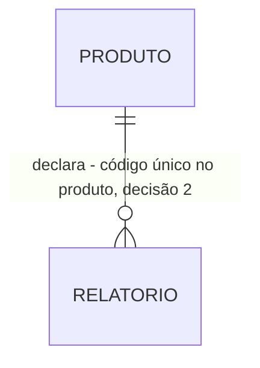

# Catálogo derivado do código: o módulo anuncia, a aplicação edita e inativa

> Build this with **tlc-implement**.
> Every criterion below becomes a check with a proof, referenced by its number. Nothing under
> `Unresolved` gets settled while building.

## Intent

O sistema não sabe quais produtos e quais relatórios existem. Sem esse conjunto conhecido, não há o
que reservar no ciclo diário, não há a que conceder permissão e não há o que listar para o usuário.
A fonte é explícita sobre o custo do caminho alternativo, e é o motivo de esta task existir com a
forma que tem: um catálogo cadastrável pela aplicação permitiria criar a sigla `SEGUROS` sem módulo,
sem base, sem JRXML e sem task na DAG — e, sob a reserva do ciclo, esse cadastro geraria execuções
que nenhum contêiner apuraria, todas viram erro, e um cadastro derrubaria a métrica primária
(ADR-0002). O `prd.md` não quantifica quantas vezes isso aconteceu, porque o sistema não existe.

Quando isto existir, cada módulo processador anuncia o seu produto e os seus relatórios ao iniciar,
e o ADMINISTRADOR edita pela aplicação apenas o que é genuinamente mutável — nome do produto e nome,
descrição e tempo estimado do relatório — e inativa. Não cria e não apaga. A tela é
`catálogo (ADMINISTRADOR)`, e o seu padrão visual está em aberto: ver `Unresolved` 2.

11 criteria in 2 slices · 4 one-way doors · 3 open, of which 2 block

## Criteria

### Publicação do catálogo na inicialização do módulo

1. Quando um módulo processador inicia, então a sigla do seu produto e, para cada relatório declarado, código, nome, descrição e tempo estimado inicial são publicados no schema de controle.
2. Se dois relatórios declarados pelo mesmo módulo processador carregam o mesmo código, então a inicialização do módulo aborta com código de saída diferente de 0.
3. Se um relatório declara tempo estimado que não seja inteiro maior que 0 segundos, então a inicialização do módulo aborta com código de saída diferente de 0.
4. Se a sigla do produto não casa com `^[A-Z]{1,20}$`, ou o código do relatório não casa com `^[A-Z]{1,20}-\d{4}$`, então a inicialização do módulo aborta com código de saída diferente de 0.
5. Quando um módulo processador reinicia e o relatório já consta do catálogo, então nome, descrição e tempo estimado já ajustados pela operação permanecem inalterados, e apenas a existência do relatório é reafirmada.

### Edição e inativação pelo ADMINISTRADOR

6. Quando um ADMINISTRADOR edita o catálogo, então apenas nome do produto e nome, descrição e tempo estimado do relatório são persistidos, e sigla e código permanecem inalterados.
7. Se um usuário de perfil diferente de ADMINISTRADOR solicita edição ou inativação de produto ou de relatório, então a resposta é `403` e nada é persistido.
8. Se a edição do tempo estimado faz a soma dos tempos estimados dos relatórios ativos do produto ultrapassar 600 segundos, então a edição é recusada com `409`.
9. Se um ADMINISTRADOR solicita a inativação de um produto que ainda tem ao menos um relatório ativo, então a solicitação é recusada com `409`.
10. Quando um produto ou relatório é inativado, então ele sai da listagem, e as linhas de execução, auditoria e download que o referenciam permanecem íntegras e legíveis.
11. Sempre, nenhuma rota e nenhuma rotina executa remoção física de linha de catálogo.

## States

`ativo` e `inativado` são do Produto e do Relatório. Não há aresta de volta: a reativação não é
declarada em fonte alguma, e é o que `Unresolved` 1 pergunta.

```mermaid
stateDiagram-v2
    [*] --> ativo: módulo processador publica na inicialização (1)
    ativo --> ativo: ADMINISTRADOR edita atributo mutável (6)
    ativo --> ativo: módulo reinicia e reafirma a existência, sem sobrescrever (5)
    ativo --> inativado: ADMINISTRADOR inativa; produto exige zero relatórios ativos (9, 10)
    inativado --> inativado: permanece referenciável por execução, auditoria e download (10, 11)
```

## Out of scope

- Criação e remoção de produto e de relatório pela aplicação — o catálogo é derivado do código; produto novo é módulo novo (RN-49, ADR-0002)
- Edição da sigla do produto e do código do relatório — ambos compõem caminho de artefato imutável, fixado em T3
- Os relatórios de exemplo em si, seus JRXML e seus modelos de dados — T3 e `Unresolved` de lá; T2 entrega o mecanismo de declaração, não o conteúdo declarado

## Observable

| Surface | Decision | Landing |
| --- | --- | --- |
| tela `catálogo (ADMINISTRADOR)` | estado de erro | 8, 9 |
| tela `catálogo (ADMINISTRADOR)` | estado não autorizado | 7 |
| tela `catálogo (ADMINISTRADOR)` | estado vazio | Unresolved 2 |
| tela `catálogo (ADMINISTRADOR)` | estado de carregamento | Unresolved 2 |
| tela `catálogo (ADMINISTRADOR)` | ordenação e densidade | Unresolved 2 |
| tela `catálogo (ADMINISTRADOR)` | ação destrutiva confirma antes de agir | n/a - não existe remoção nesta task; a inativação é recusável, reversível apenas por decisão futura e não destrói nada (10, 11) |
| API `PATCH /api/v1/produtos/{sigla}` e `PATCH /api/v1/relatorios/{codigo}` | forma do erro e seus códigos | 8, 9; o envelope é a porta registrada em `Decided` e provado em T8 |
| API `POST /api/v1/produtos/{sigla}/inativacao` e `.../relatorios/{codigo}/inativacao` | quem pode chamar | 7 |
| API `todas as rotas de catálogo` | versionamento | n/a - versão única em mono repositório e nenhum consumidor externo à pilha; prefixo `/api/v1` fixo (RA-01) |
| API `todas as rotas de catálogo` | limite de requisição | n/a - ambiente local, sem exposição externa (RA-50) |
| coleção `catálogo` | critério de agrupamento e ordenação | Unresolved 2 |
| coleção `catálogo` | nomeação | 4 — sigla e código obedecem regex fixo e são imutáveis |
| coleção `catálogo` | duplicatas | 2 |
| coleção `catálogo` | a exceção que não encaixa | 10 — o item inativado sai da listagem e continua referenciável |

## Swept

- validation: 3, 4, 8
- failure modes: 2 — a violação de unicidade impede o módulo de subir, em vez de virar mensagem de formulário
- idempotency and retry: 5 — a publicação na inicialização é reexecutada a cada restart e não sobrescreve o que a operação ajustou
- authorization: 7
- concurrency and ordering: Unresolved 3
- data lifecycle: 10, 11
- external-dependency failure: n/a - a única dependência externa de T2 é o PostgreSQL do schema de controle, e a indisponibilidade dele impede o módulo de iniciar e derruba o `readiness` da API, que é comportamento de T1 (`Unresolved` 2 de lá)
- state transitions: 10 — ver `States`
- observability: n/a - a fonte não declara métrica nem log próprio do catálogo; o Correlation ID e o envelope de erro que estas rotas emitem são provados em T8

## Impact

| Front | What changes |
|---|---|
| domínio | termo novo: `Produto` — domínio de negócio com base transacional própria, conjunto fechado e definido em código; vira entidade do schema de controle, publicada pelo módulo processador |
| domínio | termo novo: `Relatório` — a definição de uma apuração, não o arquivo; vira entidade do schema de controle |
| domínio | termo novo: `Sigla` — identificador do produto, `^[A-Z]{1,20}$`, declarado em código e imutável; nunca derivado do nome |
| domínio | termo novo: `Código do relatório` — `SIGLA-NNNN`, único dentro do produto e imutável; T3 o usa como caminho de artefato, e renomeá-lo depois moveria objetos já gravados |
| domínio | termo novo: `Inativação` — retirada do catálogo visível, sem apagar nada; quem escrever "remoção" ou "exclusão" implementa a alternativa que ADR-0007 rejeitou |
| dado armazenado | nada a migrar: não há base nem linha em produção. **A primeira migration do Flyway nasce aqui**, e nenhuma migration aplicada é alterada depois (RA-24) |
| dado armazenado | a unicidade da sigla e a dos 4 dígitos dentro do produto nascem com a tabela vazia, então não há par preexistente que possa fazer o índice falhar ao ser criado |

## Decided

| Decision | Shape | Alternative rejected |
|---|---|---|
| O catálogo é derivado do código | as tabelas de Produto e Relatório não têm rota de criação nem de remoção; a linha nasce na inicialização do módulo e a aplicação escreve apenas nome, descrição e tempo estimado | catálogo como dado livre, com telas de cadastro — cadastrar uma sigla sem módulo gera execuções reservadas que nenhum contêiner apura, todas viram erro, e um cadastro derruba a métrica primária (ADR-0002) |
| Sigla única no sistema e 4 dígitos únicos dentro do produto, ambos imutáveis | restrição de unicidade no schema de controle sobre `sigla`, e sobre o par `produto + código`; nenhuma rota expõe escrita nesses campos | unicidade só validada na aplicação — a violação de RN-03 passaria a ser persistível, e o caminho de artefato de T3 deixaria de ser estável |
| Inativação lógica, sem remoção física | coluna de inativação no catálogo; nenhum `DELETE` de linha de catálogo em rota ou rotina | remoção física com bloqueio dentro da janela de retenção — apagar um relatório destruiria as execuções dos 30 dias e mudaria retroativamente a métrica primária; métrica que muda o passado não é métrica (ADR-0007). **O código `SIGLA-NNNN` fica ocupado para sempre** |
| Envelope de erro da API | corpo com momento do erro em ISO 8601, descrição e Correlation ID, em toda resposta de erro de `/api/v1` | deixar o formato para o primeiro handler que precisar dele. **Esta porta alcança além de T2:** T2 é a primeira task com rota que devolve `400`, `403`, `404` e `409`, e o envelope escrito aqui é o que as tasks 4 a 7 copiam. Os critérios que o provam são de T8, que não o redecide |

## Relations

## Surface

| Route | In | Out | Status | Criteria |
|---|---|---|---|---|
| `PATCH /api/v1/produtos/{sigla}` | `nome` | o produto | `200`, `400`, `401`, `403`, `404` | 6, 7 |
| `POST /api/v1/produtos/{sigla}/inativacao` | `sigla` | — | `204`, `401`, `403`, `404`, `409` | 7, 9, 10 |
| `PATCH /api/v1/relatorios/{codigo}` | `nome`, `descricao`, `tempoEstimadoSegundos` | o relatório | `200`, `400`, `401`, `403`, `404`, `409` | 3, 6, 7, 8 |
| `POST /api/v1/relatorios/{codigo}/inativacao` | `codigo` | — | `204`, `401`, `403`, `404` | 7, 10 |

## Sources

- `.specs/features/scheduler-jasper-report/plan.md` — fatia S2; os critérios 1 a 4 e 6 a 11 desta task correspondem aos AC 6 a 14 de lá. **O critério 5 e o critério 7 não têm AC correspondente** e são derivados da fonte: o 5 de RN-04 ("o valor inicial vem do código; a operação pode ajustá-lo"), o 7 da matriz de perfis do `prd.md` §3.2 somada aos `403` que a própria tabela `Surface` do plano já declara
- `docs/adr/0002-catalogo-derivado-do-codigo.md` — **vinculante** para a decisão 1 e as suas consequências
- `docs/adr/0007-inativacao-logica-e-tres-retencoes.md` — **vinculante** para a decisão 3
- `docs/prd.md` — RN-01 a RN-05, RN-48 a RN-50, §3.2; `docs/glossario.md` — Produto, Sigla, Relatório, Código do relatório, Catálogo, Inativação
- Nenhum design é vinculante: `docs/design/design-system.md` não existe (`Unresolved` 2)

This task is the record of decision. If a linked document diverges, ask before building.

## Unresolved

| # | Kind | Question | Until answered |
|---|---|---|---|
| 1 | blocks | A republicação do catálogo na inicialização reativa um relatório ou produto que o ADMINISTRADOR havia inativado? | os critérios 1 e 10 se contradizem no restart, e todo deploy é um restart: um reafirma a existência de tudo que o módulo declara, o outro tirou um item da listagem. Recomendação: não reativa — a inativação é decisão da operação e sobrevive ao restart, pelo mesmo motivo que os atributos editados sobrevivem no critério 5. Nada foi escrito no critério 10 enquanto não houver resposta |
| 2 | blocks | `docs/design/design-system.md`, exigido como P2 pelo guia, não existe | a tela `catálogo (ADMINISTRADOR)` não tem padrão de vazio, de carregamento nem de ordenação, e as quatro linhas correspondentes de `Observable` ficam sem aterrissagem. A primeira tela nasce fora do padrão, que é exatamente o que o guia diz para evitar |
| 3 | open | Duas edições simultâneas de tempo estimado no mesmo produto podem cada uma passar no teto de 600 segundos e, juntas, ultrapassá-lo | escrito assim: o critério 8 é verificado por leitura e escrita, sem trava declarada. Se a resposta exigir garantia, o mecanismo é persistido — trava ou restrição no schema — e vira porta nova em `Decided` |
