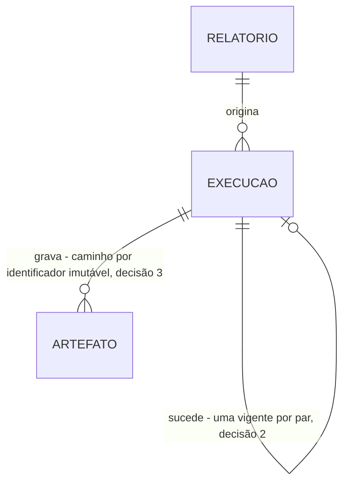

# Ciclo diário de coleta: reservar, apurar numa janela e registrar o que aconteceu

> Build this with **tlc-implement**.
> Every criterion below becomes a check with a proof, referenced by its number. Nothing under
> `Unresolved` gets settled while building.

## Intent

A base transacional de cada produto só suporta ser lida numa janela controlada, e hoje toda
solicitação de relatório vai direto a ela e concorre com a operação do produto — no fim do mês, que
é quando mais se pede relatório e quando a base está mais carregada. Não existe nenhum lugar onde o
dado já esteja apurado e congelado por data. Quem opera descobre que a apuração falhou quando o
usuário reclama, porque uma execução travada é indistinguível de uma que ainda está rodando. O
`prd.md` descreve essas consequências por pessoa e **não traz número algum** — nem volume de
solicitações, nem tempo de espera, nem custo de contenção.

Quando isto existir, um ciclo às 03h00 reserva uma Execução por relatório ativo antes de qualquer
contêiner subir, abre uma janela de leitura por produto, grava dois artefatos irmãos por relatório
concluído e registra status, duração e origem numa tabela que é a fonte da verdade. Não há tela
nesta task: o orquestrador não é exposto ao usuário final, e o estado observável do ciclo é a tabela
de Execução.

20 criteria in 4 slices · 5 one-way doors · 3 open, of which 1 blocks go-live

## Criteria

### Disparo, reserva e data de referência

1. Sempre, o ciclo de coleta é disparado diariamente às 03h00 no fuso `America/Sao_Paulo`, todos os dias.
2. Sempre, a DAG declara `catchup=False`, de modo que subir a DAG com `start_date` no passado não produza nenhuma execução retroativa.
3. Quando o ciclo é disparado, então uma Execução por relatório ativo é criada antes de qualquer contêiner de produto subir, com data/hora de início nula e origem `agendada`.
4. Sempre, no máximo 2 produtos são apurados simultaneamente.
5. Sempre, a data de referência é derivada do disparo do ciclo, e nenhuma interface — aplicação, orquestrador ou reprocessamento — a aceita como entrada.

### Janela de leitura, teto do dataset e artefato

6. Quando a apuração de um relatório conclui sem falha, então um `.jrprint` e um `.csv.gz` são gravados sob `{yyyy-MM-dd}/{SIGLA}/{SIGLA-NNNN}` no repositório de artefatos.
7. Quando uma execução conclui, então os artefatos são gravados antes do registro do status de conclusão, nunca na ordem inversa.
8. Sempre, todo statement de leitura da Coleta declara `queryTimeout`.
9. Se a contagem prévia de linhas do dataset de um relatório ultrapassa 50.000, então a execução encerra como `processado com erro` com motivo explícito, e o relatório não chega a ser apurado.

### Classificação do status

10. Quando uma Execução é disparada, então o tempo estimado vigente naquele momento é copiado para dentro dela.
11. Quando a apuração conclui sem nenhuma falha e a duração não ultrapassa o tempo estimado copiado na própria Execução, então o status registrado é `processado com sucesso`.
12. Quando a apuração conclui sem nenhuma falha e a duração ultrapassa o tempo estimado copiado na própria Execução, então o status registrado é `processado com alerta`.
13. Se qualquer falha é registrada durante a apuração, então o status registrado é `processado com erro`, inclusive quando a duração também tiver ultrapassado o tempo estimado.
14. Quando a apuração de um relatório atinge o dobro do tempo estimado copiado na Execução, então somente esse relatório é abortado como `processado com erro`, e os demais relatórios do mesmo produto seguem sendo apurados.

### Encerramento anômalo, retentativa e vigência

15. Quando o contêiner de um produto termina de forma anômala, então toda Execução daquele produto que ficou aberta encerra como `processado com erro`, inclusive as reservadas que nunca chegaram a iniciar.
16. Quando uma Execução termina em `processado com erro` e ainda restam retentativas no ciclo, então uma nova Execução de origem `retentativa` é criada e a anterior passa a não-vigente.
17. Sempre, no máximo 2 retentativas por relatório ocorrem dentro de um mesmo ciclo.
18. Se existe Execução do par em `em processamento`, então nova execução do mesmo par é recusada.
19. Sempre, o status de uma Execução já terminal nunca é alterado.
20. Sempre, existe no máximo uma Execução vigente para o par data de referência + código do relatório.

## States

Há **quatro** status, e `em processamento` é o único não-terminal. A Execução reservada carrega esse
mesmo status e se distingue pela data/hora de início nula (RA-14) — não é um quinto status. As
arestas de saída dos dois status de sucesso existem para tornar visível que não há nenhuma: a
Execução é append-only, e a retentativa cria linha nova em vez de reabrir a anterior.

```mermaid
stateDiagram-v2
    [*] --> em_processamento_reservada: reserva do ciclo, início nulo, origem agendada (3)
    em_processamento_reservada --> em_processamento: o contêiner do produto inicia a apuração e preenche o início (10)
    em_processamento_reservada --> processado_com_erro: o contêiner termina de forma anômala sem chegar a iniciar (15)
    em_processamento --> processado_com_sucesso: conclui sem falha, dentro do tempo estimado copiado (11)
    em_processamento --> processado_com_alerta: conclui sem falha, acima do tempo estimado copiado (12)
    em_processamento --> processado_com_erro: falha registrada, dobro do tempo estimado, teto do dataset ou fim anômalo (9, 13, 14, 15)
    processado_com_erro --> em_processamento_reservada: retentativa cria Execução nova; a anterior passa a não-vigente (16, 17)
    processado_com_sucesso --> processado_com_sucesso: terminal, status nunca alterado (19)
    processado_com_alerta --> processado_com_alerta: terminal, status nunca alterado (19)
```

## Out of scope

- Cancelamento de execução em andamento — o único interruptor é o tempo; derrubar a task no Airflow segue disponível como ação de operação, fora da aplicação, e o seu efeito é o critério 15 (ADR-0001)
- Apuração retroativa e qualquer parâmetro de data de referência — critérios 2 e 5, e ADR-0005
- Reprocessamento forçado e a recusa auditada de par já concluído — T6
- Expurgo dos artefatos gravados aqui — T7
- A métrica que lê esta tabela e as suas labels — T8
- Exportação em qualquer formato — T5; esta task grava os dois artefatos e não os converte

## Observable

| Surface | Decision | Landing |
| --- | --- | --- |
| tarefa agendada `dag-coleta-diaria` | formato e verbosidade da saída | n/a - o orquestrador não é exposto ao usuário final (RA-13), e o estado observável do ciclo é a tabela de Execução (3, 15) |
| tarefa agendada `dag-coleta-diaria` | flags e seus padrões | 2, 5 — `catchup=False` declarado e nenhum parâmetro de data de referência; o parâmetro `forcar_reprocessamento` é de T6 |
| tarefa agendada `dag-coleta-diaria` | código de saída da task | 15 |
| tarefa agendada `dag-coleta-diaria` | falha no meio do caminho | 14, 15, 16 |
| tarefa agendada `task de produto` | o que acontece quando um item falha e os outros não | 14 |

Nenhuma tela, rota, documento ou coleção é exposta por T3.

## Swept

- validation: 9 — a contagem prévia recusa o dataset acima do teto antes de apurar, e não como falha de memória dias depois na exportação
- failure modes: 13, 15
- idempotency and retry: 16, 17
- authorization: n/a - o ciclo é disparado por relógio, não por usuário; a autorização do disparo sob demanda é T6
- concurrency and ordering: 4, 7, 18 — pool de 2 produtos, artefato gravado antes do status, e par em curso recusa nova execução
- data lifecycle: 6 — a gravação; o expurgo e as três retenções são T7
- external-dependency failure: 8, 15 — `queryTimeout` na base transacional e fim anômalo do contêiner. A indisponibilidade do MinIO na gravação está em `Unresolved` 3
- state transitions: 11, 12, 13, 14, 16, 19, 20 — ver `States`
- observability: n/a - a fonte não declara métrica própria do ciclo nesta fatia; a tabela de Execução é o registro, e as labels que a tornam métrica são o critério de T8

## Impact

| Front | What changes |
|---|---|
| domínio | termo novo: `Execução` — uma apuração do par Relatório + Data de referência, e um **registro imutável de um evento**, não uma linha que representa o estado atual do par |
| domínio | termo novo: `Execução vigente` — um **ponteiro**, não um status. Quem escrever "última execução" lê errado: existem não-vigentes, as que falharam antes de uma retentativa e as invalidadas por T6. Hoje não há consumidor para errar, e é por isso que o nome precisa nascer certo |
| domínio | termo novo: `Data de referência` — rotula o **dia da apuração**, e o artefato de 09/08 contém o movimento fechado de 08/08. Qualquer relatório, tela ou métrica que trate o rótulo como dia do movimento erra por um dia |
| domínio | termo novo: `Origem da execução` — `agendada`, `retentativa` ou `reprocessamento forçado`; sem ela, a métrica de apuração e a de instabilidade se contaminam |
| domínio | termo novo: `Artefato` — o resultado gravado de uma Execução bem-sucedida, e o único insumo da Exportação de T5 |
| domínio | termo novo: `Janela de leitura` — no máximo uma bem-sucedida por relatório por dia; uma que falhou não entregou nada e pode ser reaberta pela retentativa, que relê só o que não concluiu |
| dado armazenado | nada a migrar; as tabelas de Execução e de Artefato nascem em migration nova sobre o schema criado em T2, e nenhuma migration aplicada é alterada (RA-24) |
| dado armazenado | a unicidade parcial do critério 20 nasce com a tabela vazia, então não há par preexistente capaz de fazer o índice falhar na criação |
| dependência externa | as bases transacionais dos 5 produtos **não existem** e serão schemas semeados com dado sintético; todo número medido contra elas é sintético até haver base real |

## Decided

| Decision | Shape | Alternative rejected |
|---|---|---|
| Artefato persistido como `JasperPrint` serializado, em dois arquivos irmãos | por execução, `<SIGLA-NNNN>.jrprint` (serialização Java nativa) e `<SIGLA-NNNN>.csv.gz` (separador `;`) | preencher o relatório de novo na exportação — reabriria a base transacional, e isso quebra a janela única. **Esta porta alcança T5:** as fontes não vão embutidas no `.jrprint`, então quem exporta precisa das mesmas *font extensions* no classpath, e os renderers de barcode precisam do mesmo jar (`arquitetura-inicial.md` §12) |
| Execução append-only com ponteiro de vigência | unicidade parcial do par data de referência + código do relatório restrita às linhas vigentes, e nenhum `UPDATE` de status: retentativa e reprocessamento inserem linha nova | uma linha por par, atualizada a cada tentativa — apaga a série de tentativas que a métrica de 30 dias precisa ler, e faz RN-15 cair (ADR-0004) |
| Caminho do artefato por identificadores imutáveis | `{yyyy-MM-dd}/{SIGLA}/{SIGLA-NNNN}.jrprint` e `.csv.gz` no bucket | caminho pelo nome do produto — o nome é editável em T2, e o caminho mudaria por baixo de artefatos já gravados |
| `catchup=False` declarado na DAG | `catchup=False` escrito explicitamente na construção da DAG, junto do `start_date` | confiar no padrão do Airflow — é `True` no 2.x, e uma run por dia perdido carimbaria data antiga com o dado de hoje: a corrupção que ADR-0005 proíbe, entrando por omissão |
| Tempo estimado copiado para dentro da Execução | a Execução carrega o valor vigente no momento do disparo, e alerta, limite e métrica leem essa cópia | ler o catálogo na hora de classificar — editar o tempo em T2 reclassificaria execuções passadas, e a série deixaria de ser comparável |

Os dois limites de tempo do critério 14 e do critério 15 não são o mesmo prazo escrito duas vezes:
o do relatório é regra de negócio, vive dentro do contêiner e é verificado entre chunks; o de
segurança é `execution_timeout` da task e existe para o caso de a apuração estar travada a ponto de
não conseguir aplicar o próprio limite. O `queryTimeout` do critério 8 é o que impede uma chamada
JDBC travada de tornar o limite interno inexistente sem que ninguém perceba.

## Relations



## Sources

- `.specs/features/scheduler-jasper-report/plan.md` — fatia S3; os critérios 1 a 19 desta task correspondem aos AC 15 a 33 de lá. **O critério 20 não tem AC correspondente** e é derivado de RN-16 somado à porta 2 do plano, que declara a unicidade parcial sem que nenhum AC a afirme
- `docs/adr/0001-janela-de-leitura-unica-e-sem-cancelamento.md` — **vinculante** para a ausência de cancelamento e para os dois limites
- `docs/adr/0004-execucao-append-only-com-ponteiro-de-vigencia.md` — **vinculante** para a decisão 2 e para os critérios 16, 19 e 20
- `docs/adr/0005-sem-apuracao-retroativa.md` — **vinculante** para os critérios 2 e 5
- `docs/prd.md` — RN-06 a RN-19, RN-44 a RN-47, RN-52, RN-54; RNF-03, RNF-04, RNF-06, RNF-17 a RNF-20
- `docs/arquitetura-inicial.md` — RA-09 a RA-11, RA-14, RA-16, RA-17, RA-19, RA-54 a RA-57, RA-64, RA-65, RA-67
- Nenhum design é fonte desta task: T3 não tem tela

This task is the record of decision. If a linked document diverges, ask before building.

## Unresolved

| # | Kind | Question | Until answered |
|---|---|---|---|
| 1 | blocks go-live | Quais são os dois relatórios de exemplo de cada produto, e qual o modelo de dados de cada um (RA-08)? | nada real pode ser apurado: os critérios 6 e 9 não têm relatório nem dataset sobre o qual rodar, e as bases transacionais dos 5 produtos não existem. As provas podem ficar verdes contra dado sintético e ainda assim nenhum relatório de verdade sai |
| 2 | open | Os limites recalibrados do `prd.md` §10 resistem à medição com k6 (Q10)? | RNF-05 e RNF-06 seguem `PROVISÓRIO`, e o número 50.000 do critério 9 pode mudar. O critério é escrito com o número atual |
| 3 | open | O que a Coleta faz quando o MinIO não responde na gravação do artefato? | escrito assim: a falha de gravação é uma falha registrada e cai no critério 13, `processado com erro`, sem retentativa própria de gravação. Se a resposta exigir retentativa de gravação, ela é mecanismo novo e o critério 16 ganha um caso que hoje não tem |
