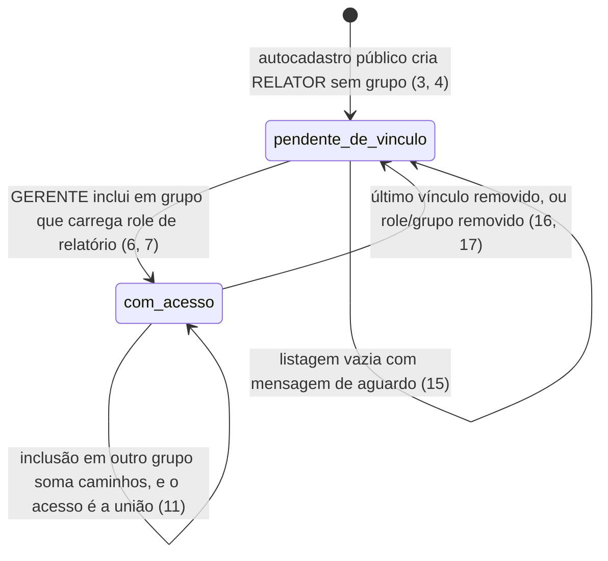
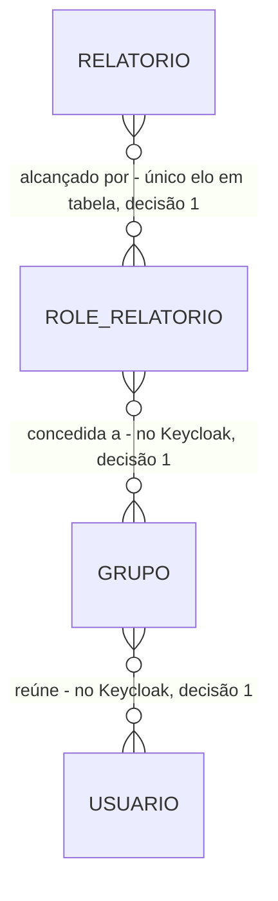

# Acesso: quem entra alcança exatamente o que lhe foi concedido

> Build this with **tlc-implement**.
> Every criterion below becomes a check with a proof, referenced by its number. Nothing under
> `Unresolved` gets settled while building.

## Intent

Quem administra o acesso concede permissão caso a caso, e a permissão fica dispersa e não auditável:
não há como conceder acesso a um **conjunto** de relatórios de uma vez, nem como revogá-lo de uma
vez. Quem responde por uma área depende de TI para cada concessão, e ninguém consegue responder
"quem enxerga este relatório hoje" sem inspecionar concessão por concessão. O `prd.md` descreve isso
por pessoa e não o quantifica — não há número de solicitações de acesso nem tempo de atendimento.

Quando isto existir, o GERENTE cria roles de relatório, vincula-as a relatórios e a grupos, e move
pessoas entre grupos; o RELATOR enxerga a união de todos os caminhos da sua cadeia e nada além
dela; e o GERENTE não consegue promover ninguém, nem a si mesmo, porque Perfil e Role de relatório
são objetos de tipos distintos em espaços de nomes distintos. As telas são `autocadastro` e
`roles e grupos (GERENTE)`, e o seu padrão visual está em aberto: ver `Unresolved` 2.

17 criteria in 3 slices · 3 one-way doors · 3 open, of which 2 block

## Criteria

### Identidade e perfis

1. Quando o contêiner do Keycloak inicia, então um usuário de perfil ADMINISTRADOR é criado com a senha lida de variável de ambiente.
2. Sempre, Perfil é realm role e Role de relatório é client role do cliente `relatorios`, em espaços de nomes distintos.
3. Quando um visitante conclui o autocadastro público, então um usuário de perfil RELATOR é criado sem nenhum grupo.
4. Se uma requisição de autocadastro informa perfil, então o campo é ignorado e o usuário é criado como RELATOR.
5. Quando um usuário de qualquer perfil troca a própria senha ou solicita recuperação por e-mail, então a operação conclui e a mensagem chega ao Mailpit.

### Administração do acesso

6. Quando um GERENTE cria uma role de relatório e a vincula a relatórios e a grupos, então essa role passa a alcançar aqueles relatórios a partir daqueles grupos.
7. Quando um GERENTE inclui ou remove um usuário RELATOR em um grupo, então a pertinência do usuário ao grupo reflete a operação.
8. Quando um ADMINISTRADOR cadastra ou remove um usuário ADMINISTRADOR ou GERENTE, então o usuário passa a existir com o perfil informado, ou deixa de existir.
9. Quando um ADMINISTRADOR ou um GERENTE remove um usuário RELATOR, então o usuário deixa de existir.
10. Se um GERENTE tenta criar ou promover um usuário a GERENTE ou a ADMINISTRADOR, inclusive manipulando a requisição diretamente, então a resposta é `403`.

### Acesso efetivo

11. Quando um RELATOR lista relatórios, então a listagem contém exclusivamente os alcançados pela união de todos os caminhos da sua cadeia de permissão.
12. Se um RELATOR requisita diretamente um relatório fora da sua cadeia de permissão, então a resposta é `403`.
13. Quando um ADMINISTRADOR lista ou exporta, então o acesso é concedido a todos os relatórios sem consulta à cadeia de permissão.
14. Se um GERENTE solicita exportação de qualquer relatório, então a resposta é `403`.
15. Enquanto um RELATOR não pertence a nenhum grupo, a sua listagem de relatórios vem vazia, acompanhada da mensagem de que as permissões ainda não foram configuradas.
16. Quando o vínculo de um usuário a um grupo é removido, então o acesso aos relatórios correspondentes é negado já na requisição seguinte.
17. Quando uma role de relatório ou um grupo é removido, então o acesso que eles concediam cessa, e os demais caminhos da cadeia permanecem intactos.

## States

O ciclo de vida é o do acesso de um usuário RELATOR, não o do usuário.

## Out of scope

- MFA, rotação obrigatória da senha inicial do ADMINISTRADOR e verificação de e-mail obrigatória no autocadastro — fora desta versão (`prd.md` §5)
- Moderação ou fila de aprovação do autocadastro, e grupo padrão — não há acesso concedido por omissão; todo acesso passa pela cadeia (D32)
- A exportação em si e a listagem navegável — T5; esta task entrega quem pode, não o quê sai
- Administração do catálogo — T2

## Observable

| Surface | Decision | Landing |
| --- | --- | --- |
| tela `autocadastro` | estado de erro e mensagem de conclusão | 3, 4 |
| tela `autocadastro` | estado de carregamento e densidade | Unresolved 2 |
| tela `pendente de vínculo` | estado vazio | 15 |
| tela `roles e grupos (GERENTE)` | estado não autorizado | 10 |
| tela `roles e grupos (GERENTE)` | estado vazio, ordenação e densidade | Unresolved 2 |
| tela `roles e grupos (GERENTE)` | ação destrutiva confirma antes de agir | Unresolved 2 — a remoção de role, de grupo e de usuário (9, 17) é destrutiva e irreversível, e é a única desta natureza no sistema; não há padrão de confirmação declarado |
| API `POST /api/v1/roles-relatorio`, `POST /api/v1/grupos`, `POST /api/v1/usuarios-administrativos` | quem pode chamar | 8, 10 |
| API `PUT /api/v1/grupos/{id}/usuarios` e `PUT /api/v1/roles-relatorio/{nome}/relatorios` | forma do erro e seus códigos | 10; o envelope é a porta registrada em T2 e provado em T8 |
| API `todas as rotas de acesso` | versionamento | n/a - versão única em mono repositório e nenhum consumidor externo à pilha; prefixo `/api/v1` fixo (RA-01) |
| API `todas as rotas de acesso` | limite de requisição | n/a - ambiente local, sem exposição externa (RA-50) |
| documento `mensagem de pendente de vínculo` | o que o leitor faz em seguida | 15 |
| coleção `grupos e roles de relatório` | critério de agrupamento, nomeação e ordenação | Unresolved 2 |
| coleção `grupos e roles de relatório` | duplicatas | n/a - o Keycloak recusa nome duplicado de client role e de grupo; a tabela `Surface` já declara o `409` correspondente |
| coleção `grupos e roles de relatório` | a exceção que não encaixa | 13 — o ADMINISTRADOR não passa pela cadeia e não aparece em coleção alguma dela |

## Swept

- validation: 4 — o campo de perfil na requisição de autocadastro é ignorado em vez de recusado, porque recusar informaria que o campo existe
- failure modes: 10, 12, 14
- idempotency and retry: n/a - os três vínculos usam `PUT` com substituição total da lista (ver `Surface`), idempotente por construção: repetir a mesma lista não muda estado nem resposta
- authorization: 10, 12, 13, 14 — o critério 13 é a única exceção de autorização do sistema e exige prova dedicada (RA-68)
- concurrency and ordering: Unresolved 1
- data lifecycle: 17 — remover role ou grupo revoga o que eles concediam sem afetar outros caminhos; nada do catálogo é tocado (T2, critério 11)
- external-dependency failure: Unresolved 3
- state transitions: 3, 6, 7, 15, 16, 17 — ver `States`
- observability: n/a - a fonte não declara métrica própria de acesso; o Correlation ID que estas rotas emitem é provado em T8

## Impact

| Front | What changes |
|---|---|
| domínio | termo novo: `Perfil` — ADMINISTRADOR, GERENTE ou RELATOR, conjunto **fechado** definido em código; um usuário tem exatamente um. Vive como realm role |
| domínio | termo novo: `Role de relatório` — permissão nomeada criada pelo GERENTE, conjunto **aberto**. É objeto de tipo diferente do Perfil, e essa diferença é o que impede um GERENTE de se promover. Vive como client role |
| domínio | termo novo: `Grupo` — coleção de usuários que recebe roles de relatório; o elo entre a permissão e a pessoa |
| domínio | termo novo: `Cadeia de permissão` — o caminho Relatório → Role de relatório → Grupo → Usuário, com todos os elos N:N e o acesso efetivo sendo a **união** de todos os caminhos |
| domínio | termo novo: `Pendente de vínculo` — RELATOR que se autocadastrou e não pertence a nenhum grupo. Entra na aplicação e não alcança nenhum relatório; não é "usuário inativo" nem "bloqueado" |
| dado armazenado | nada a migrar. Apenas **um** elo da cadeia vira tabela no schema de controle — Relatório → Role de relatório; Role, Grupo e pertinência vivem no Keycloak |
| dependência externa | o Keycloak passa a ser a fonte da verdade da autorização, e a API passa a consumir a sua Admin REST API com credencial de serviço |

## Decided

| Decision | Shape | Alternative rejected |
|---|---|---|
| Autorização partida entre Keycloak e schema de controle | Perfil = realm role (`ADMINISTRADOR`, `GERENTE`, `RELATOR`); Role de relatório = client role do cliente `relatorios`; o elo Relatório → Role de relatório = tabela no schema de controle | a cadeia inteira no Keycloak — ele não conhece o conceito de Relatório, então o elo não tem onde morar. E a cadeia inteira em tabela própria foi rejeitada por descartar grupos e mapeamento de roles nativos (ADR-0003) |
| Service account da API com permissões administrativas grossas | `manage-users` e `manage-clients` no realm | restringir o service account a gerir só o cliente `relatorios` — depende de *fine-grained admin permissions*, **preview** no Keycloak 26.5.2, e a segurança do sistema não se apoia num recurso preview. **Risco aceito e declarado:** a API tem tecnicamente poder de criar um ADMINISTRADOR; o que a impede é o critério 10 e a separação de espaços de nomes da decisão 1 |
| Grupo e role identificados pelos identificadores do Keycloak | `{id}` do grupo e `{nome}` da client role nas rotas | identificador próprio no schema de controle — criaria um segundo dono do mesmo objeto, e a decisão 1 já disse quem é o dono |

## Relations

## Surface

| Route | In | Out | Status | Criteria |
|---|---|---|---|---|
| `POST /api/v1/roles-relatorio` | `nome` | a role | `201`, `400`, `401`, `403`, `409` | 6, 10 |
| `PUT /api/v1/roles-relatorio/{nome}/relatorios` | lista de `codigo` | — | `204`, `400`, `401`, `403`, `404` | 6, 17 |
| `POST /api/v1/grupos` | `nome` | o grupo | `201`, `400`, `401`, `403`, `409` | 6, 10 |
| `PUT /api/v1/grupos/{id}/roles-relatorio` | lista de `nome` | — | `204`, `401`, `403`, `404` | 6, 17 |
| `PUT /api/v1/grupos/{id}/usuarios` | lista de `idUsuario` | — | `204`, `401`, `403`, `404` | 7, 16 |
| `POST /api/v1/usuarios-administrativos` | `email`, `perfil` | o usuário | `201`, `400`, `401`, `403`, `409` | 8, 10 |
| `DELETE /api/v1/usuarios/{id}` | `id` | — | `204`, `401`, `403`, `404` | 9, 10 |

O autocadastro e a troca de senha não aparecem aqui: são a página de registro e o Account Console do
Keycloak, expostos seletivamente pelo Traefik, e não rotas da API (RA-33, RA-34).

## Sources

- `.specs/features/scheduler-jasper-report/plan.md` — fatia S4; os critérios 1 a 5 e 10 a 16 desta task correspondem aos AC 34 a 45 de lá. **Os critérios 6, 7, 8, 9 e 17 não têm AC correspondente** e são derivados de RF-31, RF-32, RF-35, F15 e RF-43 do `prd.md`, cujas rotas o plano já lista em `Surface` sem que nenhum AC as afirme
- `docs/adr/0003-autorizacao-hibrida-keycloak-e-schema-de-controle.md` — **vinculante** para as decisões 1 e 2
- `docs/prd.md` — RN-22 a RN-29, §3.2 (matriz de perfis), RF-29 a RF-37, RF-43, RF-55
- `docs/arquitetura-inicial.md` — RA-30, RA-32 a RA-35, RA-61, RA-68
- `docs/glossario.md` — Perfil, Role de relatório, Grupo, Cadeia de permissão, Pendente de vínculo
- Nenhum design é vinculante: `docs/design/design-system.md` não existe (`Unresolved` 2)

This task is the record of decision. If a linked document diverges, ask before building.

## Unresolved

| # | Kind | Question | Until answered |
|---|---|---|---|
| 1 | blocks | Qual mecanismo faz o critério 16 valer "já na requisição seguinte", dado que as client roles e a pertinência a grupo viajam nos claims do JWT e um token emitido antes da desvinculação continua válido até expirar? As duas respostas defensáveis são: TTL curto de token, ou a API resolve grupo e role por requisição contra o Keycloak em vez de ler os claims | os critérios 16 e 17 afirmam que o acesso cessa e não apontam nada que o garanta. Sem a escolha, o acesso revogado permanece até o token expirar, e nenhum documento do projeto declara esse prazo. A escolha é porta: vira linha em `Decided` |
| 2 | blocks | `docs/design/design-system.md`, exigido como P2 pelo guia, não existe | as telas `autocadastro` e `roles e grupos (GERENTE)` não têm padrão de vazio, carregamento, ordenação nem confirmação de ação destrutiva, e quatro linhas de `Observable` ficam sem aterrissagem. A remoção de usuário e de grupo é a única ação irreversível do sistema e é justamente a que fica sem padrão de confirmação |
| 3 | open | O que a API responde quando o Keycloak não responde? | escrito assim: `503` com o envelope de erro registrado em `Decided` de T2, e nenhuma escrita parcial. Se a resposta for outra, os códigos das sete rotas de `Surface` ganham um caso |
