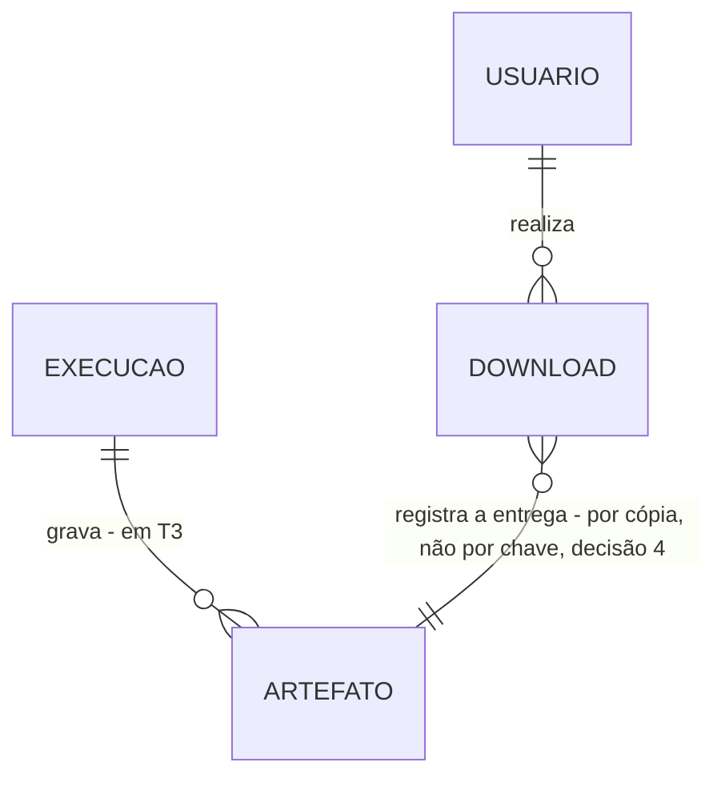

# Exportação: o relatório apurado sai no formato que o usuário precisa

> Build this with **tlc-implement**.
> Every criterion below becomes a check with a proof, referenced by its number. Nothing under
> `Unresolved` gets settled while building.

## Intent

Quem precisa do relatório não sabe se o dado está disponível, não sabe se o número que recebeu
ontem é o mesmo de hoje, e depende de alguém para obter o arquivo em formato diferente de PDF. O
dado apurado por T3 está gravado e não tem por onde sair: existe um `.jrprint` e um `.csv.gz` num
bucket, e nenhuma forma de um usuário autorizado chegar até eles. O `prd.md` descreve essa
dependência e não a quantifica — não há número de pedidos de conversão nem tempo de espera medido.

Quando isto existir, o usuário navega data de referência → produto → relatório, escolhe PDF, XLSX,
DOCX ou CSV, e recebe o arquivo na mesma requisição, sem que a base transacional do produto seja
tocada. Cada entrega deixa um registro que sobrevive ao artefato e à inativação do relatório. A tela
é `listagem de relatórios`, e o seu padrão visual está em aberto: ver `Unresolved` 1.

10 criteria in 3 slices · 4 one-way doors · 4 open, of which 2 block

## Criteria

### Navegar e obter o arquivo

1. Quando um usuário autorizado navega a listagem, então a data de referência aparece em `dd/MM/yyyy`, depois o produto, depois o relatório.
2. Quando um usuário autorizado solicita exportação de um par cuja execução vigente está em `processado com sucesso` ou `processado com alerta`, então o arquivo é devolvido na mesma resposta HTTP, sem que nenhum registro de status seja criado.
3. Se a execução vigente do par não está em `processado com sucesso` nem em `processado com alerta`, então a exportação é recusada com `409`.

### Os quatro formatos

4. Sempre, PDF, XLSX e DOCX são produzidos a partir do `.jrprint`, e o CSV a partir do `.csv.gz`, sem que nenhuma conexão com schema transacional seja aberta.
5. Quando a exportação em XLSX é gerada, então a planilha é contínua e o cabeçalho de coluna aparece exatamente uma vez.
6. Sempre, o CSV é entregue com separador `;` e apenas as colunas da consulta principal, sem subrelatório, sem imagem e sem formatação.
7. Se já existem 2 exportações em andamento, então a requisição excedente é recusada de imediato com `429` e indicação de repetir mais tarde, sem ser enfileirada.

### O registro da entrega

8. Quando um arquivo exportado é entregue, então um Download é registrado com cópia do código e do nome do relatório, da sigla do produto, da data de referência, do formato, do usuário e do momento.
9. Quando o ADMINISTRADOR consulta o histórico de downloads, então os identificadores aparecem como estavam no momento do download, mesmo após edição de nome ou inativação do relatório.
10. Sempre, a API expõe contador de exportações por formato e por desfecho — entregue, `409`, `410` e `429` — rotulado por sigla do produto e código do relatório.

## Out of scope

- Reexportação a partir de artefato expurgado — passada a retenção, aquela data deixa de existir para o sistema; a recusa `410` é de T7
- Cache do binário exportado e virtualização do `JasperPrint` — trocariam heap por disco, e o disco é o recurso mais escasso da máquina alvo
- Exportação assíncrona ou enfileirada — o critério 7 recusa em vez de enfileirar, porque o critério 2 exige resposta na mesma requisição
- A cadeia de permissão em si — T4; esta task consome o guard e não o redefine
- As labels da métrica de execução e a taxa de apuração limpa — T8; o critério 10 instrumenta a exportação, não a Coleta

## Observable

| Surface | Decision | Landing |
| --- | --- | --- |
| tela `listagem de relatórios` | estado não autorizado | existing - entregue por T4 (critérios 12 e 14) |
| tela `listagem de relatórios` | estado vazio | existing - entregue por T4 (critério 15), para o RELATOR pendente de vínculo |
| tela `listagem de relatórios` | estado de erro | 3 |
| tela `listagem de relatórios` | estado de carregamento | Unresolved 1 |
| tela `listagem de relatórios` | ordenação e densidade | Unresolved 1 |
| tela `listagem de relatórios` | ação destrutiva confirma antes de agir | n/a - exportar e baixar não destroem nada e são repetíveis |
| tela `histórico de downloads` | ordenação e paginação | Unresolved 1 |
| API `GET /api/v1/datas-referencia/.../exportacoes/{formato}` | forma do erro e seus códigos | 3, 7; o `410` é de T7 e o envelope é a porta registrada em T2 |
| API `GET /api/v1/datas-referencia/.../exportacoes/{formato}` | quem pode chamar | existing - entregue por T4 (critérios 11, 12, 13, 14) |
| API `GET /api/v1/datas-referencia/.../exportacoes/{formato}` | limite de simultaneidade | 7 |
| API `GET /api/v1/downloads` | quem pode chamar | existing - entregue por T4; o histórico é do ADMINISTRADOR (`prd.md` §3.2) |
| API `todas as rotas de exportação` | versionamento | n/a - versão única em mono repositório e nenhum consumidor externo à pilha; prefixo `/api/v1` fixo (RA-01) |
| documento `mensagem de recusa por simultaneidade` | o que o leitor faz em seguida | 7 — a indicação de repetir mais tarde é parte do critério |
| coleção `relatórios disponíveis` | critério de agrupamento e ordenação | 1 — data de referência, depois produto, depois relatório |
| coleção `relatórios disponíveis` | a exceção que não encaixa | existing - entregue por T2 (critério 10): o relatório inativado sai da listagem e o seu download histórico permanece |

## Swept

- validation: 4 — os quatro formatos e a origem de cada um são o conjunto fechado que a rota aceita
- failure modes: 3
- idempotency and retry: 8 — a exportação é deliberadamente **não** idempotente: cada entrega registra um Download novo, e é esse registro que o critério 9 consulta. Nada é deduplicado
- authorization: existing - entregue por T4 (critérios 11, 12, 13, 14)
- concurrency and ordering: 7
- data lifecycle: 9 — o histórico sobrevive à edição de nome e à inativação; o expurgo do artefato e a sobrevivência dos metadados são T7
- external-dependency failure: Unresolved 4
- state transitions: n/a - a Exportação **não tem status** e nunca é armazenada; o ciclo de vida de status pertence exclusivamente à Execução, em T3
- observability: 10

## Impact

| Front | What changes |
|---|---|
| domínio | termo novo: `Exportação` — conversão síncrona e sob demanda de um Artefato para um formato de entrega. Nunca é armazenada e **nunca tem status**; quem lhe der um status reintroduz o ciclo de vida que pertence à Execução |
| domínio | termo novo: `Download` — a entrega do arquivo a um usuário, registrada com cópia dos identificadores do momento; sobrevive ao expurgo do Artefato e à inativação do Relatório |
| domínio | termo existente: `Artefato` nasceu em T3 como saída da Coleta e passa a ser **o único insumo** da Exportação. Quem depende disso hoje: nada além desta task, e é por isso que o invariante "a exportação não abre conexão transacional" precisa de prova própria (critério 4) |
| dado armazenado | nada a migrar; a tabela de Download nasce em migration nova sobre o schema de T2, com as colunas copiadas da decisão 3 |
| dependência externa | a API passa a ler o bucket do MinIO; nenhuma base transacional é alcançada por ela, e qualquer dependência da API para um schema transacional é defeito |

## Decided

| Decision | Shape | Alternative rejected |
|---|---|---|
| Convenção de autoria do JRXML para o XLSX contínuo | em **todo** JRXML do projeto, o cabeçalho de coluna fica na banda `title`, renderizada uma vez; `pageHeader` e `pageFooter` guardam só ornamento descartável. A exportação XLSX exclui essas bandas por origem de elemento, com `onePagePerSheet(false)` e `removeEmptySpaceBetweenRows(true)` | configurar o exportador — `ignorePagination` age no preenchimento, não na exportação, e o print já está paginado; reconstruí-lo exigiria preencher de novo, o que fere a janela única. XLSX a partir do `.csv.gz` em streaming também foi rejeitado: perderia subtotais e totais de grupo, e o mesmo relatório exibiria conjuntos de linhas diferentes em PDF e em XLSX (ADR-0006). **Esta porta alcança todo relatório futuro:** cada um deve o teste do critério 5, ou a convenção apodrece no primeiro que alguém escrever sem ter lido isto |
| Três recusas de exportação com códigos distintos | `409` sem execução válida, `410` artefato expurgado, `429` semáforo cheio | um `400` genérico para as três — RN-39 exige mensagem distinta de indisponibilidade por retenção, e sem a distinção o frontend não sabe o que dizer ao usuário: esperar, pedir reprocessamento ou desistir |
| Semáforo de exportações, sem fila | permissões limitadas a 2 no processo da API; a requisição excedente é recusada de imediato | fila com espera — o critério 2 exige resposta na mesma requisição. O semáforo é o que mantém o consumo de memória num teto conhecido, e forma um teto único com o limite de artefato e o teto de linhas: afrouxar qualquer um dos três sozinho quebra os outros dois |
| Download guarda cópia dos identificadores | a linha copia código, nome do relatório, sigla do produto, data de referência e formato como estavam no instante da entrega | só chaves estrangeiras — o nome é editável em T2 e o relatório pode ser inativado; um histórico que "sobrevive indefinidamente" passaria a exibir o download de 2026 com o nome que o relatório ganhou em 2027 |

## Relations

## Surface

| Route | In | Out | Status | Criteria |
|---|---|---|---|---|
| `GET /api/v1/datas-referencia` | — | datas em `dd/MM/yyyy` com artefato disponível | `200`, `401` | 1 |
| `GET /api/v1/datas-referencia/{data}/produtos` | `data` | `sigla` · `nome` | `200`, `401`, `404` | 1 |
| `GET /api/v1/datas-referencia/{data}/produtos/{sigla}/relatorios` | `data`, `sigla` | `codigo` · `nome` · `status` | `200`, `401`, `403`, `404` | 1 |
| `GET /api/v1/datas-referencia/{data}/relatorios/{codigo}/exportacoes/{formato}` | `data`, `codigo`, `formato` | o arquivo, com `Content-Disposition` | `200`, `401`, `403`, `404`, `409`, `410`, `429` | 2, 3, 4, 5, 6, 7, 8 |
| `GET /api/v1/downloads` | período, `codigoRelatorio` | linhas com os identificadores copiados | `200`, `401`, `403` | 9 |

A data de referência aparece aqui como entrada e não contradiz o critério 5 de T3: a proibição vale
para a **apuração**, onde carimbar dado de hoje com rótulo de ontem grava número errado. Na
exportação a data é seletor de artefato já gravado, e ler o que já existe não corre esse risco.
A suposição segue não confirmada — é a primeira da tabela de suposições de `plan.md`.

## Sources

- `.specs/features/scheduler-jasper-report/plan.md` — fatia S5; os critérios 1 a 9 desta task correspondem aos AC 46 a 54 de lá. **O critério 10 não tem AC correspondente** e é derivado de `prd.md` §6, que exige as métricas secundárias de exportação mensuráveis sem consulta manual ao banco, sem que nenhum AC as instrumente. O critério afirma o contador, nunca a meta: `≤ 1%` é alvo de serviço e nenhuma execução única o satisfaz ou o refuta
- `docs/adr/0006-xlsx-do-jasperprint-com-convencao-de-autoria.md` — **vinculante** para a decisão 1 e para o critério 5
- `docs/prd.md` — RN-30 a RN-35, RN-38, RN-42, RN-53; RNF-05, RNF-07 a RNF-11
- `docs/arquitetura-inicial.md` — RA-17, RA-26, RA-27, RA-29, RA-59, RA-60, RA-66
- `docs/glossario.md` — Exportação, Download, Artefato
- Nenhum design é vinculante: `docs/design/design-system.md` não existe (`Unresolved` 1)

This task is the record of decision. If a linked document diverges, ask before building.

## Unresolved

| # | Kind | Question | Until answered |
|---|---|---|---|
| 1 | blocks | `docs/design/design-system.md`, exigido como P2 pelo guia, não existe | as telas `listagem de relatórios` e `histórico de downloads` não têm padrão de carregamento, ordenação nem paginação, e três linhas de `Observable` ficam sem aterrissagem. O critério 1 fixa a hierarquia da navegação e nada mais do que o usuário vê |
| 2 | blocks go-live | Quais são os dois relatórios de exemplo de cada produto, e qual o modelo de dados de cada um (RA-08)? | os critérios 5 e 6 não têm relatório sobre o qual rodar, e o critério 5 é exigido **por relatório**, não uma vez. As provas podem ficar verdes contra um relatório sintético e nenhum relatório real sair |
| 3 | open | Os limites recalibrados do `prd.md` §10 resistem à medição com k6 (Q10)? | RNF-05 e RNF-10 seguem `PROVISÓRIO`, e o número 2 do critério 7 pode mudar. O critério é escrito com o número atual |
| 4 | open | O que a exportação responde quando o MinIO não responde, caso distinto de artefato expurgado? | escrito assim: `503` com o envelope de erro registrado em `Decided` de T2, e o `410` fica reservado ao expurgo de T7. Confundir os dois faria o usuário concluir que o dado expirou quando o repositório apenas caiu |
