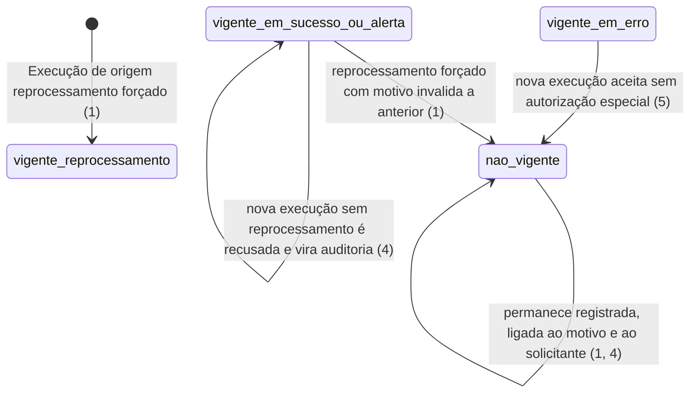
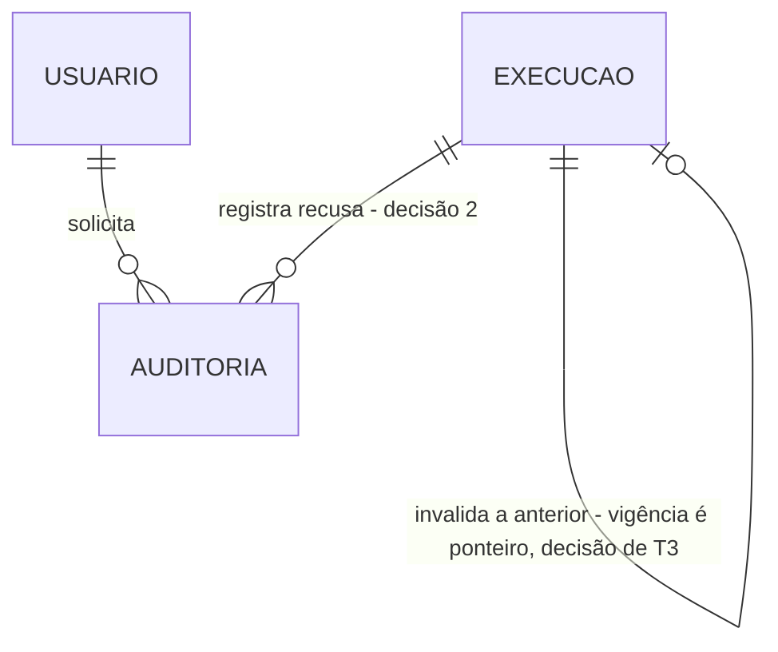

# Reprocessamento forçado: refazer uma apuração é ato autorizado e auditado

> Build this with **tlc-implement**.
> Every criterion below becomes a check with a proof, referenced by its number. Nothing under
> `Unresolved` gets settled while building.

## Intent

Uma apuração pode concluir com sucesso e ainda assim estar errada — dado da origem corrigido depois
do ciclo, modelo de relatório com defeito, número que não bate. Hoje não há o que fazer: o par já
tem execução vigente em sucesso, o artefato está gravado, e quem opera não tem como refazer a
apuração nem deixar registro do porquê. Ao mesmo tempo, permitir refazer sem cerimônia apagaria a
diferença entre "a apuração falhou" e "alguém decidiu refazer", e as duas métricas do `prd.md` §6 se
contaminariam. A fonte não diz com que frequência isso acontece; a meta de `≤ 2` reprocessamentos
por mês é `PROVISÓRIO` e existe como sintoma a observar, não como volume medido.

Quando isto existir, o ADMINISTRADOR solicita o reprocessamento de um par da data corrente com
motivo obrigatório, a execução anterior é invalidada e permanece registrada, e os artefatos são
sobrescritos. Toda tentativa de refazer **sem** passar por aqui é recusada e vira evento de
auditoria — nunca uma falha de apuração. A tela é `catálogo (ADMINISTRADOR)`, a mesma de T2.

5 criteria in 1 slice · 2 one-way doors · 1 open, of which 0 block

## Criteria

1. Quando um ADMINISTRADOR solicita reprocessamento forçado de um par da data de referência corrente informando motivo, então a execução vigente é invalidada, uma Execução de origem `reprocessamento forçado` é criada e os artefatos são sobrescritos.
2. Se a solicitação de reprocessamento forçado chega sem motivo textual não vazio, então a recusa é `400` e nenhuma Execução é criada.
3. Se um usuário de perfil diferente de ADMINISTRADOR solicita reprocessamento forçado, então a resposta é `403`.
4. Se uma nova execução é solicitada para um par cuja execução vigente está em `processado com sucesso` ou `processado com alerta`, fora do reprocessamento forçado, então ela é recusada, um evento de auditoria com solicitante, momento e Correlation ID é registrado, e nenhuma Execução é criada.
5. Quando a execução vigente de um par está em `processado com erro`, então nova execução do par é aceita sem exigir autorização especial.

## States

O ciclo de vida é o da **vigência**, não o do status: a Execução invalidada permanece com o seu
status terminal intacto e deixa de ser a que vale.

## Out of scope

- Reprocessamento de data de referência passada — só a data corrente; a data nunca é informada, e apurar hoje sob rótulo de ontem gravaria número errado sem que nenhuma métrica detectasse (ADR-0005)
- Cancelamento da execução que o reprocessamento disparou — não existe cancelamento no sistema (ADR-0001)
- Retentativa automática após falha — é de T3, tem origem própria e não passa por autorização
- A exposição do Airflow ao usuário final — quem aciona a DAG é a API; o parâmetro é contrato entre os dois, nunca interface de usuário

## Observable

| Surface | Decision | Landing |
| --- | --- | --- |
| tela `catálogo (ADMINISTRADOR)` | ação destrutiva confirma antes de agir | 2 — o motivo textual obrigatório **é** a confirmação: não há como disparar sem escrever por quê |
| tela `catálogo (ADMINISTRADOR)` | estado de erro e estado não autorizado | 2, 3 |
| tela `catálogo (ADMINISTRADOR)` | estado vazio, carregamento e ordenação | existing - a tela é a de T2, e o seu padrão visual está em `Unresolved` 2 de lá |
| API `POST /api/v1/reprocessamentos` | forma da resposta | 1 — `idExecucao` e `correlationId`, em `202` |
| API `POST /api/v1/reprocessamentos` | forma do erro e seus códigos | 2, 3, 4; o envelope é a porta registrada em T2 e provado em T8 |
| API `POST /api/v1/reprocessamentos` | quem pode chamar | 3 |
| API `POST /api/v1/reprocessamentos` | versionamento | n/a - versão única em mono repositório e nenhum consumidor externo à pilha; prefixo `/api/v1` fixo (RA-01) |
| API `POST /api/v1/reprocessamentos` | limite de requisição | n/a - ambiente local, sem exposição externa (RA-50); o teto de simultaneidade que existe é o da exportação, em T5 |
| tarefa agendada `dag-coleta-diaria` | parâmetros e seus padrões | 1 — `forcar_reprocessamento`; não há e nunca haverá parâmetro de data de referência (T3, critério 5) |
| documento `motivo do reprocessamento` | estrutura e o que o leitor faz em seguida | 2 — texto livre não vazio, lido por quem auditar depois |

## Swept

- validation: 2
- failure modes: 4 — a recusa é o caso normal, não a exceção, e precisa deixar rastro sem virar falha de apuração
- idempotency and retry: n/a - cada solicitação é um ato humano auditado com motivo próprio; repetir cria deliberadamente um segundo registro, e não há nada a deduplicar
- authorization: 3
- concurrency and ordering: existing - entregue por T3 (critério 18): par com Execução em `em processamento` recusa nova execução, e é isso que impede o reprocessamento de colidir com o ciclo agendado das 03h00
- data lifecycle: 1, 4 — a execução invalidada permanece ligada ao motivo e ao solicitante; auditoria que apaga o registro auditado não é auditoria
- external-dependency failure: Unresolved 1
- state transitions: 1, 5 — ver `States`
- observability: 4 — o evento de auditoria carrega solicitante, momento e Correlation ID, que é o mesmo identificador exibido ao usuário (T8, critério 2)

## Impact

| Front | What changes |
|---|---|
| domínio | termo novo: `Reprocessamento forçado` — nova apuração de um par que **já concluiu com sucesso ou alerta**, solicitada por um ADMINISTRADOR com motivo obrigatório. Não é "refazer", não é "rerun", e não é retentativa: a retentativa responde a falha e não pede autorização |
| domínio | termo novo: `Auditoria` — o registro de uma solicitação recusada ou autorizada, com solicitante, momento, motivo e Correlation ID. **Uma tentativa recusada nunca aparece como falha de apuração**, e é essa separação que mantém as métricas do `prd.md` §6 sem contaminação |
| domínio | termo existente: `Origem da execução` nasceu em T3 com `agendada` e `retentativa`; esta task acrescenta `reprocessamento forçado` ao conjunto. Quem branqueia hoje sobre esse enum: a métrica primária de T8, que conta exclusivamente `agendada` |
| dado armazenado | nada a migrar; a tabela de Auditoria nasce em migration nova sobre o schema de T2, e o valor `reprocessamento forçado` entra no enum de origem já existente |

## Decided

| Decision | Shape | Alternative rejected |
|---|---|---|
| O parâmetro `forcar_reprocessamento` é contrato entre API e orquestrador | a DAG aceita `forcar_reprocessamento` e **nenhum** parâmetro de data de referência; quem o envia é a API, depois de capturar solicitante, motivo e Correlation ID | expor o Airflow ao ADMINISTRADOR — o motivo obrigatório e a auditoria deixariam de ter onde ser capturados, e a interface do usuário passaria a ser a do orquestrador |
| A recusa de unicidade é evento de auditoria, não Execução | a recusa do critério 4 grava linha em Auditoria e **não** grava linha em Execução | registrar a recusa como Execução com status de erro — uma tentativa recusada apareceria como falha de apuração e derrubaria a métrica primária sem que nada tivesse falhado |

## Relations

## Surface

| Route | In | Out | Status | Criteria |
|---|---|---|---|---|
| `POST /api/v1/reprocessamentos` | `codigoRelatorio`, `motivo` | `idExecucao` · `correlationId` | `202`, `400`, `401`, `403`, `409` | 1, 2, 3, 4 |

## Sources

- `.specs/features/scheduler-jasper-report/plan.md` — fatia S6; os critérios 1 a 5 desta task correspondem aos AC 55 a 59 de lá, sem acréscimo
- `docs/adr/0004-execucao-append-only-com-ponteiro-de-vigencia.md` — **vinculante**: a execução invalidada permanece, ligada ao motivo e ao solicitante
- `docs/adr/0005-sem-apuracao-retroativa.md` — **vinculante** para a restrição à data de referência corrente
- `docs/prd.md` — RN-16 a RN-21, RN-43, RN-46; RF-08 a RF-12
- `docs/arquitetura-inicial.md` — RA-12, RA-13, RA-67
- `docs/glossario.md` — Reprocessamento forçado, Retentativa, Execução vigente, Origem da execução
- Nenhum design é vinculante: a tela é a de T2, cujo padrão visual está em aberto lá

This task is the record of decision. If a linked document diverges, ask before building.

## Unresolved

| # | Kind | Question | Until answered |
|---|---|---|---|
| 1 | open | O que a API responde quando o disparo da DAG no Airflow falha, dado que o `202` do critério 1 promete aceitação? | escrito assim: nenhuma Execução é criada e a resposta é `502` com o envelope de erro registrado em `Decided` de T2. O risco de escrever outra coisa é devolver `202` sem que nada tenha sido disparado, e o ADMINISTRADOR ficar esperando um reprocessamento que não existe |
