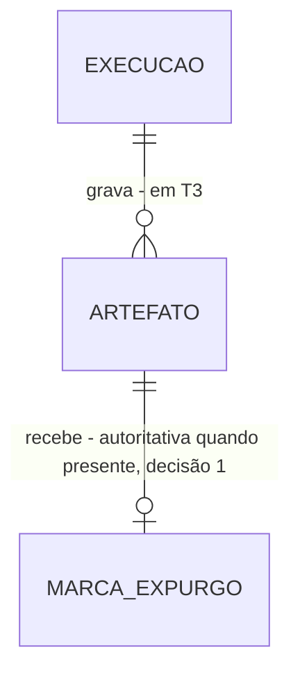

# Retenção: o artefato expira; o registro do que houve, não

> Build this with **tlc-implement**.
> Every criterion below becomes a check with a proof, referenced by its number. Nothing under
> `Unresolved` gets settled while building.

## Intent

Os artefatos de T3 se acumulam sem prazo, na máquina que tem ~20 GB livres em disco e sustenta a
pilha inteira. Pior que o volume é o que o desenho faz se as retenções forem confundidas: a métrica
primária tem janela móvel de 30 dias e o artefato vive 7, então apagar o registro da Execução junto
com o arquivo faria a métrica passar a ser calculada sobre série truncada — **funcionando, e
devolvendo números errados no fim do mês**. E um pedido de exportação de dado já expirado, recusado
com erro genérico, manda o usuário abrir chamado para algo que é comportamento correto.

Quando isto existir, o artefato é apagado automaticamente 7 dias após a sua data de referência, o
sistema sabe que ele se foi e recusa a exportação com uma mensagem que diz exatamente isso, e nem o
metadado de Execução nem o histórico de downloads são tocados. Não há tela própria: o que o usuário
vê é a data desaparecer da listagem de T5 e a mensagem de indisponibilidade por retenção.

5 criteria in 1 slice · 2 one-way doors · 3 open, of which 1 blocks

## Criteria

1. Quando um artefato completa 7 dias contados da sua data de referência, então ele é apagado automaticamente do repositório, com a janela lida de variável de ambiente.
2. Quando o repositório de artefatos, autenticado por credencial de serviço, notifica a remoção de um objeto, então aquele artefato é marcado como expurgado no schema de controle.
3. Se a marca de expurgo não existe e a data de referência é anterior a hoje menos a janela de retenção, então o artefato é tratado como expurgado.
4. Se a exportação é solicitada para um artefato expurgado, então a recusa é `410`, com mensagem explícita de indisponibilidade por retenção e nunca com erro genérico.
5. Sempre, metadados de Execução e registros de histórico de downloads nunca são expurgados.

## States

O ciclo de vida é o do Artefato, e é deliberadamente independente dos outros dois. Não há aresta de
volta: reexportar a partir de artefato expurgado está fora de escopo, e passada a janela aquela data
deixa de existir para o sistema.

```mermaid
stateDiagram-v2
    [*] --> disponivel: execução conclui e grava os dois arquivos irmãos (T3, critério 6)
    disponivel --> apagado_no_bucket: ciclo de vida do bucket apaga aos 7 dias da data de referência (1)
    apagado_no_bucket --> marcado_expurgado: notificação do repositório chega e é gravada (2)
    apagado_no_bucket --> tratado_como_expurgado: notificação não chegou; a data é anterior à janela (3)
    marcado_expurgado --> marcado_expurgado: exportação recusada com 410 (4)
    tratado_como_expurgado --> tratado_como_expurgado: exportação recusada com 410 (4)
```

## Out of scope

- Reexportação a partir de artefato expurgado — passada a janela, aquela data deixa de existir para o sistema (RN-39)
- Expurgo de metadados de Execução e de histórico de downloads — critério 5; são as outras duas retenções, e confundi-las é o que faria a métrica de 30 dias ser calculada sobre dado que já não existe
- Remoção de linha de catálogo — não existe; o que existe é inativação, em T2
- Backup e restauração dos artefatos — não declarados em fonte alguma do projeto

## Observable

| Surface | Decision | Landing |
| --- | --- | --- |
| API `POST /internal/artefatos/expurgos` | quem pode chamar | 2 — credencial de serviço; é superfície nova e está declarada como tal |
| API `POST /internal/artefatos/expurgos` | forma da resposta e do erro | 2; o envelope é a porta registrada em T2 |
| API `POST /internal/artefatos/expurgos` | repetição da mesma notificação | Unresolved 2 |
| API `POST /internal/artefatos/expurgos` | versionamento | n/a - a rota é interna, consumida só pelo repositório de artefatos, e não recebe o prefixo `/api/v1` |
| API `POST /internal/artefatos/expurgos` | limite de requisição | n/a - o único chamador é o bucket, e o volume é o de objetos expirando por dia |
| tarefa agendada `expurgo por ciclo de vida do bucket` | formato e verbosidade da saída | n/a - a rotina é do MinIO, não do projeto; o estado observável é a marca no schema de controle (2) e a derivação (3) |
| tarefa agendada `expurgo por ciclo de vida do bucket` | parâmetros e seus padrões | 1 — janela de 7 dias lida de variável de ambiente |
| tarefa agendada `expurgo por ciclo de vida do bucket` | falha silenciosa | 3 — é exatamente o caso que a derivação aritmética cobre |
| documento `mensagem de indisponibilidade por retenção` | estrutura e o que o leitor faz em seguida | 4 |
| coleção `datas de referência disponíveis` | a exceção que não encaixa | 4 — a data expurgada sai da listagem de T5 e ainda assim responde com mensagem própria se alguém a pedir direto |

Nenhuma tela é exposta por T7: o efeito visível acontece nas telas de T5.

## Swept

- validation: Unresolved 1 — a forma do evento do bucket, e portanto o que o endpoint valida, depende de a notificação existir
- failure modes: 3 — a notificação perdida custa uma inconsistência transitória, não uma resposta errada ao usuário
- idempotency and retry: Unresolved 2
- authorization: 2
- concurrency and ordering: Unresolved 3
- data lifecycle: 1, 5 — as três retenções: artefato por 7 dias, Execução nunca, downloads indefinidamente
- external-dependency failure: 3 — é a resposta a "o MinIO não notificou"
- state transitions: 1, 2, 3, 4 — ver `States`
- observability: n/a - a fonte não declara métrica nem alerta de expurgo; o efeito observável é a marca no schema de controle e a recusa do critério 4

## Impact

| Front | What changes |
|---|---|
| domínio | termo novo: `Expurgo` — a remoção automática dos artefatos após a janela de retenção. Atinge **só os artefatos**; a Execução e o histórico de downloads sobrevivem a ele. Não é "limpeza", "purge" nem "exclusão" |
| domínio | termo existente: `Artefato` nasceu em T3 como resultado gravado e passa a ter estado de expurgo. Quem depende disso hoje: a exportação de T5, que até agora só distinguia execução válida de inválida e passa a ter uma terceira recusa (`410`) que não pode ser confundida com as outras duas |
| dado armazenado | nada a migrar. A marca de expurgo é coluna ou linha nova sobre a tabela de Artefato de T3, sobre base sem volume, então a alteração não depende de linhas preexistentes |
| dependência externa | o MinIO passa a chamar a API, e não só a ser chamado por ela: a direção se inverte, e o endpoint `/internal` é superfície nova exposta ao bucket |

## Decided

| Decision | Shape | Alternative rejected |
|---|---|---|
| A marca de expurgo é autoritativa quando presente, e a derivação aritmética é o fallback | quando a marca existe, ela decide; quando falta, a API deriva o estado por `data de referência < hoje − janela de retenção` | confiar só na notificação — uma notificação perdida passaria a devolver resposta errada ao usuário em vez de custar uma inconsistência transitória. E confiar só na aritmética descartaria a informação exata de que o objeto se foi |
| O expurgo é ciclo de vida do bucket, não rotina da aplicação | variável de ambiente com valor padrão 7 dias, aplicada como política de ciclo de vida do bucket; a aplicação não apaga objeto | rotina de varredura escrita no projeto — reimplementaria um recurso que o repositório já tem, e passaria a ser mais um processo que pode falhar em silêncio. **Como não há retroatividade, a data de referência é a data de gravação do objeto**, e a política implementa a janela sem ajuste de compensação |

## Relations

## Surface

| Route | In | Out | Status | Criteria |
|---|---|---|---|---|
| `POST /internal/artefatos/expurgos` | evento do bucket, credencial de serviço | — | `202`, `400`, `401` | 2 |

## Sources

- `.specs/features/scheduler-jasper-report/plan.md` — fatia S7; os critérios 1 a 5 desta task correspondem aos AC 60 a 64 de lá, sem acréscimo
- `docs/adr/0007-inativacao-logica-e-tres-retencoes.md` — **vinculante** para as três retenções e para o critério 5
- `docs/prd.md` — RN-36 a RN-39, RN-51; RNF-12, RNF-13, RNF-16; RF-24
- `docs/arquitetura-inicial.md` — RA-20, RA-21, RA-22, RA-62, RA-63, e §14, que declara o spike de que `Unresolved` 1 trata
- `docs/glossario.md` — Expurgo, Artefato, Download
- Nenhum design é fonte desta task: T7 não tem tela própria

This task is the record of decision. If a linked document diverges, ask before building.

## Unresolved

| # | Kind | Question | Until answered |
|---|---|---|---|
| 1 | blocks | A expiração por ciclo de vida do MinIO emite evento de notificação? A documentação confirma notificação para eventos de **transição** e **restauração**, e não foi possível confirmar para **expiração** | o critério 2 não tem gatilho e não pode ser satisfeito; sobra a derivação do critério 3. A forma do evento, e portanto o que o endpoint valida, fica indefinida junto. O spike está descrito em `arquitetura-inicial.md` §14: regra de ILM de 1 dia, `mc event add` em `s3:ObjectRemoved:*`, observar o webhook. Se não emitir, a rota de `Surface` e o critério 2 saem, e T7 passa a ser o critério 3 sozinho |
| 2 | open | Marcar duas vezes o mesmo artefato como expurgado é inócuo? | escrito assim: idempotente, porque notificação de bucket é entregue ao menos uma vez e a repetição é o caso normal, não a exceção. É a quarta suposição de `plan.md` e segue não confirmada |
| 3 | open | O que acontece quando o objeto é apagado entre a checagem de status e a leitura do artefato, durante uma exportação já em curso? | escrito assim: a leitura falha e cai na recusa `410` do critério 4, e não na falha de MinIO indisponível de `Unresolved` 4 de T5. Distinguir os dois casos no momento da falha é o que a resposta precisa fixar |
