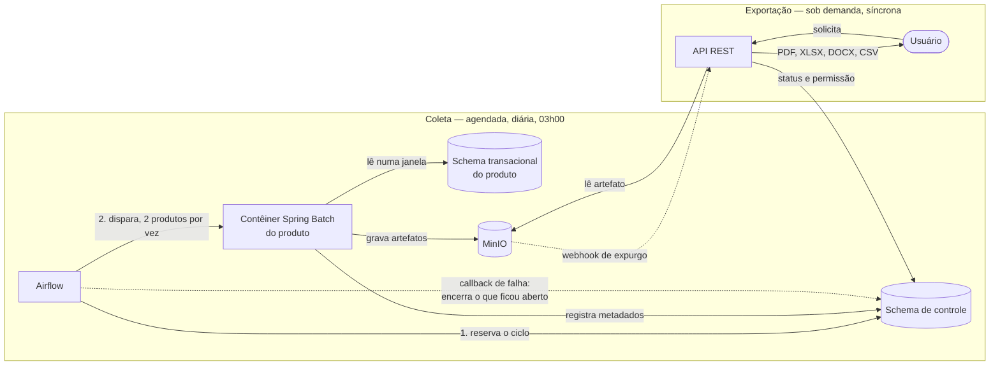

# Arquitetura Inicial — Scheduler Jasper Report

> Documento do eixo **Engenharia** (E0/E1 do `guias/guia-app-web.md`). Descreve **como** o
> sistema é construído — stack, módulos, formatos de arquivo, orquestração e infraestrutura.
> O **o quê** e o **porquê** vivem em [`prd.md`](./prd.md); os termos, em
> [`glossario.md`](./glossario.md).

> **Os identificadores são permanentes.** Um `RA-NN` nunca é renumerado nem reaproveitado:
> decisão nova recebe o próximo número livre, ainda que pertença a uma seção anterior; decisão
> descartada tem o ID **aposentado** e permanece listada como tal.
>
> As referências `RN-NN` e `RF-NN` apontam para o [`prd.md`](./prd.md). A seção
> [13](#13-rastreabilidade-ra--rn) consolida o mapeamento.

---

## 1. Visão geral

O sistema tem duas metades que se encontram num repositório de artefatos:

- **Coleta** — agendada e diária. O orquestrador reserva as execuções do ciclo e dispara um
  contêiner de processamento por produto; ele lê a base transacional daquele domínio **numa
  única janela**, renderiza os relatórios, grava os artefatos no repositório e registra os
  metadados da execução.
- **Exportação** — sob demanda e síncrona. A API REST lê o artefato já renderizado e o converte
  para o formato que o usuário pediu. Nunca toca na base transacional.

O relatório é **lido da base uma vez** e **exportado quantas vezes for preciso**. Toda a
arquitetura existe para sustentar essa assimetria.

---

## 2. Módulos e repositório

- **RA-01** — O código fonte fica num **mono repositório com versão única** no GitHub. Todos os
  módulos compartilham o mesmo ciclo de versão e as mesmas dependências — é a premissa de que
  dependem os trade-offs da seção 12.
- **RA-02** — **Biblioteca comum**, dependência de todos os outros módulos backend.
- **RA-03** — **Starter do Processador**, sobre Spring Batch. Concentra o que é comum a toda
  apuração: leitura paginada, renderização, gravação de artefato e registro de metadados.
- **RA-04** — **Múltiplos módulos processadores segmentados por produto**: Poupança
  (`POUPANCA`), Cliente (`CLIENTE`), Conta Corrente (`CONTACORRENTE`), Consórcio (`CONSORCIO`)
  e Empréstimo (`EMPRESTIMO`). **O módulo processador é o Produto** — não há produto sem módulo,
  e não se cria produto sem escrever código (RN-49).
- **RA-05** — **API REST**, executando na porta `8080`. É o único módulo que atende o usuário
  final.
- **RA-06** — **Frontend** em Angular, que se integra **exclusivamente** com os endpoints da API
  REST. Não acessa repositório, banco ou orquestrador diretamente.
- **RA-07** — Cada relatório tem o **seu próprio JRXML**, versionado no repositório e associado ao
  módulo processador do seu produto.
- **RA-08** — Cada módulo processador traz **dois relatórios de exemplo**, com imagens e fontes
  diferentes entre si — exercitam na prática os riscos declarados na seção 12.

---

## 3. Coleta e orquestração

- **RA-09** — A cadeia de execução é:
  **reserva do ciclo → orquestrador (Airflow) → contêiner de processamento (Spring Batch) →
  base transacional do produto → repositório de artefatos → registro de metadados**. Nenhuma
  etapa é pulada e nenhuma inverte a ordem. Atende RN-06.
- **RA-54** — **Reserva do ciclo (RN-45).** A primeira task da DAG lê o catálogo e grava uma
  Execução por relatório ativo da data de referência, com data/hora de início **nula**. Só
  depois qualquer contêiner sobe. É o que garante que um relatório não apurado apareça como
  falha em vez de desaparecer do denominador da métrica.
- **RA-65** — A DAG tem **uma task por produto, estática**, espelhando os módulos de RA-04.
  A lista de produtos é código porque o produto **é** código (RA-04); a lista de relatórios é
  dado, e por isso a reserva de RA-54 consulta o catálogo em tempo de execução. Adicionar um
  produto é adicionar módulo e task no mesmo PR — o mono repositório de RA-01 garante que os
  dois não divirjam.
- **RA-55** — As tasks de produto correm em **pool de 2** (RNF-18). A máquina alvo tem 4 vCPUs
  disputados por toda a pilha de RA-51; paralelismo total renderia contenção e transformaria
  `processado com alerta` em ruído de ambiente, poluindo a métrica primária.
- **RA-56** — A DAG declara **`catchup=False` explicitamente**. Sem isso, subir a DAG com
  `start_date` no passado dispara uma run por dia perdido, cada uma carimbando uma data de
  referência antiga com o dado de hoje — exatamente a corrupção que RN-54 proíbe, entrando por
  omissão. O padrão de `catchup_by_default` é `False` no Airflow 3.x e `True` no 2.x; a
  declaração explícita torna a versão irrelevante.
- **RA-10** — **A Coleta é a única fronteira de leitura.** Cada módulo processador lê
  exclusivamente o schema PostgreSQL do seu próprio produto. Nenhum outro módulo — inclusive a
  API REST — acessa esses schemas (RN-31).
- **RA-11** — Dentro de uma execução, **os artefatos são gravados antes dos metadados de
  conclusão**. A ordem inversa produziria uma execução em `processado com sucesso` sem artefato
  correspondente, exatamente o estado que RN-42 pressupõe impossível.
- **RA-64** — **Contagem prévia de linhas.** Antes de apurar, o processador conta as linhas do
  dataset e recusa o relatório que ultrapassar RNF-06, encerrando como `processado com erro` com
  motivo explícito (RN-52). Sem isso, o teto só se manifestaria como falha de memória na
  exportação, dias depois e em outro módulo.
- **RA-12** — A DAG aceita o parâmetro **`forcar_reprocessamento`**, que invalida a execução
  vigente do par, permite nova apuração e **sobrescreve** os artefatos (RN-20). Não existe
  parâmetro de data de referência (RN-54).
- **RA-13** — **Quem aciona a DAG para reprocessamento é a API REST.** Solicitante, motivo
  obrigatório e Correlation ID são capturados na API, que só então dispara o orquestrador. O
  parâmetro é o **contrato entre API e orquestrador**, não a interface do usuário — o Airflow não
  é exposto ao usuário final.
- **RA-14** — **Encerramento de execução anômala (RN-10).** Quando o contêiner de um produto
  termina de forma anômala, o **callback de falha da task do Airflow** encerra como
  `processado com erro` **todas as execuções daquele produto que ficaram abertas** — inclusive as
  que a reserva criou e que nunca chegaram a começar, distinguíveis pelo início nulo. É o
  mecanismo que sustenta a métrica *"execuções presas em `em processamento` 30 min após o fim do
  ciclo = 0"*.
- **RA-15** — **Aposentada.** Substituída por RA-57: concentrar o timeout num único lugar deixou
  de ser adequado quando a unidade de orquestração passou a ser o produto e a unidade de negócio
  continuou sendo o relatório.
- **RA-57** — **Os dois limites de tempo de RN-13**, com papéis distintos:

  | Limite | Onde vive | Valor | Papel |
  |---|---|---|---|
  | Do relatório | Dentro do contêiner | 2× o tempo estimado da própria execução | Regra de negócio; alimenta a métrica; os demais relatórios do produto seguem |
  | De segurança | `execution_timeout` da task | 2× a soma dos tempos estimados do produto, com folga | Interruptor de emergência; o efeito recai em RA-14 |

  O limite do relatório é verificado **entre chunks** do Spring Batch. Uma consulta que trava
  dentro de uma única chamada JDBC não é interrompida por essa verificação: por isso **todo
  statement de leitura da Coleta declara `queryTimeout`**. Sem ele o limite interno não existe e
  ninguém percebe — o sistema silenciosamente volta a ter um só limite.
- **RA-58** — **Catálogo derivado (RN-49).** Ao iniciar, cada módulo processador publica no
  schema de controle o seu produto e os seus relatórios — código, nome, descrição e tempo
  estimado inicial. A aplicação guarda apenas o que é mutável (nome, descrição, tempo estimado) e
  nunca cria nem apaga linhas de catálogo. Código de relatório duplicado dentro do produto
  **impede o módulo de iniciar** (RF-44): a violação de RN-03 passa a ser impossível de persistir.

---

## 4. Artefatos e armazenamento

- **RA-16** — Cada execução bem-sucedida produz **dois arquivos irmãos**:

  | Arquivo | Conteúdo | Serve a |
  |---|---|---|
  | `.jrprint` | `JasperPrint` serializado — o relatório já renderizado e paginado | PDF, XLSX e DOCX |
  | `.csv.gz` | Dataset bruto da consulta principal, comprimido | CSV |

- **RA-17** — **O CSV não passa pelo JasperReports.** É o dataset da query principal — sem
  subrelatórios, sem imagens e sem formatação — persistido em `.csv.gz` ao lado do `.jrprint`, com
  separador `;` (compatível com Excel pt-BR). O JasperReports permanece responsável apenas por PDF,
  XLSX e DOCX (RN-34).
- **RA-18** — Os artefatos são armazenados num repositório que implementa o padrão **S3 (MinIO)**.
- **RA-19** — O caminho do artefato é
  **data de referência (`yyyy-MM-dd`) → sigla do produto → código do relatório** (RN-08). Usa a
  **sigla**, nunca o nome do produto: a sigla é imutável (RN-01) e o nome é editável, de modo que o
  caminho de um artefato jamais muda.
- **RA-20** — **Ciclo de vida dos dados no MinIO:** uma variável de ambiente (valor padrão
  **7 dias**) define quando os artefatos são apagados automaticamente (RN-36, RN-37). Como não há
  retroatividade (RN-54), a data de referência **é** a data de gravação do objeto, e a política do
  bucket implementa a janela de RN-36 sem ajuste de compensação.

  **Precisão real da janela, verificada no código** (`internal/bucket/lifecycle/lifecycle.go`,
  `ExpectedExpiryTime`): o MinIO calcula a expiração como
  `truncar(modTime_UTC + (dias + 1) × 24h, 24h)`. Com `--expire-days 7` e o ciclo às 03h00 BRT
  (06h00 UTC), o objeto é removido à **meia-noite UTC do oitavo dia — 21h00 em São Paulo**. A
  retenção efetiva é de **7 dias e ~18 horas**: nunca menor que os 7 dias de RN-36, e o desvio é
  constante e previsível. O que não é intuitivo é o **horário**: o artefato some às 21h, não à
  meia-noite local. O varredor que aplica a regra roda a cada ~1 min (`dataScannerStartDelay`), e
  não a cada 24h como se costuma afirmar — a remoção é pronta assim que a fronteira é cruzada.
- **RA-21** — Uma **função de callback no MinIO** (`Bucket Notifications`) marca o artefato como
  **expurgado** no schema de controle, para que RN-39 possa recusar com mensagem explícita de
  indisponibilidade em vez de erro genérico.

  **Verificado no código-fonte do MinIO:** a expiração por ILM emite
  **`s3:ObjectRemoved:Delete`**, com `UserAgent: "Internal: [ILM-Expiry]"` — tanto no caminho de
  objeto não transicionado (`cmd/data-scanner.go`, `applyExpiryOnNonTransitionedObjects`) quanto no
  transicionado (`cmd/bucket-lifecycle.go`, `expireTransitionedObject`). O MinIO **diverge do S3 da
  AWS** aqui: na AWS a expiração não dispara `ObjectRemoved`, e foi por isso que ela precisou criar
  a família `s3:LifecycleExpiration:*`, que o MinIO não possui.

  **Armadilha de configuração, e ela está na própria documentação do MinIO.** O README de
  lifecycle manda usar `mc event add --event ilm` para observar eventos de ciclo de vida. No
  `mc`, o alias `ilm` expande para `s3:ObjectRestore:*` e `s3:ObjectTransition:*` — **a expiração
  não está aí**. A assinatura correta para RA-21 é **`--event delete`**, que expande para
  `s3:ObjectRemoved:*`. Seguir a documentação ao pé da letra produziria um webhook que nunca
  dispara, sem erro algum.
- **RA-63** — **A marca de expurgo é recebida por endpoint da API**, autenticado por credencial de
  serviço e exposto ao MinIO — é superfície nova e declarada como tal. E a marca é **autoritativa
  quando presente**: quando ela falta, a API deriva o estado *expirado* pela comparação
  `data de referência < hoje − janela de retenção`. Assim uma notificação perdida custa uma
  inconsistência transitória, não uma resposta errada ao usuário.
- **RA-22** — **O histórico de downloads não é expurgado** junto com os artefatos no MinIO. São
  ciclos de vida independentes (RN-38).
- **RA-62** — **Três retenções, não duas** (RN-36, RN-38, RN-51): artefato por 7 dias; **metadados
  de Execução, nunca**; histórico de downloads, indefinidamente. A métrica primária tem janela de
  30 dias e a retenção de artefato é de 7 — sem a retenção indefinida da Execução, a métrica
  passaria a ser calculada sobre uma série truncada, sem sinal algum. E **nada do catálogo é
  apagado**: produto e relatório são inativados (RN-50).
- **RA-66** — O registro de **Download guarda cópia** do código, do nome do relatório, da sigla do
  produto, da data de referência e do formato — não apenas as chaves. O nome do relatório é editável
  (RF-41) e o relatório pode ser inativado (RN-50); sem a cópia, um histórico que "sobrevive
  indefinidamente" passaria a exibir o download de 2026 com o nome que o relatório ganhou em 2027.

---

## 5. Dados e persistência

- **RA-23** — Além dos schemas transacionais de cada produto, existe um **schema de controle/
  aplicação separado**. **Escrevem nele:** a Coleta (catálogo publicado, metadados de execução,
  artefatos), o **orquestrador** (reserva do ciclo em RA-54 e encerramento anômalo em RA-14) e a
  **API** (atributos editáveis do catálogo, auditoria, downloads e a marca de expurgo de RA-63).
  **Os schemas transacionais, só a Coleta lê** — esse é o invariante que não se negocia.
- **RA-24** — O versionamento de schema é feito com **Flyway**. Migration já aplicada não se altera.
- **RA-25** — A **tabela de metadados de execução é a fonte da verdade do status** (RN-09). Nenhuma
  outra fonte — nem o estado da task no orquestrador, nem a presença do arquivo no MinIO — pode
  contradizê-la.
- **RA-67** — A Execução é **append-only** (RN-46): retentativa e reprocessamento forçado inserem
  linha nova e movem o ponteiro de vigência. Nenhum caminho do sistema atualiza o status de uma
  execução já terminal, o que torna RN-15 uma propriedade do schema e não uma disciplina de código.

---

## 6. Exportação

- **RA-26** — **A geração e o download do relatório são feitos pelo módulo API REST**, de forma
  síncrona: a mesma requisição devolve o arquivo ou devolve erro (RN-30).
- **RA-27** — A exportação parte do `.jrprint` e usa o JasperReports para produzir **PDF, XLSX e
  DOCX**; o **CSV** é servido a partir do `.csv.gz`, sem passar pelo motor de relatório (RA-17).
- **RA-28** — **Aposentada.** Substituída por RA-59, que descreve o que de fato é preciso fazer
  para cumprir RN-33 — a formulação anterior supunha, incorretamente, que bastasse configurar o
  exportador.
- **RA-59** — **XLSX contínuo (RN-33) é convenção de autoria, não configuração.** O atributo
  `ignorePagination` do JasperReports é aplicado **no preenchimento**, não na exportação, e
  `pageHeader`/`pageFooter` já estão gravados por página dentro do `.jrprint`. Reconstruir o print
  sem paginação exigiria preencher de novo — o que fere RN-31 e RN-44. Portanto:

  1. **Todo JRXML do projeto** coloca o cabeçalho de coluna na banda `title`, renderizada uma única
     vez, e mantém em `pageHeader`/`pageFooter` apenas ornamento descartável.
  2. A exportação XLSX **exclui essas bandas por origem de elemento** (recurso disponível no
     JasperReports desde a 2.0.2), com `onePagePerSheet(false)` e
     `removeEmptySpaceBetweenRows(true)`.
  3. **Cada relatório tem teste** que exporta em XLSX e afirma que o cabeçalho aparece
     **exatamente uma vez** (RF-21). Sem esse teste a convenção apodrece em silêncio no primeiro
     relatório que alguém escrever sem ter lido este documento.
- **RA-60** — **Semáforo de exportações.** A API limita as exportações simultâneas a RNF-10 e
  **recusa de imediato** a requisição excedente, com indicação de repetir mais tarde (RN-53). Não
  há fila: RN-30 exige resposta na mesma requisição. É o que mantém o consumo de memória da API
  dentro de um teto conhecido, dado que cada `.jrprint` desserializado ocupa múltiplos do seu
  tamanho em disco.
- **RA-29** — **A exportação nunca acessa a base transacional do produto.** Lê apenas o artefato já
  apurado e o schema de controle (RN-31). É a razão de existir do sistema, e vale como invariante
  arquitetural: qualquer dependência da API para um schema transacional é um defeito.

---

## 7. Identidade e acesso

- **RA-30** — **Keycloak** é o provedor de identidade; a autorização entre frontend e API trafega
  por **JWT**.
- **RA-31** — **Aposentada.** Substituída por RA-61. A formulação anterior — "a cadeia é resolvida
  no Keycloak, não em tabela própria" — é impossível: o Keycloak não conhece o conceito de
  Relatório.
- **RA-61** — **A cadeia de permissão é híbrida**, e a divisão é deliberada:

  | Elo | Onde vive | Por quê |
  |---|---|---|
  | **Perfil** (ADMINISTRADOR, GERENTE, RELATOR) | **Realm role** do Keycloak | Conjunto fechado, criado na inicialização do realm, nunca pela aplicação |
  | **Role de relatório** | **Client role** de um cliente dedicado (`relatorios`) | Conjunto aberto, criado pelo GERENTE |
  | **Grupo** e pertinência de usuário | Grupos nativos do Keycloak | Recurso nativo, com as client roles mapeadas neles |
  | **Relatório → Role de relatório** | **Tabela no schema de controle** | É o único elo que precisa conhecer o catálogo |

  A separação **realm role vs. client role** é o que torna RN-26 estrutural: os endpoints do
  GERENTE só operam sobre client roles do cliente `relatorios`, e um Perfil não é alcançável por
  eles nem por engano — está em outro espaço de nomes e outro endpoint. A verificação no código
  continua existindo, mas deixa de ser a única defesa.

  **Risco aceito e declarado:** restringir um service account a gerir um único cliente depende de
  *fine-grained admin permissions*, que é **preview** no Keycloak 26.5.2. Não apoiamos a segurança
  do sistema num recurso preview: o service account da API recebe permissões administrativas
  grossas (`manage-users`, `manage-clients`). Ou seja, **a API tem tecnicamente poder de criar um
  ADMINISTRADOR**; o que a impede é o nosso código e a separação de espaços de nomes acima.
- **RA-32** — Ao iniciar o contêiner do Keycloak, um usuário do tipo **ADMINISTRADOR** é criado
  automaticamente, com senha definida em **variável de ambiente**.
- **RA-33** — Os usuários do tipo **RELATOR se cadastram somente via interface web pública** — a
  página de registro do Keycloak com tema customizado (RN-27). **Não há grupo padrão**: o usuário
  nasce sem grupo e sem acesso a relatório algum (RF-55).
- **RA-34** — O **Account Console** e a **página de registro** do Keycloak são expostos
  **seletivamente** pelo Traefik, para troca de senha e cadastro. O restante do console
  administrativo não é exposto.
- **RA-35** — **Mailpit** atende a verificação de e-mail e o reset de senha do Keycloak em ambiente
  local (RN-29).

---

## 8. Observabilidade e erros

- **RA-36** — **Log, span, trace e métrica** são enviados para o **OTel Collector**, que os
  distribui para Graylog, Prometheus/Grafana e Jaeger.
- **RA-37** — O **Correlation ID** é propagado automaticamente e formado pelo `traceId` nos logs via
  **MDC**, permitindo a pesquisa no Graylog pelo Correlation ID exibido ao usuário (RN-41).
- **RA-38** — Logs **estruturados**, enriquecidos com `traceId` e `spanId` do OpenTelemetry.
- **RA-39** — O **SDK do OpenTelemetry é desabilitado nos testes** (JUnit/Cucumber/Testcontainers),
  para que não dependam de Collector nem gerem telemetria.
- **RA-40** — Sempre que possível, as métricas usam as labels **sigla do produto** e **código do
  relatório**. A métrica primária exige ainda a label **origem da execução** (RN-46) — sem ela é
  impossível separar apuração agendada de retentativa e de reprocessamento, e as métricas do PRD §6
  se contaminam.
- **RA-41** — **Contrato de erro da API**, documentado no OpenAPI: horário do erro em **ISO 8601**,
  descrição do erro e **Correlation ID** (RN-40).
- **RA-42** — A **interface** oferece a cópia do erro em **JSON**, para anexar em chamado (RF-39).
- **RA-43** — O módulo API REST retorna status `UP` em
  `http://localhost:<porta>/actuator/health/liveness` e
  `http://localhost:<porta>/actuator/health/readiness`.

---

## 9. Testes

- **RA-44** — **Gherkin para todo comportamento observável pelo negócio** — aceitação e integração,
  inclusive a Coleta.
- **RA-45** — Nos módulos Java, os cenários em Gherkin (`*.feature`) ficam em
  `./<módulo>/src/test/resources/feature`.
- **RA-46** — Nos módulos Angular, os cenários em Gherkin (`*.feature`) ficam em
  `./<módulo>/e2e/features/`.
- **RA-47** — Testes de integração com **JUnit 5 + Cucumber + Testcontainers + Flyway**.
- **RA-48** — Testes E2E de backend com **Newman CLI + psql**; testes E2E de navegador com
  **Playwright**.
- **RA-49** — Cobertura medida com **JaCoCo**.
- **RA-68** — **Testes obrigatórios por natureza de risco**, porque são os que ninguém escreve
  espontaneamente: o acesso irrestrito do ADMINISTRADOR (RN-24); o cabeçalho único no XLSX de
  **cada** relatório (RF-21); a impossibilidade de o GERENTE promover alguém (RF-34); e o
  encerramento de execução reservada que nunca chegou a iniciar (RA-14).

---

## 10. Ambiente e entrega

- **RA-50** — **A primeira versão executa somente em ambiente local.** Não há metas de
  disponibilidade nem de escala horizontal. A máquina alvo tem **23 GB de RAM, 4 vCPUs e ~20 GB
  livres em disco**, e é essa máquina que justifica os limites recalibrados do PRD §10 e o pool de
  RA-55.
- **RA-51** — O ambiente local sobe por **Docker Compose**, com as dependências reais (PostgreSQL,
  Keycloak, MinIO, Airflow, Traefik, Mailpit, OTel Collector, Graylog, Prometheus, Grafana, Jaeger).
- **RA-52** — **Toda a aplicação e seus contêineres executam no timezone `America/Sao_Paulo`.** É o
  fuso em que a data de referência é resolvida (RN-07).
- **RA-53** — Automação do CI com **GitHub Actions**, bloqueante por PR.

---

## 11. Tech stack

> Sujeita a revisão (seção 14). Ponto de partida, não escolha fechada.

### Comum

| Item | Papel |
|---|---|
| Gherkin | Linguagem dos cenários de aceitação |
| JWT | Credencial entre frontend, API e orquestração |
| TDD / BDD | Método de trabalho: teste antes da implementação |

### Backend

| Item | Papel |
|---|---|
| Java, Maven | Linguagem e build |
| Spring Web | API REST |
| Spring Batch | Motor de apuração dos processadores |
| JasperReports | Renderização e exportação PDF/XLSX/DOCX |
| Apache Airflow | Orquestração da coleta agendada |
| PostgreSQL | Schemas transacionais e schema de controle |
| Flyway | Versionamento de schema |
| MinIO | Repositório de artefatos (padrão S3) |
| Bucket Notifications | Callback de expurgo (RA-21) |
| Keycloak | Identidade, perfis e roles de relatório |
| Mailpit | SMTP local para verificação e reset de senha |
| Traefik | Ingress e TLS |
| Docker Compose | Ambiente local |
| Actuator | Liveness e readiness |
| OpenTelemetry (Micrometer), OpenTelemetry SDK, OTel Collector | Telemetria |
| Prometheus, Grafana | Métricas e painéis |
| Graylog, Log4j2 | Logs estruturados e pesquisa |
| Jaeger | Traces |
| SpringDoc OpenAPI, Swagger | Contrato e documentação da API |
| JUnit 5, Cucumber, Testcontainers | Testes unitários e de integração |
| Newman CLI, psql | Testes E2E de backend |
| k6 | Calibração dos limites de §10 do PRD |
| JaCoCo | Cobertura |

### Frontend

| Item | Papel |
|---|---|
| TypeScript, Node.js, Angular | Aplicação web |
| Cucumber | Cenários de aceitação |
| Playwright | E2E de navegador |

---

## 12. Trade-offs aceitos

Os quatro primeiros decorrem da decisão de persistir o `JasperPrint` serializado (RA-16) e se
apoiam na premissa do mono repositório com versão única (RA-01). **Se RA-01 cair, precisam ser
reavaliados.**

- A serialização Java nativa não quebra entre versões do JasperReports (`serialVersionUID`) porque
  todos os módulos usam a mesma versão do Jasper.
- O arquivo vem de um módulo que está dentro do projeto, logo é confiável desserializar o objeto
  Java de origem conhecida.
- As imagens vão embutidas no `.jrprint`, **mas as fontes não**. A API que exporta precisa ter as
  mesmas *font extensions* no classpath — garantia que o mono repositório dá — senão o PDF sai com
  substituição de fonte, ou estoura, dependendo de
  `net.sf.jasperreports.awt.ignore.missing.font`.
- Barcodes e afins também viram renderers serializados (`BarbecueRendererImpl`), então vão junto:
  por ser mono repositório, o jar correspondente estará presente na hora de desserializar, senão dá
  `ClassNotFoundException`.
- **Memória.** Um `.jrprint` desserializado ocupa múltiplos do seu tamanho em disco. É o que obriga
  o teto de RNF-05, o teto de linhas de RNF-06 e o semáforo de RA-60 a existirem **juntos** — os
  três compõem um único teto de memória, e afrouxar qualquer um deles sozinho o quebra.
- **Relatórios do mesmo produto podem enxergar instantes diferentes da base**, quando um deles é
  apurado numa retentativa (RN-44). É o preço de permitir retentativa dentro de um modelo de janela
  única; a alternativa era ficar sem o relatório até o dia seguinte.
- **Não há como interromper uma apuração sob demanda.** Sem cancelamento (PRD §5), o único
  interruptor é o tempo. A mitigação é o teto de RN-48, que torna "o dobro do tempo estimado" um
  número conhecido e limitado em vez de uma variável livre.

---

## 13. Rastreabilidade RA ↔ RN

| Decisão | Atende |
|---|---|
| RA-04, RA-19, RA-58 | RN-01, RN-02, RN-03, RN-08, RN-49 |
| RA-09, RA-65 | RN-06 |
| RA-10, RA-29 | RN-31 |
| RA-11 | RN-42 |
| RA-12, RA-13 | RN-20, RN-21 |
| RA-14 | RN-10 |
| RA-54 | RN-45 |
| RA-55, RA-65 | RNF-18, RN-48 |
| RA-56 | RN-54 |
| RA-57 | RN-13 |
| RA-16, RA-27 | RN-32 |
| RA-17 | RN-34 |
| RA-20 | RN-36, RN-37 |
| RA-21, RA-63 | RN-37, RN-39 |
| RA-22, RA-62 | RN-38, RN-50, RN-51 |
| RA-25, RA-67 | RN-09, RN-15, RN-46 |
| RA-26 | RN-30 |
| RA-59 | RN-33 |
| RA-60 | RN-53 |
| RA-64 | RN-52 |
| RA-61 | RN-22, RN-23, RN-26 |
| RA-32 | PRD §3.2 |
| RA-33 | RN-27 |
| RA-35 | RN-29 |
| RA-37 | RN-41 |
| RA-40 | PRD §6 |
| RA-41, RA-42 | RN-40, RF-38, RF-39 |
| RA-52 | RN-07 |
| RA-66 | RN-35, RN-38 |

**Aposentadas:** RA-15 (substituída por RA-57), RA-28 (por RA-59), RA-31 (por RA-61).

---

## 14. Pendentes de definição

**Spikes — bloqueiam implementação, não desenho**

- **Calibração dos limites** de PRD §10 com `k6`: tamanho real do `.jrprint` desserializado,
  latência de exportação por formato e teto real de simultaneidade. Substitui os `PROVISÓRIO`.
- **Confirmar o comportamento de RA-21 na tag de imagem que o Compose fixar.** O achado do código é
  do branch `master`; o contrato de eventos é estável há anos, mas a verificação custa poucos
  minutos: assinar `--event delete`, apagar um objeto manualmente e observar o webhook. Não é mais
  uma incógnita de desenho — é conferência de versão.

**Desenho ainda aberto**

- Definição dos nomes dos módulos.
- Definição da arquitetura interna de cada módulo e sua respectiva estrutura.
- Definição dos relatórios de exemplo (RA-08) e seus respectivos modelos de dados.
- Modelagem detalhada das tabelas do schema de controle (E2 do guia).

**Resolvidos nesta revisão**

Periodicidade e horário da coleta; base de contagem da retenção; execuções paralelas ou
sequenciais; cadastramento de novos contêineres no Airflow (RA-65: task estática, porque produto é
código); modelagem conceitual dos metadados de execução (RA-67) e do relatório (RA-58); **e o
gatilho de RA-21 — a expiração por ILM emite `s3:ObjectRemoved:Delete`, confirmado no código-fonte
do MinIO**.

---

## 15. Tickets iniciais do projeto

1. **Prototipação descartável** usando somente HTML, CSS e JavaScript, cobrindo o drop-down de
   relatórios disponíveis por `dd/MM/yyyy` → nome do produto → código do relatório, a vinculação
   das roles de relatório aos grupos e a vinculação dos usuários aos grupos.
2. **Swagger descartável**, depois substituído pelo SpringDoc OpenAPI.
3. **Módulos compilando** com esqueleto básico, e os endpoints do Actuator `liveness` e `readiness`
   respondendo `UP` no módulo API REST (RA-43).
4. **Criar os cenários em Gherkin** (RA-44 a RA-46), começando pelos testes obrigatórios de RA-68.
5. **Criar os arquivos `CLAUDE.md` e `ARCHITECTURE.md`** no projeto e dentro de cada módulo,
   carregando os invariantes desta revisão: `catchup=False`, `queryTimeout`, convenção de autoria
   do JRXML, quem escreve no schema de controle, teto por produto e semáforo de exportação.
6. **Calibração dos limites de PRD §10 com `k6`** (seção 14) — é o único spike que ainda bloqueia.
   Ao configurar o expurgo, assinar **`--event delete`** e não `--event ilm` (RA-21).
7. **Criar as guidelines do projeto.**

---

## Fora de escopo

Exclusões de natureza técnica. As de produto estão em [`prd.md`](./prd.md#5-fora-de-escopo).

- Kubernetes.
- Classificação de dados, mascaramento e criptografia em repouso.
- Cache de exportação com o binário exportado.
- Deploy em produção/homologação.
- Virtualização do `JasperPrint` na exportação — trocaria heap por disco, e o disco é o recurso
  mais escasso da máquina alvo.

---

## 16. Documentos relacionados

| Documento | Papel | Estado |
|---|---|---|
| [`prd.md`](./prd.md) | Eixo de produto: problema, personas, regras de negócio, requisitos | Existe |
| [`glossario.md`](./glossario.md) | Linguagem ubíqua. Fonte única das definições | Existe |
| [`adr/`](./adr/) | Uma decisão estruturante por arquivo | Existe |
| [`guias/guia-app-web.md`](./guias/guia-app-web.md) | Método: define os artefatos exigidos em cada fase | Existe |
| `arquitetura/c4-contexto.md` | Diagramas C4 nível 1 e 2 em Mermaid | **Não existe** — exigido por E0 |
| `riscos.md` | Riscos técnicos abertos e como cada um será resolvido | **Não existe** — exigido por E0 |
| `ARCHITECTURE.md` | Mapa do código e invariantes — *onde eu mexo para fazer X* | **Não existe** — exigido por E1 |
