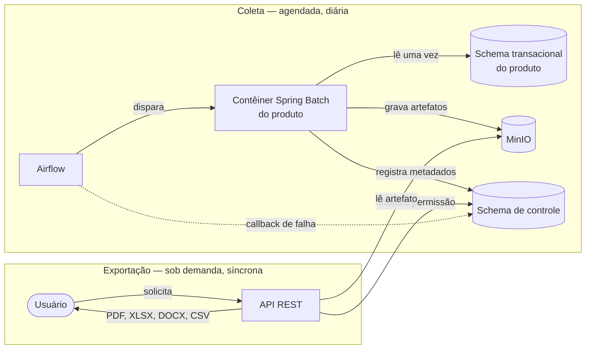

# Arquitetura Inicial — Scheduler Jasper Report

> Documento do eixo **Engenharia** (E0/E1 do `guias/guia-app-web.md`). Descreve **como** o
> sistema é construído — stack, módulos, formatos de arquivo, orquestração e infraestrutura.
> O **o quê** e o **porquê** vivem em [`prd.md`](./prd.md).

> **Os identificadores são permanentes.** Um `RA-NN` nunca é renumerado nem reaproveitado:
> decisão nova recebe o próximo número livre, ainda que pertença a uma seção anterior; decisão
> descartada tem o ID aposentado. É o que permite que um ADR, um teste ou um commit citem uma
> decisão arquitetural e a referência continue válida seis meses depois. Vale a mesma convenção
> dos `RN`/`RF` do PRD.
>
> As referências no formato `RN-NN` e `RF-NN` apontam para regras de negócio e requisitos
> funcionais do [`prd.md`](./prd.md). A seção [13](#13-rastreabilidade-ra--rn) consolida o
> mapeamento.

---

## 1. Visão geral

O sistema tem duas metades que se encontram num repositório de artefatos:

- **Coleta** — agendada e diária. O orquestrador dispara um contêiner de processamento por
  produto; ele lê a base transacional daquele domínio **uma única vez**, renderiza os relatórios,
  grava os artefatos no repositório e registra os metadados da execução.
- **Exportação** — sob demanda e síncrona. A API REST lê o artefato já renderizado e o converte
  para o formato que o usuário pediu. Nunca toca na base transacional.

O relatório é **lido da base uma vez** e **exportado quantas vezes for preciso**. Toda a
arquitetura existe para sustentar essa assimetria.

---

## 2. Módulos e repositório

- **RA-01** — O código fonte fica num **mono repositório com versão única** no GitHub. Todos os
  módulos compartilham o mesmo ciclo de versão e as mesmas dependências — é a premissa de que
  dependem os trade-offs da seção 12.
- **RA-02** — **Biblioteca comum**, dependência de todos os outros módulos backend.
- **RA-03** — **Starter do Processador**, sobre Spring Batch. Concentra o que é comum a toda
  apuração: leitura paginada, renderização, gravação de artefato e registro de metadados.
- **RA-04** — **Múltiplos módulos processadores segmentados por produto**, cada um implementando o
  Starter do Processador: Poupança (`POUPANCA`), Cliente (`CLIENTE`), Conta Corrente
  (`CONTACORRENTE`), Consórcio (`CONSORCIO`) e Empréstimo (`EMPRESTIMO`). As siglas obedecem a
  RN-01 e compõem o código do relatório (RN-02) e o caminho de armazenamento (RA-19).
- **RA-05** — **API REST**, executando na porta `8080`. É o único módulo que atende o usuário
  final: exportação e download do relatório são responsabilidade dela.
- **RA-06** — **Frontend** em Angular, que se integra **exclusivamente** com os endpoints da API
  REST. Não acessa repositório, banco ou orquestrador diretamente.
- **RA-07** — Cada relatório tem o **seu próprio JRXML**, versionado no repositório e associado ao
  módulo processador do seu produto.
- **RA-08** — Cada módulo processador traz **dois relatórios de exemplo**, com imagens e fontes
  diferentes entre si — exercitam na prática os riscos declarados em RA-27 e na seção 12.

---

## 3. Coleta e orquestração

- **RA-09** — A cadeia de execução é:
  **orquestrador (Airflow) → contêiner de processamento (Spring Batch) → base transacional do
  produto → repositório de artefatos → registro de metadados**. O orquestrador dispara um
  contêiner por produto; nenhuma etapa é pulada e nenhuma inverte a ordem. Atende RN-06.
- **RA-10** — **A Coleta é a única fronteira de leitura.** Cada módulo processador lê
  exclusivamente o schema PostgreSQL do seu próprio produto, que representa a base transacional
  daquele domínio. Nenhum outro módulo — inclusive a API REST — acessa esses schemas (RN-31).
- **RA-11** — Dentro de uma execução, **os artefatos são gravados antes dos metadados de
  conclusão**. A ordem inversa produziria uma execução em `processado com sucesso` sem artefato
  correspondente, exatamente o estado que RN-42 pressupõe impossível.
- **RA-12** — A DAG aceita o parâmetro **`forcar_reprocessamento`**, que invalida a execução
  vigente do par *data de referência + código do relatório*, permite nova apuração e **sobrescreve**
  os artefatos no repositório (RN-20).
- **RA-13** — **Quem aciona a DAG é a API REST.** Por decisão D10 do PRD, o reprocessamento forçado
  é funcionalidade autenticada da aplicação (F04): solicitante, motivo obrigatório e Correlation ID
  são capturados na API, que só então dispara o orquestrador com `forcar_reprocessamento`. O
  parâmetro é o **contrato entre API e orquestrador**, não a interface do usuário — o Airflow não é
  exposto ao usuário final.
- **RA-14** — **Encerramento de execução anômala (RN-10).** A tabela de metadados é a fonte da
  verdade do status (RA-25). Quando o contêiner termina de forma anômala e não consegue registrar o
  próprio encerramento, o **callback de falha da task do Airflow** atualiza a execução para
  `processado com erro`, encerrando qualquer registro preso em `em processamento`. É o mecanismo que
  sustenta a métrica secundária *"execuções presas em `em processamento` 30 min após o fim do ciclo
  = 0"* (PRD §6).
- **RA-15** — O **timeout duro** de RN-13 — o dobro do tempo estimado — é responsabilidade do
  **orquestrador**, não do job. O contêiner que ultrapassa o limite é interrompido de fora, e o
  encerramento como `processado com erro` recai em RA-14. Concentrar o limite num único lugar evita
  duas implementações divergentes do mesmo prazo.

---

## 4. Artefatos e armazenamento

- **RA-16** — Cada execução bem-sucedida produz **dois arquivos irmãos**:

  | Arquivo | Conteúdo | Serve a |
  |---|---|---|
  | `.jrprint` | `JasperPrint` serializado — o relatório já renderizado e paginado | PDF, XLSX e DOCX |
  | `.csv.gz` | Dataset bruto da consulta principal, comprimido | CSV |

- **RA-17** — **O CSV não passa pelo JasperReports.** É o dataset da query principal — sem
  subrelatórios, sem imagens e sem formatação — persistido em `.csv.gz` ao lado do `.jrprint`, com
  separador `;` (compatível com Excel pt-BR). O JasperReports permanece responsável apenas por PDF,
  XLSX e DOCX (RN-34).
- **RA-18** — Os artefatos são armazenados num repositório que implementa o padrão **S3 (MinIO)**.
- **RA-19** — O caminho do artefato é
  **data de referência (`yyyy-MM-dd`) → sigla do produto → código do relatório** (RN-08). Usa a
  **sigla**, nunca o nome do produto: a sigla é imutável (RN-01) e o nome é editável, de modo que o
  caminho de um artefato jamais muda.
- **RA-20** — **Ciclo de vida dos dados no MinIO:** uma variável de ambiente (valor padrão
  **7 dias**) define quando os artefatos são apagados automaticamente (RN-36, RN-37).
- **RA-21** — Uma **função de callback no MinIO** (`Bucket Notifications`) atualiza o relatório como
  **expurgado** no schema de controle. Sem ela o banco continuaria anunciando artefato que não
  existe mais, e RN-39 — recusa com mensagem explícita de indisponibilidade por retenção — não teria
  como ser cumprida.
- **RA-22** — **O histórico de downloads não é expurgado** junto com os artefatos no MinIO. São dois
  ciclos de vida independentes (RN-38).

---

## 5. Dados e persistência

- **RA-23** — Além dos schemas transacionais de cada produto, existe um **schema de controle/
  aplicação separado**, com **escrita pelos processadores** e **leitura pela API**. É onde vivem
  catálogo, metadados de execução, auditoria e histórico de downloads.
- **RA-24** — O versionamento de schema é feito com **Flyway**. Migration já aplicada não se altera.
- **RA-25** — A **tabela de metadados de execução é a fonte da verdade do status** (RN-09). Nenhuma
  outra fonte — nem o estado da task no orquestrador, nem a presença do arquivo no MinIO — pode
  contradizê-la.

---

## 6. Exportação

- **RA-26** — **A geração e o download do relatório são feitos pelo módulo API REST**, de forma
  síncrona: a mesma requisição devolve o arquivo ou devolve erro (RN-30).
- **RA-27** — A exportação parte do `.jrprint` e usa o JasperReports para produzir **PDF, XLSX e
  DOCX**; o **CSV** é servido a partir do `.csv.gz`, sem passar pelo motor de relatório (RA-17).
- **RA-28** — O `.jrprint` é gravado já paginado e posicionado para leitura em página. O exportador
  de planilha monta o grid a partir dessas coordenadas, o que produz resultado ilegível; por isso a
  exportação **XLSX ignora a paginação** e é entregue como planilha contínua (RN-33).
- **RA-29** — **A exportação nunca acessa a base transacional do produto.** Lê apenas o artefato já
  apurado e o schema de controle (RN-31). É a razão de existir do sistema, e vale como invariante
  arquitetural: qualquer dependência da API para um schema transacional é um defeito.

---

## 7. Identidade e acesso

- **RA-30** — **Keycloak** é o provedor de identidade; a autorização entre frontend e API trafega
  por **JWT**.
- **RA-31** — A **Role de Relatório é uma role real do Keycloak** e **viaja no JWT**. A cadeia
  relatório → role → grupo → usuário (RN-22) é resolvida no Keycloak, não em tabela própria.
- **RA-32** — Ao iniciar o contêiner do Keycloak, um usuário do tipo **ADMINISTRADOR** é criado
  automaticamente, com senha definida em **variável de ambiente**.
- **RA-33** — Os usuários do tipo **RELATOR se cadastram somente via interface web pública** — a
  página de registro do Keycloak com tema customizado (RN-27).
- **RA-34** — O **Account Console** e a **página de registro** do Keycloak são expostos
  **seletivamente** pelo Traefik, para troca de senha e cadastro. O restante do console
  administrativo não é exposto.
- **RA-35** — **Mailpit** atende a verificação de e-mail e o reset de senha do Keycloak em ambiente
  local (RN-29).

---

## 8. Observabilidade e erros

- **RA-36** — **Log, span, trace e métrica** são enviados para o **OTel Collector**, que os
  distribui para Graylog, Prometheus/Grafana e Jaeger.
- **RA-37** — O **Correlation ID** é propagado automaticamente e formado pelo `traceId` nos logs via
  **MDC**, permitindo a pesquisa no Graylog pelo Correlation ID exibido ao usuário (RN-41).
- **RA-38** — Logs **estruturados**, enriquecidos com `traceId` e `spanId` do OpenTelemetry,
  permitindo correlação direta entre logs e traces.
- **RA-39** — O **SDK do OpenTelemetry é desabilitado nos testes** (JUnit/Cucumber/Testcontainers),
  para que não dependam de Collector nem gerem telemetria.
- **RA-40** — Sempre que possível, as métricas usam as labels **sigla do produto** e **código do
  relatório** — são as mesmas dimensões exigidas pela instrumentação das métricas do PRD (§6).
- **RA-41** — **Contrato de erro da API**, documentado no OpenAPI: horário do erro em **ISO 8601**,
  descrição do erro e **Correlation ID** (RN-40).
- **RA-42** — A **interface** oferece a cópia do erro em **JSON**, para anexar em chamado (RF-39).
  É responsabilidade do frontend; a API entrega os campos de RA-41.
- **RA-43** — O módulo API REST retorna status `UP` em
  `http://localhost:<porta>/actuator/health/liveness` e
  `http://localhost:<porta>/actuator/health/readiness`.

---

## 9. Testes

- **RA-44** — **Gherkin para todo comportamento observável pelo negócio** — aceitação e integração,
  inclusive a Coleta.
- **RA-45** — Nos módulos Java, os cenários em Gherkin (`*.feature`) ficam em
  `./<módulo>/src/test/resources/feature`.
- **RA-46** — Nos módulos Angular, os cenários em Gherkin (`*.feature`) ficam em
  `./<módulo>/e2e/features/`.
- **RA-47** — Testes de integração com **JUnit 5 + Cucumber + Testcontainers + Flyway**.
- **RA-48** — Testes E2E de backend com **Newman CLI + psql**; testes E2E de navegador com
  **Playwright**.
- **RA-49** — Cobertura medida com **JaCoCo**.

---

## 10. Ambiente e entrega

- **RA-50** — **A primeira versão executa somente em ambiente local.** Não há metas de
  disponibilidade nem de escala horizontal, e o deploy em produção/homologação está fora de escopo.
  O alvo de ambiente de produção é decisão pendente (seção 14).
- **RA-51** — O ambiente local sobe por **Docker Compose**, com as dependências reais (PostgreSQL,
  Keycloak, MinIO, Airflow, Traefik, Mailpit, OTel Collector, Graylog, Prometheus, Grafana, Jaeger).
- **RA-52** — **Toda a aplicação e seus contêineres executam no timezone `America/Sao_Paulo`.** É o
  fuso em que a data de referência é resolvida (RN-07).
- **RA-53** — Automação do CI com **GitHub Actions**, bloqueante por PR.

---

## 11. Tech stack

> Sujeita a revisão (seção 14). Os itens abaixo são o ponto de partida, não uma escolha fechada.

### Comum

| Item | Papel |
|---|---|
| Gherkin | Linguagem dos cenários de aceitação |
| JWT | Credencial entre frontend, API e orquestração |
| TDD / BDD | Método de trabalho: teste antes da implementação |

### Backend

| Item | Papel |
|---|---|
| Java, Maven | Linguagem e build |
| Spring Web | API REST |
| Spring Batch | Motor de apuração dos processadores |
| JasperReports | Renderização e exportação PDF/XLSX/DOCX |
| Apache Airflow | Orquestração da coleta agendada |
| PostgreSQL | Schemas transacionais e schema de controle |
| Flyway | Versionamento de schema |
| MinIO | Repositório de artefatos (padrão S3) |
| Bucket Notifications | Callback de expurgo (RA-21) |
| Keycloak | Identidade, perfis e roles de relatório |
| Mailpit | SMTP local para verificação e reset de senha |
| Traefik | Ingress e TLS |
| Docker Compose | Ambiente local |
| Actuator | Liveness e readiness |
| OpenTelemetry (Micrometer), OpenTelemetry SDK, OTel Collector | Telemetria |
| Prometheus, Grafana | Métricas e painéis |
| Graylog, Log4j2 | Logs estruturados e pesquisa |
| Jaeger | Traces |
| SpringDoc OpenAPI, Swagger | Contrato e documentação da API |
| JUnit 5, Cucumber, Testcontainers | Testes unitários e de integração |
| Newman CLI, psql | Testes E2E de backend |
| JaCoCo | Cobertura |

### Frontend

| Item | Papel |
|---|---|
| TypeScript, Node.js, Angular | Aplicação web |
| Cucumber | Cenários de aceitação |
| Playwright | E2E de navegador |

---

## 12. Trade-offs aceitos

Todos decorrem da decisão de persistir o `JasperPrint` serializado (RA-16) e todos se apoiam na
premissa do mono repositório com versão única (RA-01). **Se RA-01 cair, os quatro precisam ser
reavaliados.**

- A serialização Java nativa não quebra entre versões do JasperReports (`serialVersionUID`) porque
  todos os módulos usam a mesma versão do Jasper.
- O arquivo vem de um módulo que está dentro do projeto, logo é confiável desserializar o objeto
  Java de origem conhecida.
- As imagens vão embutidas no `.jrprint`, **mas as fontes não**. A API que exporta precisa ter as
  mesmas *font extensions* no classpath — garantia que o mono repositório dá — senão o PDF sai com
  substituição de fonte, ou estoura, dependendo de
  `net.sf.jasperreports.awt.ignore.missing.font`.
- Barcodes e afins também viram renderers serializados (`BarbecueRendererImpl`), então vão junto:
  por ser mono repositório, o jar correspondente estará presente na hora de desserializar, senão dá
  `ClassNotFoundException`.

---

## 13. Rastreabilidade RA ↔ RN

Quais decisões arquiteturais implementam quais regras de negócio do PRD. A ausência de RA para uma
RN não é erro — muitas RN são regras de aplicação sem consequência de infraestrutura.

| Decisão | Atende |
|---|---|
| RA-04, RA-19 | RN-01, RN-02, RN-08 |
| RA-09 | RN-06 |
| RA-10, RA-29 | RN-31 |
| RA-11 | RN-42 |
| RA-12, RA-13 | RN-20, RN-21 |
| RA-14 | RN-10 |
| RA-15 | RN-13 |
| RA-16, RA-27 | RN-32 |
| RA-17 | RN-34 |
| RA-20 | RN-36, RN-37 |
| RA-21 | RN-37, RN-39 |
| RA-22 | RN-38 |
| RA-25 | RN-09 |
| RA-26 | RN-30 |
| RA-28 | RN-33 |
| RA-31 | RN-22, RN-23 |
| RA-32 | PRD §3.2 |
| RA-33 | RN-27 |
| RA-35 | RN-29 |
| RA-37 | RN-41 |
| RA-40 | PRD §6 |
| RA-41, RA-42 | RN-40, RF-38, RF-39 |
| RA-52 | RN-07 |

---

## 14. Pendentes de definição

**Abertas nesta revisão**

- **Periodicidade e horário da coleta** (PRD Q1) — define o `schedule` da DAG e a janela de RNF-04.
- **Base de contagem da retenção** (PRD Q8): data de referência ou data de gravação do objeto. O
  lifecycle do bucket só conhece a data do objeto; se a contagem for pela data de referência, RA-20
  não pode ser implementada só com política de bucket.
- **Execuções paralelas ou sequenciais** dentro do ciclo (PRD Q9) — define pool e concorrência no
  orquestrador, e se a janela de 60 min é alcançável.

**Já em aberto**

- Cadastramento de novos contêineres do Spring Batch no Apache Airflow.
- Modelagem da gravação dos metadados de processamento (data/hora início, data/hora fim, status).
- Modelagem da gravação dos metadados do relatório: tempo estimado de execução em segundos, produto,
  nome e descrição.
- Definição dos nomes dos módulos.
- Definição da arquitetura interna de cada módulo e sua respectiva estrutura.
- Definição dos relatórios de exemplo (RA-08) e seus respectivos modelos de dados.

---

## 15. Tickets iniciais do projeto

Tickets que devem ser os primeiros a serem implementados.

1. **Prototipação descartável** usando somente HTML, CSS e JavaScript, cobrindo:
   - drop-down para visualizar os relatórios disponíveis por `dd/MM/yyyy` → nome do produto →
     código do relatório;
   - vinculação das roles de relatório aos grupos de usuário;
   - vinculação dos usuários aos grupos.
2. **Swagger descartável**, depois substituído pelo SpringDoc OpenAPI.
3. **Módulos compilando** com esqueleto básico, e os endpoints do Actuator `liveness` e `readiness`
   respondendo `UP` no módulo API REST (RA-43).
4. **Criar os cenários em Gherkin** (RA-44 a RA-46).
5. **Criar os arquivos `CLAUDE.md` e `ARCHITECTURE.md`** no projeto e dentro de cada módulo.
6. **Criar as guidelines do projeto.**

---

<!-- Título deliberadamente sem número: prd.md linka a âncora #fora-de-escopo. Numerá-lo quebra o link. -->
## Fora de escopo

Exclusões de natureza técnica. As exclusões de produto estão em
[`prd.md`](./prd.md#5-fora-de-escopo).

- Kubernetes.
- Classificação de dados, mascaramento e criptografia em repouso.
- Cache de exportação com o binário exportado.
- Deploy em produção/homologação.

---

## 16. Documentos relacionados

| Documento | Papel | Estado |
|---|---|---|
| [`prd.md`](./prd.md) | Eixo de produto: problema, personas, regras de negócio, requisitos | Existe |
| [`guias/guia-app-web.md`](./guias/guia-app-web.md) | Método: define os artefatos exigidos em cada fase | Existe |
| `adr/NNNN-*.md` | Uma decisão estruturante por arquivo: contexto, opções, consequências | **Não existe** — exigido por E0 |
| `arquitetura/c4-contexto.md` | Diagramas C4 nível 1 e 2 em Mermaid | **Não existe** — exigido por E0 |
| `riscos.md` | Riscos técnicos abertos e como cada um será resolvido | **Não existe** — exigido por E0 |
| `ARCHITECTURE.md` | Mapa do código e invariantes — *onde eu mexo para fazer X* | **Não existe** — exigido por E1 |
| `CLAUDE.md` | Constituição técnica: comandos, convenções, regras invioláveis | **Não existe** — exigido por E1 |
