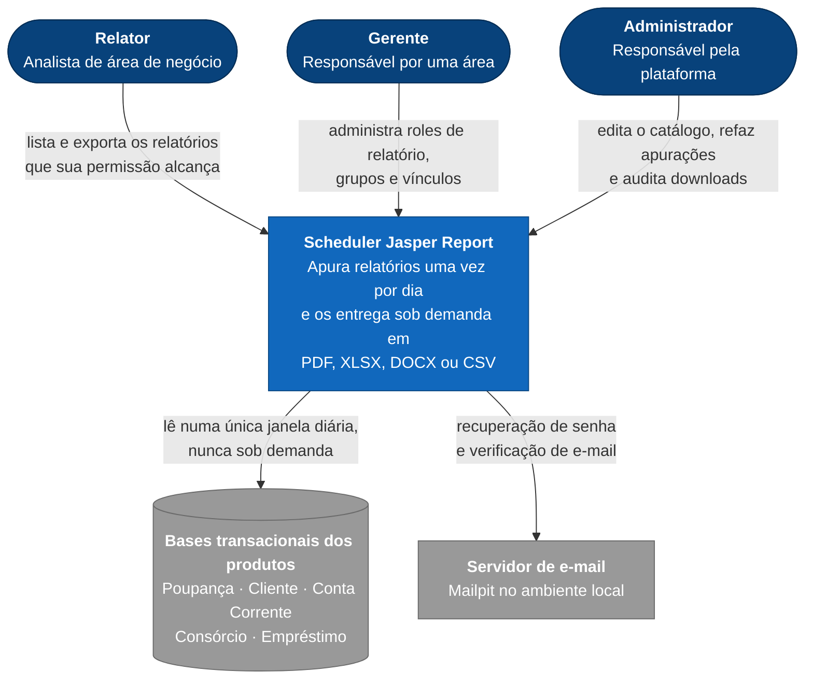
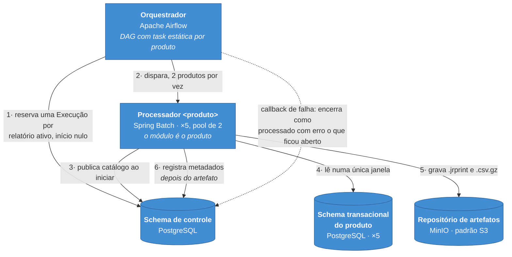
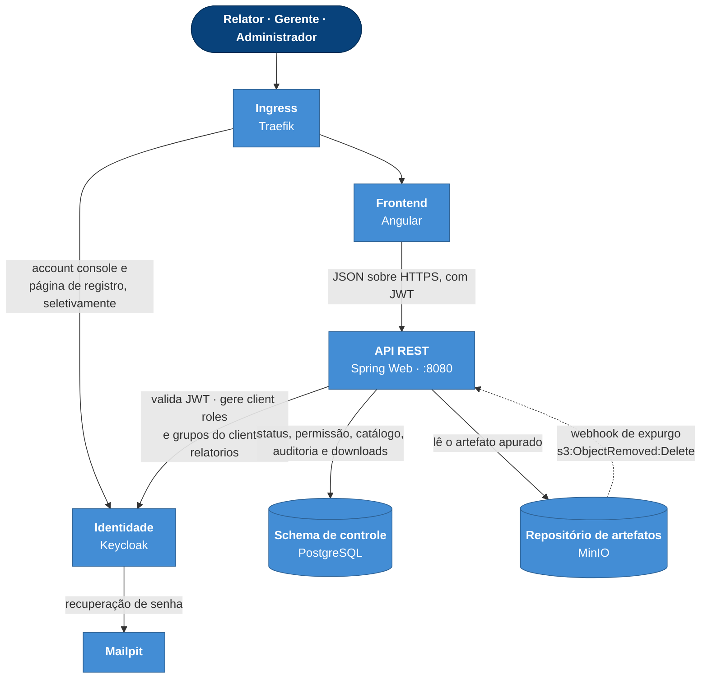

# C4 — Contexto e Contêineres

> Artefato E0 do [`guias/guia-app-web.md`](../guias/guia-app-web.md). Diagramas em Mermaid,
> versionados: são lidos e atualizados junto com o código.
>
> **Atualize quando um contêiner nascer, morrer ou trocar de responsabilidade** — não a cada
> feature. O detalhamento interno de cada contêiner pertence ao `ARCHITECTURE.md` (E1/E3);
> o *porquê* de cada escolha pertence aos [`adr/`](../adr/).

---

## Nível 1 — Contexto

Quem usa o sistema, e com que mundo ele fala.

**O que este nível afirma.** As bases transacionais são **externas** ao sistema: pertencem aos
produtos, e a única seta que chega nelas parte da Coleta. O Gerente não tem seta de exportação —
ele administra acesso e não consome relatório (RN-25).

---

## Nível 2 — Contêineres

O sistema tem duas metades que quase não se tocam: encontram-se apenas no **repositório de
artefatos** e no **schema de controle**. Por isso são dois diagramas, e não um.

### 2a — Coleta

Agendada, diária, 03h00 `America/Sao_Paulo`.

A numeração das setas é a cadeia de `RA-09`: nenhuma etapa é pulada e nenhuma inverte a ordem.
A ordem 5 → 6 é `RA-11` — o artefato é gravado **antes** dos metadados de conclusão, porque a
ordem inversa produziria uma execução em `processado com sucesso` sem artefato.

### 2b — Exportação

Sob demanda e síncrona.

**O invariante mais importante do projeto aparece aqui como uma ausência:** não existe seta —
nem caixa — ligando a API a schema transacional algum. Qualquer dependência da API para um
schema transacional é um defeito, não uma variação de desenho (`RA-29`, RN-31).

---

## Telemetria

Não tem diagrama próprio de propósito: a pilha não participa de fluxo de negócio algum, e
desenhá-la ao lado dos contêineres faria dez setas decorativas competirem com as que importam.

Todo contêiner aplicacional — API, os cinco processadores e o orquestrador — emite **log, span,
trace e métrica** para o **OTel Collector**, que distribui para **Graylog** (logs),
**Prometheus/Grafana** (métricas) e **Jaeger** (traces). O `traceId` do OpenTelemetry é o
Correlation ID exibido ao usuário (`RA-37`).

---

## Contêineres, em uma tabela

| Contêiner | Tecnologia | Responsabilidade | Não faz |
|---|---|---|---|
| Frontend | Angular | Interface do usuário final | Não acessa banco, repositório ou orquestrador |
| API REST | Spring Web, `:8080` | Único módulo que atende o usuário; exporta e autoriza | Nunca lê schema transacional |
| Processador `<produto>` | Spring Batch | Apura os relatórios de um produto numa única janela | Não lê o schema de outro produto |
| Orquestrador | Apache Airflow | Reserva o ciclo, dispara os produtos, encerra o que ficou aberto | Não é exposto ao usuário final |
| Schema de controle | PostgreSQL | Catálogo, execuções, artefatos, auditoria, downloads | — |
| Schema transacional | PostgreSQL, ×5 | Base do produto | Lido **apenas** pela Coleta |
| Repositório de artefatos | MinIO | `.jrprint` e `.csv.gz`, com expurgo por ILM | — |
| Identidade | Keycloak | Perfis (realm roles), roles de relatório (client roles), grupos | Não conhece o conceito de Relatório |
| Ingress | Traefik | Borda e TLS; expõe o console do Keycloak seletivamente | — |
| Mailpit | Mailpit | SMTP local | — |
| Telemetria | OTel Collector, Graylog, Prometheus, Grafana, Jaeger | Logs, métricas e traces | — |

---

## Documentos relacionados

| Documento | Papel |
|---|---|
| [`../arquitetura-inicial.md`](../arquitetura-inicial.md) | As decisões `RA-NN` que estes diagramas desenham |
| [`../prd.md`](../prd.md) | As regras `RN-NN` que as setas obedecem |
| [`../adr/`](../adr/) | Por que cada decisão não foi outra coisa |
